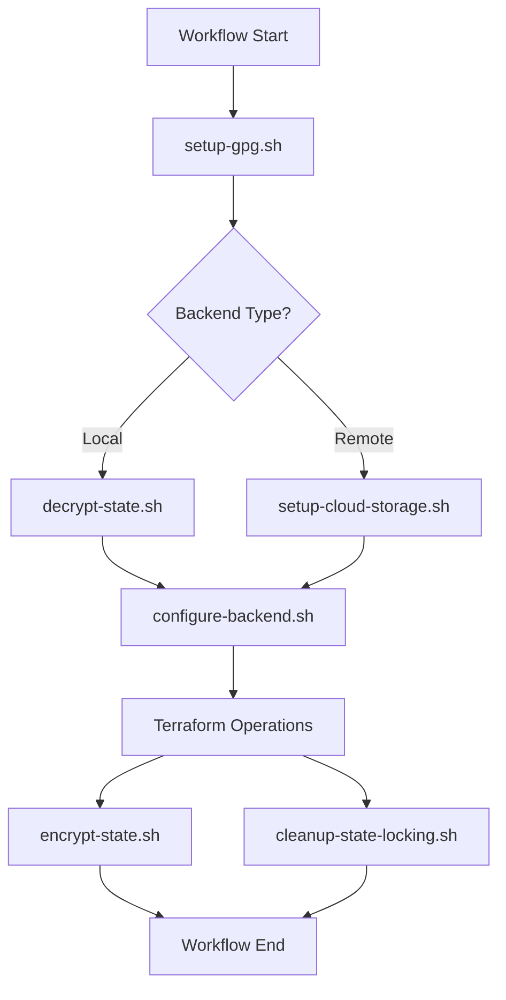

# GitHub Actions Scripts Directory

This directory contains **utility scripts** used by GitHub Actions workflows to automate infrastructure deployment tasks. All scripts are designed for modularity, reusability, and maintainability.

## Purpose

These scripts handle complex operations that would otherwise make workflow files cluttered and hard to maintain. Each script has a specific responsibility and can be used independently or called from workflows.

## Current Scripts Overview

| Script | Purpose | Used By | Status |
|--------|---------|---------|---------|
| `configure-backend.sh` | Generate backend.tf files for Terraform | terraform.yml, terraform-destroy.yml | Active |
| `setup-cloud-storage.sh` | Setup remote storage across cloud providers | terraform.yml (remote backend) | Active |
| `encrypt-state.sh` | Encrypt Terraform state files with GPG | terraform.yml, terraform-destroy.yml | Active |
| `decrypt-state.sh` | Decrypt Terraform state files with GPG | terraform.yml, terraform-destroy.yml | Active |
| `setup-gpg.sh` | Configure GPG environment for encryption | terraform.yml, terraform-destroy.yml | Active |
| `generate-pg-secrets.sh` | Generate PostgreSQL secrets (legacy) | N/A | Legacy |
| `cleanup-state-locking.sh` | Clean up DynamoDB state locks | terraform-destroy.yml | Active |
| `test-*.sh` | Various testing and validation scripts | Manual testing | Active |
| `validate-workflow-integration.sh` | Validate workflow integration | Manual testing | Active |
| `setup-s3-backend.sh` | Empty placeholder | N/A | Placeholder |
| `setup-remote-storage.sh` | Empty placeholder | N/A | Placeholder |

## Core Scripts

### configure-backend.sh

**Purpose**: Generates Terraform backend configuration files based on provider and backend type.

**Usage**:
```bash
./configure-backend.sh --type <local|remote> --provider <aws|azure|gcp> --component <component> [options]
```

**Key Features**:
- Supports local and remote backends
- Cloud-agnostic backend generation
- Custom state file naming for local backends
- Validation and error handling

### encrypt-state.sh / decrypt-state.sh

**Purpose**: GPG encryption and decryption of Terraform state files for secure local storage.

**Usage**:
```bash
# Encrypt state files
./encrypt-state.sh --backend-type local --passphrase <gpg-passphrase>

# Decrypt state files
./decrypt-state.sh --backend-type local --passphrase <gpg-passphrase>
```

**Key Features**:
- AES256 encryption with compression
- Automatic file detection and processing
- Git-safe encrypted storage
- Custom state file naming support

### setup-cloud-storage.sh

**Purpose**: Creates and configures remote storage (S3, Azure Storage, GCS) for Terraform state.

**Usage**:
```bash
./setup-cloud-storage.sh --provider <aws|azure|gcp> --config <config> --branch <branch>
```

**Configuration Formats**:
- **AWS**: `aws:bucket_base:region`
- **Azure**: `azure:resource_group:storage_account:container`
- **GCP**: `gcp:bucket_name:region`

### setup-gpg.sh

**Purpose**: Configures GPG environment for state file encryption in GitHub Actions.

**Usage**:
```bash
./setup-gpg.sh --passphrase <gpg-passphrase>
```

**Key Features**:
- GPG key import and configuration
- Batch mode setup for automation
- Trust database initialization

## Testing and Validation Scripts

### test-infrastructure.sh

**Purpose**: Comprehensive testing of all scripts and workflow combinations.

**Usage**:
```bash
./test-infrastructure.sh [--test-type <scripts|paths|all>] [--provider <provider>]
```

**Test Coverage**:
- Script functionality validation
- Path resolution testing
- Workflow integration testing
- Error handling verification

### validate-workflow-integration.sh

**Purpose**: Validates integration between scripts and GitHub Actions workflows.

**Usage**:
```bash
./validate-workflow-integration.sh [options]
```

## Utility Scripts

### cleanup-state-locking.sh

**Purpose**: Removes DynamoDB state locks when using remote backends.

**Usage**:
```bash
./cleanup-state-locking.sh --provider <provider> --table-name <dynamodb-table>
```

## Legacy Scripts

### generate-pg-secrets.sh

**Status**: Legacy - No longer used 
**Reason**: PostgreSQL configuration now handled via Terraform variables (`enable_postgresql_setup`) 
**Replacement**: Configure PostgreSQL in `terraform/implementations/{cloud}/{component}/{cloud}.tfvars`

## Placeholder Scripts

Some scripts are empty placeholders for future functionality:
- `setup-s3-backend.sh` - Functionality moved to `setup-cloud-storage.sh`
- `setup-remote-storage.sh` - Functionality moved to `setup-cloud-storage.sh`
## Script Integration with Workflows

### Terraform Workflows Integration

**terraform.yml workflow uses these scripts**:
1. `setup-gpg.sh` - Configure GPG for state encryption
2. `decrypt-state.sh` - Decrypt existing state files
3. `configure-backend.sh` - Generate backend configuration
4. `setup-cloud-storage.sh` - Create remote storage (if remote backend)
5. `encrypt-state.sh` - Encrypt state files after operations

**terraform-destroy.yml workflow uses these scripts**:
1. `setup-gpg.sh` - Configure GPG for state decryption
2. `decrypt-state.sh` - Decrypt state files for destroy operation
3. `configure-backend.sh` - Generate backend configuration
4. `cleanup-state-locking.sh` - Clean up state locks after destroy

### Script Dependencies



## Directory Structure

```
.github/scripts/
├── README.md # This file - scripts documentation
├── configure-backend.sh # Backend configuration generation
├── setup-cloud-storage.sh # Remote storage setup
├── encrypt-state.sh # GPG state encryption
├── decrypt-state.sh # GPG state decryption
├── setup-gpg.sh # GPG environment setup
├── cleanup-state-locking.sh # State lock cleanup
├── generate-pg-secrets.sh # Legacy PostgreSQL secrets
├── test-infrastructure.sh # Comprehensive testing
├── validate-workflow-integration.sh # Workflow validation
├── test-*.sh # Various test scripts
├── setup-s3-backend.sh # Empty placeholder
└── setup-remote-storage.sh # Empty placeholder
```

## Usage from Workflows

Scripts are called from GitHub Actions workflows with proper error handling:

```yaml
- name: Setup GPG
 run: |
 chmod +x .github/scripts/setup-gpg.sh
 .github/scripts/setup-gpg.sh --passphrase "${{ secrets.GPG_PASSPHRASE }}"

- name: Decrypt State
 run: |
 chmod +x .github/scripts/decrypt-state.sh
 .github/scripts/decrypt-state.sh --backend-type local --passphrase "${{ secrets.GPG_PASSPHRASE }}"
```

## Script Development Guidelines

1. **Modularity**: Each script handles one specific task
2. **Error Handling**: All scripts use `set -e` and proper error checking
3. **Logging**: Clear, structured logging with script name prefixes
4. **Help Usage**: All scripts include `--help` option with usage information
5. **Validation**: Input validation and sanity checks
6. **Cloud Agnostic**: Support multiple cloud providers where applicable

## Testing Scripts

Run the comprehensive test suite to validate all scripts:

```bash
# Test all scripts and combinations
.github/scripts/test-infrastructure.sh

# Test specific functionality
.github/scripts/test-infrastructure.sh --test-type scripts

# Validate workflow integration
.github/scripts/validate-workflow-integration.sh
```

---

**This directory provides the automation backbone for MOSIP infrastructure deployment workflows with secure, modular, and maintainable scripts.**
