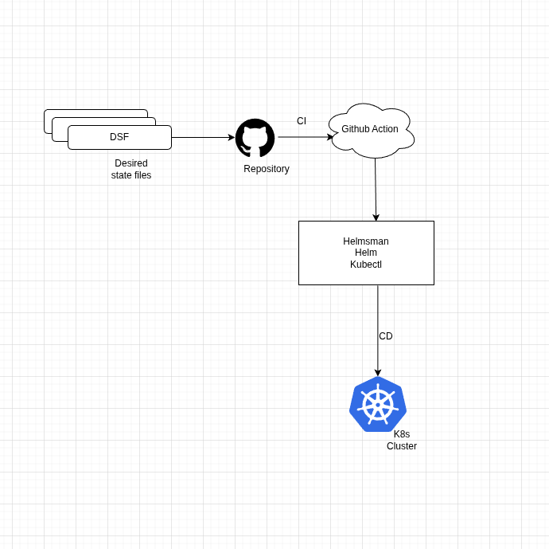

# Helmsman

Helmsman is a tool which is used to manage kubernetes deployment with helm chart, so basically it provides us a way to manage helm releases including installing, deleting and upgrading helm releases based on our requirement using helmsman configuration file/desired State File (DSF).



### Explanation:
Imagine that we have different applications that we want to run on kubernetes which has it’s own process on how to set it up and run it, so helmsman helps us to keep the instructions within the Desired State File (DSF) and follows the instructions present in configuration file to make sure that the applications/services are setup correctly.

Like explaned in the above point we tell the helmsman what applications we want to run and how we want them to set up using simple Desired State File (DSF). helmsman uses a simple declarative TOML file to allow you to describe a desired state for your k8s applications. Alternatively YAML declaration is also acceptable.

The Desired State File (DSF) tells the helmsman on how the deployments should be handled like “install this app”, “use this version of app” or “make sure this app is running on these many number of instances”.

Helmsman sees what you desire, validates that your desire makes sense, compares it with the current state of Helm and figures out what to do to make your desire come true.


### Working:
Helmsman gets its directions to navigate from a declarative file called Desired State File (DSF) maintained by the user (Kubernetes admin) and is usually version controlled. DSFs follow a specification which allows user to define how to connect to a Kubernetes cluster, what namespaces to use/create, what Helm repos to use for finding charts, and what instances (aka releases) of the chart to be installed/deleted/rolled back/upgraded and with what input parameters.

Helmsman interprets your wishes from the DSF and compares it to what’s running in the designated cluster. It is smart enough to figure out what changes need to be applied to make your wishes come true without maintaining/storing any additional information anywhere.

Note: To get more information about desired state file(DSF) please check the README.md file located in dsf directory.

### Installation:

Please make sure the following are installed prior to using helmsman as a binary:

* [kubectl](https://github.com/kubernetes/kubectl)
* [helm](https://github.com/helm/helm) (helm >=v2.10.0 for helmsman >= 1.6.0, helm >=v3.0.0 for helmsman >=v3.0.0)
* [helm-diff](https://github.com/databus23/helm-diff) (helmsman >= 1.6.0)

Check the [releases](https://github.com/Praqma/Helmsman/releases) page for the different versions.
```
# on Linux
curl -L https://github.com/Praqma/helmsman/releases/download/v3.17.0/helmsman_3.17.0_linux_amd64.tar.gz | tar zx
# on MacOS
curl -L https://github.com/Praqma/helmsman/releases/download/v3.17.0/helmsman_3.17.0_darwin_amd64.tar.gz | tar zx

mv helmsman /usr/local/bin/helmsman
```

### Helmsman commands:

The below commands can be exicuted manually via cmd terminal

To plan without executing:

```helmsman -f example.yaml```

To plan and execute the plan:

```helmsman --apply -f example.yaml```

To run a dry-run:

```helmsman --dry-run -f example.yaml```

To limit execution to specific application:

```helmsman --dry-run --target artifactory -f example.yaml```