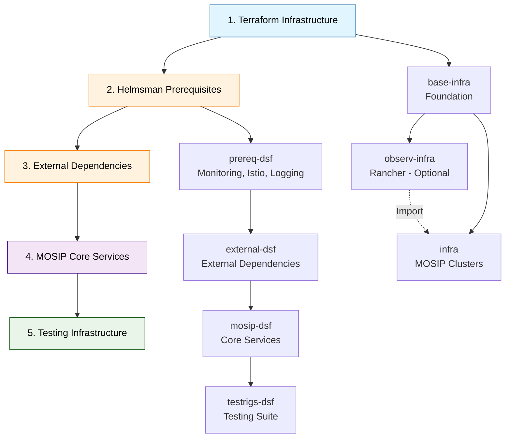

# MOSIP Infrastructure Deployment


> **Rapid deployment model for complete MOSIP platform infrastructure and services**

This repository provides a **3-step rapid deployment model** for MOSIP (Modular Open Source Identity Platform) that covers infrastructure provisioning, dependency setup, and complete MOSIP service deployment.

## 🚀 Rapid Deployment Model

### Step 1: Infrastructure Creation (Terraform)
**Create cloud infrastructure using Terraform**

```bash
cd terraform/
# Follow the detailed Terraform documentation
```

**Infrastructure Components:**
1. **base-infra** - Foundation infrastructure (VPC, networking, security)
2. **observ-infra** - Management cluster with Rancher UI (Optional)
3. **infra** - MOSIP application clusters with optional Rancher import

**GitHub Actions Integration:**
- Automated infrastructure provisioning
- Branch-based environment isolation  
- Optional Rancher cluster import automation

📖 **[Complete Terraform Documentation](terraform/README.md)**

---

### Step 2: External Dependencies & Monitoring (Helmsman)
**Deploy prerequisites and external dependencies using Helmsman**

```bash
cd Helmsman/
# Follow the detailed Helmsman documentation
```

**Deployment Sequence:**
1. **prereq-dsf** - Deploy prerequisites (monitoring, Istio, logging)
2. **external-dsf** - Deploy external dependencies (databases, message queues, storage)

**What gets deployed:**

**Prerequisites (prereq-dsf):**
- **Monitoring stack** (Rancher monitoring, Grafana, AlertManager)
- **Logging infrastructure** (Cattle logging system)
- **Service mesh** (Istio) and networking components

**External Dependencies (external-dsf):**
- **Databases** (PostgreSQL with initialization)
- **Identity & Access** (Keycloak)
- **Security** (SoftHSM, ClamAV antivirus)
- **Object Storage** (MinIO)
- **Message Queues** (ActiveMQ, Kafka with UI)
- **Supporting services** (S3, message gateways, CAPTCHA, landing page)

📖 **[Complete Helmsman Documentation](Helmsman/README.md)**

---

### Step 3: MOSIP Core Services & Testing (Helmsman + GitHub Actions)
**Deploy MOSIP core services and testing infrastructure**

**MOSIP Core Deployment:**
```bash
cd Helmsman/
# Deploy MOSIP core services
```

1. **mosip-dsf** - Deploy MOSIP core services (Identity, Authentication, etc.)

**Testing Infrastructure (GitHub Actions):**
- **testrigs-dsf** - Automated deployment of testing suite:
  - **API Test Rig** - API testing automation
  - **DSL Test Rig** - Domain-specific language testing  
  - **UI Test Rig** - User interface testing automation

📖 **[Helmsman DSF Documentation](Helmsman/dsf/README.md)**

---

## 📋 Complete Deployment Flow



## ⚙️ GitHub Actions Automation

### Infrastructure Automation
- **terraform.yml** - Automated infrastructure provisioning
- **terraform-destroy.yml** - Infrastructure cleanup automation

### Application Deployment Automation  
- **helmsman_external.yml** - External dependencies deployment
- **helmsman_mosip.yml** - MOSIP core services deployment
- **helmsman_testrigs.yml** - Testing infrastructure deployment

📖 **[GitHub Actions Documentation](.github/workflows/README.md)**

---

## 🏗️ Architecture Overview

### Infrastructure Layer (Terraform)
```
terraform/
├── base-infra/          # Foundation infrastructure (VPC, networking, security)
├── observ-infra/        # Management cluster with Rancher UI (Optional)
├── infra/               # MOSIP Kubernetes clusters
├── modules/             # Reusable Terraform modules
│   ├── aws/             # AWS-specific modules
│   ├── azure/           # Azure-specific modules
│   └── gcp/             # GCP-specific modules
└── implementations/     # Cloud-specific implementations
    ├── aws/             # AWS deployment configurations
    ├── azure/           # Azure deployment configurations
    └── gcp/             # GCP deployment configurations
```

### Application Layer (Helmsman)
```
Helmsman/
├── dsf/                 # Desired State Files for deployments
│   ├── prereq-dsf.yaml  # Prerequisites (monitoring, Istio, logging)
│   ├── external-dsf.yaml # External dependencies (PostgreSQL, Keycloak, MinIO, ActiveMQ, Kafka)
│   ├── mosip-dsf.yaml   # MOSIP core services (Identity, Auth, Registration)
│   └── testrigs-dsf.yaml # Testing suite (API, DSL, UI test rigs)
├── hooks/               # Deployment automation scripts
└── utils/               # Utilities and configurations
    ├── istio-addons/    # Service mesh components
    ├── logging/         # Logging stack configurations
    └── monitoring/      # Monitoring and alerting setup
```

### Automation Layer (GitHub Actions)
```
.github/workflows/
├── terraform.yml        # Infrastructure provisioning workflow
├── terraform-destroy.yml # Infrastructure cleanup workflow
├── helmsman_external.yml # External dependencies deployment
├── helmsman_mosip.yml   # MOSIP core services deployment
└── helmsman_testrigs.yml # Testing infrastructure deployment
```

---

## 🚦 Prerequisites

### Required Setup
1. **Cloud Account** - AWS, Azure, or GCP with appropriate permissions
2. **Domain Name** - Registered domain for MOSIP services
3. **GitHub Repository** - Forked repository with secrets configured
4. **SSH Keys** - Key pair for infrastructure access

### GitHub Secrets Configuration
```bash
# Cloud provider credentials
AWS_ACCESS_KEY_ID, AWS_SECRET_ACCESS_KEY
# OR
AZURE_CREDENTIALS
# OR  
GCP_SERVICE_ACCOUNT_KEY

# Infrastructure access
SSH_PRIVATE_KEY          # Private key for server access
MOSIP_EMAIL_ID          # Email for SSL certificate notifications
```

---

## 🎯 Quick Start Guide

### 1. Fork & Configure Repository
```bash
# Fork this repository to your GitHub account
# Configure required GitHub secrets
# Create environment-specific branch (optional)
```

### 2. Deploy Infrastructure
```bash
# Navigate to GitHub Actions
# Run "terraform plan / apply" workflow
# Select target cloud provider and environment
# Monitor deployment progress
```

### 3. Deploy Dependencies & MOSIP
```bash
# Run "helmsman external" workflow (prerequisites + monitoring)
# Run "helmsman mosip" workflow (core MOSIP services)  
# Run "helmsman testrigs" workflow (testing infrastructure)
```

### 4. Access MOSIP Platform
```bash
# Access Rancher UI (if observ-infra deployed)
# Access MOSIP services via configured domain
# Run automated tests via deployed test rigs
```

---

## 📚 Detailed Documentation

| Component | Purpose | Documentation |
|-----------|---------|---------------|
| **Terraform** | Infrastructure provisioning | [terraform/README.md](terraform/README.md) |
| **Helmsman** | Application deployment | [Helmsman/README.md](Helmsman/README.md) |
| **GitHub Actions** | CI/CD automation | [.github/workflows/README.md](.github/workflows/README.md) |
| **Architecture** | Visual diagrams | [docs/_images/ARCHITECTURE_DIAGRAMS.md](docs/_images/ARCHITECTURE_DIAGRAMS.md) |

---

## 🔧 Optional Components

### Rancher Management (observ-infra)
- **Purpose**: Centralized Kubernetes cluster management
- **Features**: Multi-cluster UI, RBAC, monitoring dashboards
- **Deployment**: Optional during infrastructure provisioning
- **Import**: MOSIP clusters can be optionally imported to Rancher

### Advanced Monitoring
- **Infrastructure monitoring** via cloud-native tools
- **Application monitoring** via Prometheus/Grafana
- **Log aggregation** via ELK/EFK stack
- **Alerting** via AlertManager integration

---

## 🆘 Support & Troubleshooting

### Common Issues
- **Infrastructure failures**: Check Terraform logs in GitHub Actions
- **Deployment failures**: Review Helmsman logs and Kubernetes events
- **Access issues**: Verify DNS configuration and SSL certificates
- **Test failures**: Check test rig logs and service dependencies

### Getting Help
- **GitHub Issues**: Report bugs and request features
- **Documentation**: Comprehensive guides in component directories
- **Community**: MOSIP community support channels

---

## 📄 License

This project is licensed under the [Mozilla Public License 2.0](LICENSE).

---

*For detailed technical documentation, refer to the component-specific README files linked above.*
