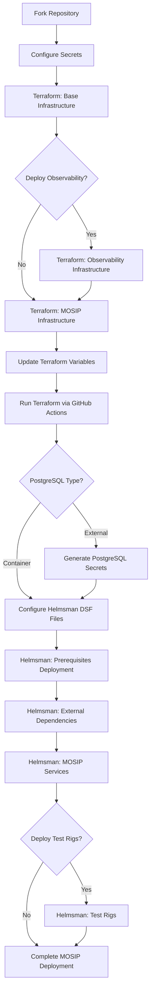

# MOSIP Rapid Deployment


> **Complete MOSIP platform rapid deployment with infrastructure provisioning, dependency setup, and service deployment**

This repository provides a **3-step rapid deployment model** for MOSIP (Modular Open Source Identity Platform) with enhanced security features including GPG encryption for local backends, optional external PostgreSQL support, and automated PostgreSQL secret management.

## 🚀 Complete Deployment Flow



## 📋 Prerequisites

> **Note:** As of now, Terraform scripts are available for AWS, Azure, and GCP. Community contributions are welcome for other cloud providers - placeholder structures are available.

### Required Cloud Provider Account

- AWS, Azure, or GCP account with appropriate permissions
- Service account/access keys with infrastructure creation rights

### Required Secrets for Rapid Deployment

> **📝 Secret Configuration Types:**
> - **Repository Secrets**: Global secrets shared across all environments (set once in GitHub repo settings)
> - **Environment Secrets**: Environment-specific secrets (configured per deployment environment)

#### 🔐 Terraform Secrets

**Repository Secrets** (configured in GitHub repository settings):
```yaml
# GPG Encryption (for local backend)
GPG_PASSPHRASE: "your-gpg-passphrase"  # Required for GPG encryption

# Cloud Provider Credentials
AWS_ACCESS_KEY_ID: "AKIA..."           # AWS Access Key ID
AWS_SECRET_ACCESS_KEY: "..."           # AWS Secret Access Key
```

**Environment Secrets** (configured per deployment environment):
```yaml
# WireGuard VPN (optional - for infrastructure access)
TF_WG_CONFIG: |
  [Interface]
  PrivateKey = terraform-private-key
  Address = 10.0.1.2/24
  
  [Peer]
  PublicKey = server-public-key
  Endpoint = your-server:51820
  AllowedIPs = 10.0.0.0/16

# Notifications (optional)
SLACK_WEBHOOK_URL: "https://hooks.slack.com/services/..."  # Slack notifications
GITHUB_TOKEN: "ghp_..."                                    # GitHub token for API access
```

#### 🎡 Helmsman Secrets

**Environment Secrets** (configured per deployment environment):
```yaml
# Kubernetes Access
KUBECONFIG: "apiVersion: v1..."  # Complete kubeconfig file content

# WireGuard VPN Access (for cluster access)
CLUSTER_WIREGUARD_WG0: |
  [Interface]
  PrivateKey = helmsman-wg0-private-key
  Address = 10.0.0.2/24
  
  [Peer]
  PublicKey = cluster-public-key
  Endpoint = cluster-server:51820
  AllowedIPs = 10.0.0.0/16

# Secondary WireGuard Config (optional)
CLUSTER_WIREGUARD_WG1: |
  [Interface]
  PrivateKey = helmsman-wg1-private-key
  Address = 10.0.2.2/24
  
  [Peer]
  PublicKey = cluster-public-key-2
  Endpoint = cluster-server-2:51820
  AllowedIPs = 10.0.0.0/16

# PostgreSQL (if using external deployment)
POSTGRES_PASSWORD: "your-secure-postgres-password"
```

## 🚀 Quick Start Guide

### 1. Fork and Setup Repository

```bash
# Fork the repository to your GitHub account
# Clone your fork
git clone https://github.com/YOUR_USERNAME/infra.git
cd infra
```

### 2. Configure GitHub Secrets

Navigate to your repository → **Settings** → **Secrets and variables** → **Actions**

**Configure Repository & Environment Secrets:**

Add the required secrets as follows:
- **Repository Secrets** (Settings > Secrets and variables > Actions > Repository secrets):
  - `GPG_PASSPHRASE`
  - `AWS_ACCESS_KEY_ID` 
  - `AWS_SECRET_ACCESS_KEY`

- **Environment Secrets** (Settings > Secrets and variables > Actions > Environment secrets):
  - All other secrets mentioned in the Prerequisites section above (KUBECONFIG, WireGuard configs, etc.)

### 3. Terraform Infrastructure Deployment

#### Step 3a: Base Infrastructure

1. **Update terraform variables:**

   ```bash
   # Edit terraform/base-infra/aws/terraform.tfvars (or azure/gcp)
   ```
2. **Configure base-infra variables:**

   ```hcl
   # Example for AWS
   region = "us-west-2"
   availability_zones = ["us-west-2a", "us-west-2b"]
   vpc_cidr = "10.0.0.0/16"
   environment = "production"
   ```
3. **Run base-infra via GitHub Actions:**

   - Go to **Actions** → **Terraform Base Infrastructure**
   - Click **Run workflow**
   - Select your branch and cloud provider
   - Choose action: `apply`

#### Step 3b: Observability Infrastructure (Optional)

1. **Update observ-infra variables:**

   ```hcl
   # terraform/observ-infra/aws/terraform.tfvars
   cluster_name = "mosip-observability"
   node_instance_type = "t3.large"
   min_nodes = 1
   max_nodes = 3
   ```
2. **Run observ-infra via GitHub Actions:**

   - Actions → **Terraform Observability Infrastructure**
   - Select cloud provider and run `apply`

#### Step 3c: MOSIP Infrastructure

1. **Update infra variables:**

   ```hcl
   # terraform/infra/aws/terraform.tfvars
   cluster_name = "mosip-cluster"
   node_instance_type = "t3.xlarge"
   min_nodes = 3
   max_nodes = 10

   # NEW: Optional external PostgreSQL
   enable_external_postgres = true  # Set to false for containerized
   postgres_instance_class = "db.t3.large"
   postgres_allocated_storage = 100
   ```
2. **Run main infra via GitHub Actions:**

   - Actions → **Terraform Infrastructure**
   - Select cloud provider and run `apply`

### 4. Helmsman Deployment

#### Step 4a: Generate PostgreSQL Secrets (if using external PostgreSQL)

**Execute this BEFORE updating DSF configuration files:**

1. **Generate PostgreSQL Secrets:**
   - Actions → **Generate PostgreSQL Secrets**
   - Deployment type: `external-node`

#### Step 4b: Update DSF Configuration Files

```bash
cd Helmsman/dsf/
```

1. **Update prereq-dsf.yaml:**

   ```yaml
   # Configure monitoring, Istio, logging
   helmRepos:
     rancher-latest: "https://releases.rancher.com/server-charts/latest"

   apps:
     rancher-monitoring:
       enabled: true
       namespace: cattle-monitoring-system
   ```
2. **Update external-dsf.yaml:**

   ```yaml
   # Configure external dependencies
   apps:
     postgresql:
       enabled: false  # Set to true if using containerized PostgreSQL
     minio:
       enabled: true
     kafka:
       enabled: true
   ```
3. **Update mosip-dsf.yaml:**

   ```yaml
   # Configure MOSIP services
   apps:
     config-server:
       enabled: true
     artifactory:
       enabled: true
     kernel:
       enabled: true
   ```

#### Step 4c: Run Helmsman Deployments via GitHub Actions

1. **Deploy Prerequisites & External Dependencies:**
   - Actions → **Helmsman External Dependencies**
   - Select DSF file: `prereq-dsf.yaml` (first run)
   - Mode: `apply`
   - Then run again with DSF file: `external-dsf.yaml`
   - Mode: `apply`

2. **Deploy MOSIP Services:**
   - Actions → **Helmsman Deployment**
   - Select DSF file: `mosip-dsf.yaml`
   - Mode: `apply`

3. **Deploy Test Rigs** (Optional):
   - Actions → **Helmsman Deployment**  
   - Select DSF file: `testrigs-dsf.yaml`
   - Mode: `apply`

### 5. Verify Deployment

```bash
# Check cluster status
kubectl get nodes
kubectl get namespaces

# Check MOSIP services
kubectl get pods -n mosip
kubectl get services -n istio-system
```

## 🔄 Rapid Deployment Model

### Step 1: Infrastructure Creation (Terraform)

**Create cloud infrastructure using Terraform with enhanced security**

**🔒 New Features:**

- **GPG Encryption** for local Terraform state backend
- **Optional External PostgreSQL** support in infrastructure components
- **Enhanced State Management** with encryption

**Infrastructure Components:**

1. **base-infra** - Foundation infrastructure (VPC, networking, security)
2. **observ-infra** - Management cluster with Rancher UI (Optional)
3. **infra** - MOSIP application clusters with optional external PostgreSQL

**GitHub Actions Integration:**

- Automated infrastructure provisioning with GPG encrypted state
- Branch-based environment isolation
- Optional Rancher cluster import automation
- Support for AWS, Azure, and GCP (community contributions welcome)

**[Complete Terraform Documentation](terraform/README.md)**

---

### Step 2: External Dependencies & Monitoring (Helmsman)

**Deploy prerequisites and external dependencies using Helmsman**

**Deployment Sequence:**

1. **prereq-dsf** - Deploy prerequisites (monitoring, Istio, logging)
2. **external-dsf** - Deploy external dependencies (databases, message queues, storage)

**What gets deployed:**

**Prerequisites (prereq-dsf):**

- **Monitoring stack** (Rancher monitoring, Grafana, AlertManager)
- **Logging infrastructure** (Cattle logging system)
- **Service mesh** (Istio) and networking components

**External Dependencies (external-dsf):**

- **Databases** (PostgreSQL with initialization or external connection)
- **Identity & Access** (Keycloak)
- **Security** (SoftHSM, ClamAV antivirus)
- **Object Storage** (MinIO)
- **Message Queues** (ActiveMQ, Kafka with UI)
- **Supporting services** (S3, message gateways, CAPTCHA, landing page)

**[Complete Helmsman Documentation](Helmsman/README.md)**

---

### Step 3: PostgreSQL Secret Management (GitHub Actions)

**🆕 New automated PostgreSQL secret generation workflow**

**Features:**

- **Automated secret generation** for external PostgreSQL deployments
- **Kubernetes secret management** with proper validation
- **Secure cluster access** via WireGuard VPN
- **Environment-specific** secret handling

**Workflow Integration:**

- Supports both containerized and external PostgreSQL deployments
- Automatic kubectl and kubeconfig setup
- Comprehensive validation and error handling

---

### Step 4: MOSIP Core Services & Testing (Helmsman + GitHub Actions)

**Deploy MOSIP core services and testing infrastructure**

**MOSIP Core Deployment:**

1. **mosip-dsf** - Deploy MOSIP core services (Identity, Authentication, etc.)

**Testing Infrastructure (GitHub Actions):**

- **testrigs-dsf** - Automated deployment of testing suite:
  - **API Test Rig** - API testing automation
  - **DSL Test Rig** - Domain-specific language testing
  - **UI Test Rig** - User interface testing automation

**[Helmsman DSF Documentation](Helmsman/dsf/README.md)**

---

## GitHub Actions Automation

### Infrastructure Automation

- **terraform.yml** - Automated infrastructure provisioning
- **terraform-destroy.yml** - Infrastructure cleanup automation

### Application Deployment Automation

- **helmsman_external.yml** - External dependencies deployment
- **helmsman_mosip.yml** - MOSIP core services deployment
- **helmsman_testrigs.yml** - Testing infrastructure deployment

**[GitHub Actions Documentation](.github/workflows/README.md)**

---

## Architecture Overview

### Infrastructure Layer (Terraform)

```
terraform/
├── base-infra/          # Foundation infrastructure (VPC, networking, security)
├── observ-infra/        # Management cluster with Rancher UI (Optional)
├── infra/               # MOSIP Kubernetes clusters
├── modules/             # Reusable Terraform modules
│   ├── aws/             # AWS-specific modules
│   ├── azure/           # Azure-specific modules
│   └── gcp/             # GCP-specific modules
└── implementations/     # Cloud-specific implementations
    ├── aws/             # AWS deployment configurations
    ├── azure/           # Azure deployment configurations
    └── gcp/             # GCP deployment configurations
```

### Application Layer (Helmsman)

```
Helmsman/
├── dsf/                 # Desired State Files for deployments
│   ├── prereq-dsf.yaml  # Prerequisites (monitoring, Istio, logging)
│   ├── external-dsf.yaml # External dependencies (PostgreSQL, Keycloak, MinIO, ActiveMQ, Kafka)
│   ├── mosip-dsf.yaml   # MOSIP core services (Identity, Auth, Registration)
│   └── testrigs-dsf.yaml # Testing suite (API, DSL, UI test rigs)
├── hooks/               # Deployment automation scripts
└── utils/               # Utilities and configurations
    ├── istio-addons/    # Service mesh components
    ├── logging/         # Logging stack configurations
    └── monitoring/      # Monitoring and alerting setup
```

### Automation Layer (GitHub Actions)

```
.github/workflows/
├── terraform.yml        # Infrastructure provisioning workflow
├── terraform-destroy.yml # Infrastructure cleanup workflow
├── helmsman_external.yml # External dependencies deployment
├── helmsman_mosip.yml   # MOSIP core services deployment
└── helmsman_testrigs.yml # Testing infrastructure deployment
```

---

## 🚀 Quick Start Guide

### 1. Fork & Configure Repository

```bash
# Fork this repository to your GitHub account
# Configure required GitHub secrets
# Create environment-specific branch (optional)
```

### 2. Deploy Infrastructure

```bash
# Navigate to GitHub Actions
# Run "terraform plan / apply" workflow
# Select target cloud provider and environment
# Monitor deployment progress
```

### 3. Deploy Dependencies & MOSIP

```bash
# Run "helmsman external" workflow (prerequisites + monitoring)
# Run "helmsman mosip" workflow (core MOSIP services)  
# Run "helmsman testrigs" workflow (testing infrastructure)
```

### 4. Access MOSIP Platform

```bash
# Access Rancher UI (if observ-infra deployed)
# Access MOSIP services via configured domain
# Run automated tests via deployed test rigs
```

---

## Detailed Documentation

| Component                | Purpose                     | Documentation                                                               |
| ------------------------ | --------------------------- | --------------------------------------------------------------------------- |
| **Terraform**      | Infrastructure provisioning | [terraform/README.md](terraform/README.md)                                     |
| **Helmsman**       | Application deployment      | [Helmsman/README.md](Helmsman/README.md)                                       |
| **GitHub Actions** | CI/CD automation            | [.github/workflows/README.md](.github/workflows/README.md)                     |
| **Architecture**   | Visual diagrams             | [docs/_images/ARCHITECTURE_DIAGRAMS.md](docs/_images/ARCHITECTURE_DIAGRAMS.md) |

---

## Optional Components

### Rancher Management (observ-infra)

- **Purpose**: Centralized Kubernetes cluster management
- **Features**: Multi-cluster UI, RBAC, monitoring dashboards
- **Deployment**: Optional during infrastructure provisioning
- **Import**: MOSIP clusters can be optionally imported to Rancher

### Advanced Monitoring

- **Infrastructure monitoring** via cloud-native tools
- **Application monitoring** via Prometheus/Grafana
- **Log aggregation** via ELK/EFK stack
- **Alerting** via AlertManager integration

---

## Support & Troubleshooting

### Common Issues

- **Infrastructure failures**: Check Terraform logs in GitHub Actions
- **Deployment failures**: Review Helmsman logs and Kubernetes events
- **Access issues**: Verify DNS configuration and SSL certificates
- **Test failures**: Check test rig logs and service dependencies

### Getting Help

- **GitHub Issues**: Report bugs and request features
- **Documentation**: Comprehensive guides in component directories
- **Community**: MOSIP community support channels

---

## License

This project is licensed under the [Mozilla Public License 2.0](LICENSE).

---

*For detailed technical documentation, refer to the component-specific README files linked above.*
