# MOSIP Rapid Deployment


> **Complete MOSIP platform rapid deployment with infrastructure provisioning, dependency setup, and service deployment**

This repository provides a **3-step rapid deployment model** for MOSIP (Modular Open Source Identity Platform) with enhanced security features including GPG encryption for local backends and integrated PostgreSQL setup via Terraform modules.

## Complete Deployment Flow

```mermaid
graph TB
    %% Prerequisites
    A[Fork Repository] --> B[Configure Secrets]
    B --> C[Select Cloud Provider<br/>AWS/Azure/GCP]
    
    %% Infrastructure Phase
    C --> D[Terraform: Base Infrastructure<br/>VPC, Networking, Jumpserver, WireGuard]
    D --> E{Deploy Observability?}
    E -->|Yes| F[Terraform: Observability Infrastructure<br/>Rancher UI, Keycloak, Monitoring]
    E -->|No| G[Configure PostgreSQL Setup]
    F --> G[Configure PostgreSQL Setup]
    
    %% PostgreSQL Configuration
    G --> H{PostgreSQL Deployment Choice}
    H -->|Production| I[Set enable_postgresql_setup = true<br/>External PostgreSQL via Terraform]
    H -->|Development| J[Set enable_postgresql_setup = false<br/>Container PostgreSQL via Helmsman]
    
    %% Terraform Infrastructure Deployment
    I --> K[Terraform: MOSIP Infrastructure<br/>+ Auto PostgreSQL Setup via Ansible]
    J --> L[Terraform: MOSIP Infrastructure<br/>Kubernetes Cluster Only]
    K --> M[Run Terraform via GitHub Actions<br/>GPG Encrypted State Management]
    L --> M
    
    %% Helmsman Configuration
    M --> N{PostgreSQL Setup Complete?}
    N -->|External PostgreSQL| O[Configure Helmsman DSF Files<br/>postgresql.enabled = false]
    N -->|Container PostgreSQL| P[Configure Helmsman DSF Files<br/>postgresql.enabled = true]
    
    %% Helmsman Deployment Phase
    O --> Q[Helmsman: Prerequisites<br/>Monitoring, Istio, Logging]
    P --> Q
    Q --> R[Helmsman: External Dependencies<br/>PostgreSQL containers, Keycloak, MinIO, Kafka]
    
    %% MOSIP Services
    R --> S[Helmsman: MOSIP Core Services<br/>Registration, Authentication, ID Repository]
    S --> T{Deploy Test Rigs?}
    T -->|Yes| U[Helmsman: Test Rigs<br/>API Testing, UI Testing, DSL Testing]
    T -->|No| V[Verify Deployment]
    U --> V
    
    %% Final Verification
    V --> W[Access MOSIP Platform<br/>Web UI, APIs, Admin Console]
    W --> X[Complete MOSIP Platform<br/>Ready for Production]
    
    %% Styling
    classDef prereq fill:#fff3e0,stroke:#ff8f00,stroke-width:2px
    classDef terraform fill:#e3f2fd,stroke:#1976d2,stroke-width:2px
    classDef helmsman fill:#f3e5f5,stroke:#7b1fa2,stroke-width:2px
    classDef postgres fill:#c8e6c9,stroke:#2e7d32,stroke-width:2px
    classDef success fill:#e8f5e8,stroke:#388e3c,stroke-width:2px
    classDef decision fill:#fce4ec,stroke:#c2185b,stroke-width:2px
    classDef config fill:#f1f8e9,stroke:#689f38,stroke-width:2px
    
    class A,B,C prereq
    class D,F,I,J,K,L,M terraform
    class O,P,Q,R,S,U helmsman
    class G,H,N postgres
    class V,W,X success
    class E,H,N,T decision
    class G,O,P config
```



> **Note:** Complete Terraform scripts are available only for **AWS**. For **Azure and GCP**, only placeholder structures are configured - community contributions are welcome to implement full functionality.

## Prerequisites

### Required Cloud Provider Account

- **AWS account** with appropriate permissions (fully supported)
- Azure or GCP account (placeholder implementations - community contributions needed)
- Service account/access keys with infrastructure creation rights

### Required Secrets for Rapid Deployment

> **Secret Configuration Types:**
> - **Repository Secrets**: Global secrets shared across all environments (set once in GitHub repo settings)
> - **Environment Secrets**: Environment-specific secrets (configured per deployment environment)

#### Terraform Secrets

**Repository Secrets** (configured in GitHub repository settings):
```yaml
# GPG Encryption (for local backend)
GPG_PASSPHRASE: "your-gpg-passphrase"  # Required for GPG encryption

# Cloud Provider Credentials
AWS_ACCESS_KEY_ID: "AKIA..."           # AWS Access Key ID
AWS_SECRET_ACCESS_KEY: "..."           # AWS Secret Access Key
```

**Environment Secrets** (configured per deployment environment):
```yaml
# WireGuard VPN (optional - for infrastructure access)
TF_WG_CONFIG: |
  [Interface]
  PrivateKey = terraform-private-key
  Address = 10.0.1.2/24
  
  [Peer]
  PublicKey = server-public-key
  Endpoint = your-server:51820
  AllowedIPs = 10.0.0.0/16

# Notifications (optional)
SLACK_WEBHOOK_URL: "https://hooks.slack.com/services/..."  # Slack notifications
GITHUB_TOKEN: "ghp_..."                                    # GitHub token for API access
```

#### Helmsman Secrets

**Environment Secrets** (configured per deployment environment):
```yaml
# Kubernetes Access
KUBECONFIG: "apiVersion: v1..."  # Complete kubeconfig file content

# WireGuard VPN Access (for cluster access)
CLUSTER_WIREGUARD_WG0: |
  [Interface]
  PrivateKey = helmsman-wg0-private-key
  Address = 10.0.0.2/24
  
  [Peer]
  PublicKey = cluster-public-key
  Endpoint = cluster-server:51820
  AllowedIPs = 10.0.0.0/16

# Secondary WireGuard Config (optional)
CLUSTER_WIREGUARD_WG1: |
  [Interface]
  PrivateKey = helmsman-wg1-private-key
  Address = 10.0.2.2/24
  
  [Peer]
  PublicKey = cluster-public-key-2
  Endpoint = cluster-server-2:51820
  AllowedIPs = 10.0.0.0/16
```

> **Note**: PostgreSQL secrets are no longer required! PostgreSQL setup is handled automatically by Terraform modules and Ansible scripts based on your `enable_postgresql_setup` configuration.

## Quick Start Guide

### 1. Fork and Setup Repository

```bash
# Fork the repository to your GitHub account
# Clone your fork
git clone https://github.com/YOUR_USERNAME/infra.git
cd infra
```

### 2. Configure GitHub Secrets

Navigate to your repository → **Settings** → **Secrets and variables** → **Actions**

**Configure Repository & Environment Secrets:**

Add the required secrets as follows:
- **Repository Secrets** (Settings > Secrets and variables > Actions > Repository secrets):
  - `GPG_PASSPHRASE`
  - `AWS_ACCESS_KEY_ID` 
  - `AWS_SECRET_ACCESS_KEY`

- **Environment Secrets** (Settings > Secrets and variables > Actions > Environment secrets):
  - All other secrets mentioned in the Prerequisites section above (KUBECONFIG, WireGuard configs, etc.)

### 3. Terraform Infrastructure Deployment

#### Step 3a: Base Infrastructure

1. **Update terraform variables:**

   ```bash
   # Edit terraform/base-infra/aws/terraform.tfvars (or azure/gcp)
   ```
2. **Configure base-infra variables:**

   ```hcl
   # Example for AWS
   region = "us-west-2"
   availability_zones = ["us-west-2a", "us-west-2b"]
   vpc_cidr = "10.0.0.0/16"
   environment = "production"
   ```
3. **Run base-infra via GitHub Actions:**

   - Go to **Actions** → **Terraform Base Infrastructure**
   - Click **Run workflow**
   - Select your branch and cloud provider
   - Choose action: `apply`

#### Step 3b: Observability Infrastructure (Optional)

1. **Update observ-infra variables:**

   ```hcl
   # terraform/observ-infra/aws/terraform.tfvars
   cluster_name = "mosip-observability"
   node_instance_type = "t3.large"
   min_nodes = 1
   max_nodes = 3
   ```
2. **Run observ-infra via GitHub Actions:**

   - Actions → **Terraform Observability Infrastructure**
   - Select cloud provider and run `apply`

#### Step 3c: MOSIP Infrastructure

1. **Update infra variables in `terraform/implementations/aws/infra/aws.tfvars`:**

   Complete configuration example with detailed explanations:

   ```hcl
   # Environment name (infra component)
   cluster_name = "soil38"
   # MOSIP's domain (ex: sandbox.xyz.net)
   cluster_env_domain = "soil38.mosip.net"
   # Email-ID will be used by certbot to notify SSL certificate expiry via email
   mosip_email_id = "chandra.mishra@technoforte.co.in"
   # SSH login key name for AWS node instances (ex: my-ssh-key)
   ssh_key_name = "mosip-aws"
   # The AWS region for resource creation
   aws_provider_region = "ap-south-1"

   # Specific availability zones for VM deployment (optional)
   # If empty, uses all available AZs in the region
   # Example: ["ap-south-1a", "ap-south-1b"] for specific AZs
   # Example: [] for all available AZs in the region
   specific_availability_zones = []

   # The instance type for Kubernetes nodes (control plane, worker, etcd)
   k8s_instance_type = "t3a.2xlarge"
   # The instance type for Nginx server (load balancer)
   nginx_instance_type = "t3a.2xlarge"
   # The Route 53 hosted zone ID
   zone_id = "Z090954828SJIEL6P5406"

   ## UBUNTU 24.04
   # The Amazon Machine Image ID for the instances
   ami = "ami-0ad21ae1d0696ad58"

   # Repo K8S-INFRA URL
   k8s_infra_repo_url = "https://github.com/mosip/k8s-infra.git"
   # Repo K8S-INFRA branch
   k8s_infra_branch = "MOSIP-42914"
   # NGINX Node's Root volume size
   nginx_node_root_volume_size = 24
   # NGINX node's EBS volume size
   nginx_node_ebs_volume_size = 300
   # NGINX node's second EBS volume size (optional - set to 0 to disable)
   nginx_node_ebs_volume_size_2 = 200 # Enable second EBS volume for PostgreSQL testing
   # Kubernetes nodes Root volume size
   k8s_instance_root_volume_size = 64

   # Control-plane, ETCD, Worker
   k8s_control_plane_node_count = 3
   # ETCD, Worker
   k8s_etcd_node_count = 3
   # Worker
   k8s_worker_node_count = 2

   # RKE2 Version Configuration
   rke2_version = "v1.28.9+rke2r1"

   # Rancher Import Configuration
   enable_rancher_import = false

   # Security group CIDRs
   network_cidr   = "10.0.0.0/8" # Use your actual VPC CIDR
   WIREGUARD_CIDR = "10.0.0.0/8" # Use your actual WireGuard VPN CIDR

   # Rancher Import URL
   rancher_import_url = "\"kubectl apply -f https://rancher.mosip.net/v3/import/dzshvnb6br7qtf267zsrr9xsw6tnb2vt4x68g79r2wzsnfgvkjq2jk_c-m-b5249w76.yaml\""
   # DNS Records to map
   subdomain_public   = ["resident", "prereg", "esignet", "healthservices", "signup"]
   subdomain_internal = ["admin", "iam", "activemq", "kafka", "kibana", "postgres", "smtp", "pmp", "minio", "regclient", "compliance"]

   # PostgreSQL Configuration (used when second EBS volume is enabled)
   enable_postgresql_setup = true # Enable PostgreSQL setup for main infra
   postgresql_version      = "15"
   storage_device          = "/dev/nvme2n1"
   mount_point             = "/srv/postgres"
   postgresql_port         = "5433"

   # MOSIP Infrastructure Repository Configuration
   mosip_infra_repo_url = "https://github.com/mosip/mosip-infra.git"
   mosip_infra_branch = "develop"

   # VPC Configuration - Existing VPC to use (discovered by Name tag)
   vpc_name = "mosip-boxes"
   ```

   **Key Configuration Variables Explained:**

   | Variable | Description | Example Value |
   |----------|-------------|---------------|
   | `cluster_name` | Unique identifier for your MOSIP cluster | `"soil38"` |
   | `cluster_env_domain` | Domain name for MOSIP services access | `"soil38.mosip.net"` |
   | `mosip_email_id` | Email for SSL certificate notifications | `"admin@example.com"` |
   | `ssh_key_name` | AWS EC2 key pair name for SSH access | `"mosip-aws"` |
   | `aws_provider_region` | AWS region for resource deployment | `"ap-south-1"` |
   | `zone_id` | Route 53 hosted zone ID for DNS management | `"Z090954828SJIEL6P5406"` |
   | `k8s_instance_type` | EC2 instance type for Kubernetes nodes | `"t3a.2xlarge"` |
   | `nginx_instance_type` | EC2 instance type for load balancer | `"t3a.2xlarge"` |
   | `ami` | Amazon Machine Image ID (Ubuntu 24.04) | `"ami-0ad21ae1d0696ad58"` |
   | `enable_postgresql_setup` | External PostgreSQL setup via Terraform | `true` (external) / `false` (container) |
   | `nginx_node_ebs_volume_size_2` | EBS volume size for PostgreSQL data (GB) | `200` |
   | `postgresql_version` | PostgreSQL version to install | `"15"` |
   | `postgresql_port` | PostgreSQL service port | `"5433"` |
   | `vpc_name` | Existing VPC name tag to use | `"mosip-boxes"` |

   > **Important Notes:**
   > - Ensure `cluster_name` and `cluster_env_domain` match values used in Helmsman DSF files
   > - Set `enable_postgresql_setup = true` for production deployments with external PostgreSQL
   > - Set `enable_postgresql_setup = false` for development deployments with containerized PostgreSQL
   > - The `nginx_node_ebs_volume_size_2` is required when `enable_postgresql_setup = true`
2. **Run main infra via GitHub Actions:**

   - Actions → **Terraform Infrastructure**
   - Select cloud provider and run `apply`
   - If `enable_postgresql_setup = true`, Terraform will automatically:
     - Provision dedicated EBS volume for PostgreSQL
     - Install and configure PostgreSQL 15 via Ansible
     - Setup security and backup configurations
     - Make PostgreSQL ready for MOSIP services

### 4. Helmsman Deployment

#### Step 4a: Update DSF Configuration Files

1. **Clone the MOSIP infra repository and navigate to Helmsman directory:**

   ```bash
   git clone https://github.com/mosip/infra.git
   cd infra/Helmsman
   ```

2. **Navigate to DSF configuration directory:**

   ```bash
   cd dsf/
   ```

3. **Update prereq-dsf.yaml:**

   - **Search and replace the following values:**
     - `<sandbox>` → your cluster name (e.g., `soil`)
     - `sandbox.xyz.net` → your domain name (e.g., `soil.mosip.net`)

   > **Note:** Maintain consistency with your Terraform configuration:
   > - `<sandbox>` should match `cluster_name` in `aws.tfvars` 
   > - `sandbox.xyz.net` should match `cluster_env_domain` in `aws.tfvars`

   ```yaml
   # Configure monitoring, Istio, logging
   helmRepos:
     rancher-latest: "https://releases.rancher.com/server-charts/latest"

   apps:
     rancher-monitoring:
       enabled: true
       namespace: cattle-monitoring-system
   ```
4. **Update external-dsf.yaml:**

   - **Search and replace the following values:**
     - `<sandbox>` → your cluster name (e.g., `soil`)
     - `sandbox.xyz.net` → your domain name (e.g., `soil.mosip.net`)

   > **Note:** Maintain consistency with your Terraform configuration:
   > - `<sandbox>` should match `cluster_name` in `aws.tfvars` 
   > - `sandbox.xyz.net` should match `cluster_env_domain` in `aws.tfvars`

   - **Configure reCAPTCHA keys:**
     
     1. **Create reCAPTCHA keys for each domain:**
        - Go to [Google reCAPTCHA Admin](https://www.google.com/recaptcha/admin/create)
        - Create reCAPTCHA v2 ("I'm not a robot" Checkbox) for each domain:
          - **PreReg domain**: `prereg.your-domain.net` (e.g., `prereg.soil.mosip.net`)
          - **Admin domain**: `admin.your-domain.net` (e.g., `admin.soil.mosip.net`)
          - **Resident domain**: `resident.your-domain.net` (e.g., `resident.soil.mosip.net`)

     2. **Update captcha-setup.sh arguments in external-dsf.yaml (around line 315):**
        ```yaml
        hooks:
          postInstall: "$WORKDIR/hooks/captcha-setup.sh PREREG_SITE_KEY PREREG_SECRET_KEY ADMIN_SITE_KEY ADMIN_SECRET_KEY RESIDENT_SITE_KEY RESIDENT_SECRET_KEY"
        ```
        
        **Arguments order:**
        - **Argument 1**: PreReg site key
        - **Argument 2**: PreReg secret key  
        - **Argument 3**: Admin site key
        - **Argument 4**: Admin secret key
        - **Argument 5**: Resident site key
        - **Argument 6**: Resident secret key

     3. **Example configuration:**
        ```yaml
        hooks:
          postInstall: "$WORKDIR/hooks/captcha-setup.sh 6LfkAMwrAAAAAATB1WhkIhzuAVMtOs9VWabODoZ_ 6LfkAMwrAAAAAHQAT93nTGcLKa-h3XYhGoNSG-NL 6LdNAcwrAAAAAETGWvz-3I12vZ5V8vPJLu2ct9CO 6LdNAcwrAAAAAE4iWGJ-g6Dc2HreeJdIwAl5h1iL 6LdRAcwrAAAAAFUEHHKK5D_bSrwAPqdqAJqo4mCk 6LdRAcwrAAAAAOeVl6yHGBCBA8ye9GsUOy4pi9s9"
        ```

   ```yaml
   # Configure external dependencies
   apps:
     postgresql:
       # Set based on your Terraform configuration:
       enabled: false  # false if enable_postgresql_setup = true (external PostgreSQL via Terraform)
                      # true if enable_postgresql_setup = false (container PostgreSQL)
     minio:
       enabled: true
     kafka:
       enabled: true
   ```
5. **Update mosip-dsf.yaml:**

   - **Search and replace the following values:**
     - `<sandbox>` → your cluster name (e.g., `soil`)
     - `sandbox.xyz.net` → your domain name (e.g., `soil.mosip.net`)

   > **Note:** Maintain consistency with your Terraform configuration:
   > - `<sandbox>` should match `cluster_name` in `aws.tfvars` 
   > - `sandbox.xyz.net` should match `cluster_env_domain` in `aws.tfvars`

   ```yaml
   # Configure MOSIP services  
   apps:
     config-server:
       enabled: true
     artifactory:
       enabled: true
     kernel:
       enabled: true
   ```

> **Note:** Apply the same search and replace pattern to **all DSF files** including `testrigs-dsf.yaml` if you plan to deploy test rigs:
> - `<sandbox>` → your cluster name (e.g., `soil`)
> - `sandbox.xyz.net` → your domain name (e.g., `soil.mosip.net`)
>
> **Important:** Ensure consistency with your Terraform configuration:
> - `<sandbox>` should match `cluster_name` in `terraform/implementations/aws/infra/aws.tfvars`
> - `sandbox.xyz.net` should match `cluster_env_domain` in `terraform/implementations/aws/infra/aws.tfvars`

#### Step 4b: Configure Repository Secrets for Helmsman

**After updating all DSF files**, configure the required repository secrets for Helmsman deployments:

1. **Update Repository Branch Configuration:**
   - Ensure your repository is configured to use the correct branch for Helmsman workflows
   - Verify GitHub Actions have access to your deployment branch

2. **Configure KUBECONFIG Secret:**
   
   **Locate the Kubernetes config file:**
   ```bash
   # After Terraform infrastructure deployment completes, find the kubeconfig file in:
   terraform/implementations/aws/infra/
   ```
   
   **Add KUBECONFIG as Environment Secret:**
   - Go to your GitHub repository → Settings → Environments
   - Select or create environment for your branch (e.g., `release-0.1.0`, `main`, `develop`)
   - Click "Add secret" under Environment secrets
   - Name: `KUBECONFIG`
   - Value: Copy the entire contents of the kubeconfig file from `terraform/implementations/aws/infra/`
   
   **Example kubeconfig file location:**
   ```
   terraform/implementations/aws/infra/kubeconfig_<cluster-name>
   ```
   
   **Branch Environment Configuration:**
   - Ensure the environment name matches your deployment branch
   - Configure environment protection rules if needed
   - Verify Helmsman workflows reference the correct environment

3. **Required Environment Secrets for Helmsman:**
   
   **Environment Secrets (branch-specific):**
   ```yaml
   # Kubernetes Access (Environment Secret)
   KUBECONFIG: "<contents-of-kubeconfig-file>"
   ```
   
   **Repository Secrets (global):**
   ```yaml
   # GPG Encryption (if using encrypted backends)
   GPG_PASSPHRASE: "your-gpg-passphrase"
   
   # AWS Credentials (if not using OIDC)
   AWS_ACCESS_KEY_ID: "AKIA..."
   AWS_SECRET_ACCESS_KEY: "..."
   ```

4. **Verify Secret Configuration:**
   - Ensure KUBECONFIG is configured as environment secret for your branch
   - Verify repository secrets are properly configured
   - Test repository access from GitHub Actions
   - Verify KUBECONFIG provides cluster access

> **Important:** 
> - **KUBECONFIG**: Must be added as Environment Secret tied to your deployment branch name
> - **Branch Environment**: Ensure environment name matches your branch (e.g., `release-0.1.0`)
> - **File Source**: KUBECONFIG file is generated after successful Terraform infrastructure deployment

#### Step 4c: Run Helmsman Deployments via GitHub Actions

1. **Deploy Prerequisites & External Dependencies (Parallel Deployment):**
   
   **Option A: Run Both Workflows Simultaneously (Recommended)**
   - Actions → **Helmsman External Dependencies** 
   - Select DSF file: `prereq-dsf.yaml`
   - Mode: `apply`
   
   **At the same time (in parallel):**
   - Actions → **Helmsman External Dependencies**
   - Select DSF file: `external-dsf.yaml` 
   - Mode: `apply`
   
   **Option B: Sequential Deployment (if preferred)**
   - First run: `prereq-dsf.yaml` → Mode: `apply`
   - Then run: `external-dsf.yaml` → Mode: `apply`

2. **Deploy MOSIP Services:**
   - Actions → **Helmsman Deployment**
   - Select DSF file: `mosip-dsf.yaml`
   - Mode: `apply`

3. **Deploy Test Rigs** (Optional):
   - Actions → **Helmsman Deployment**  
   - Select DSF file: `testrigs-dsf.yaml`
   - Mode: `apply`

### 5. Verify Deployment

```bash
# Check cluster status
kubectl get nodes
kubectl get namespaces

# Check MOSIP services
kubectl get pods -n mosip
kubectl get services -n istio-system
```

## Rapid Deployment Model

### Step 1: Infrastructure Creation (Terraform)

**Create cloud infrastructure using Terraform with enhanced security**

**New Features:**

- **GPG Encryption** for local Terraform state backend
- **Optional External PostgreSQL** support in infrastructure components
- **Enhanced State Management** with encryption

**Infrastructure Components:**

1. **base-infra** - Foundation infrastructure (VPC, networking, security)
2. **observ-infra** - Management cluster with Rancher UI (Optional)
3. **infra** - MOSIP application clusters with optional external PostgreSQL

**GitHub Actions Integration:**

- Automated infrastructure provisioning with GPG encrypted state
- Branch-based environment isolation
- Optional Rancher cluster import automation
- **AWS fully supported** - Azure and GCP placeholder implementations (community contributions welcome)

**[Complete Terraform Documentation](terraform/README.md)**

---

### Step 2: External Dependencies & Monitoring (Helmsman)

**Deploy prerequisites and external dependencies using Helmsman**

**Deployment Sequence (Parallel Deployment Supported):**

1. **prereq-dsf** - Deploy prerequisites (monitoring, Istio, logging)
2. **external-dsf** - Deploy external dependencies (databases, message queues, storage)

> **Performance Tip**: prereq-dsf and external-dsf can be deployed **in parallel** since they don't have dependencies on each other. This reduces total deployment time by ~40%.

**What gets deployed:**

**Prerequisites (prereq-dsf):**

- **Monitoring stack** (Rancher monitoring, Grafana, AlertManager)
- **Logging infrastructure** (Cattle logging system)
- **Service mesh** (Istio) and networking components

**External Dependencies (external-dsf):**

- **Databases** (PostgreSQL with initialization or external connection)
- **Identity & Access** (Keycloak)
- **Security** (SoftHSM, ClamAV antivirus)
- **Object Storage** (MinIO)
- **Message Queues** (ActiveMQ, Kafka with UI)
- **Supporting services** (S3, message gateways, CAPTCHA, landing page)

**[Complete Helmsman Documentation](Helmsman/README.md)**

---

### Step 3: MOSIP Core Services & Testing (Helmsman + GitHub Actions)

**Deploy MOSIP core services and testing infrastructure**

**MOSIP Core Deployment:**

1. **mosip-dsf** - Deploy MOSIP core services (Identity, Authentication, etc.)

**PostgreSQL Integration:**

- **External PostgreSQL**: Automatically configured by Terraform modules (no manual secret management required)
- **Container PostgreSQL**: Deployed via Helmsman external-dsf configuration

**Testing Infrastructure (GitHub Actions):**

- **testrigs-dsf** - Automated deployment of testing suite:
  - **API Test Rig** - API testing automation
  - **DSL Test Rig** - Domain-specific language testing
  - **UI Test Rig** - User interface testing automation

**[Helmsman DSF Documentation](Helmsman/dsf/README.md)**

---

## GitHub Actions Automation

### Infrastructure Automation

- **terraform.yml** - Automated infrastructure provisioning
- **terraform-destroy.yml** - Infrastructure cleanup automation

### Application Deployment Automation

- **helmsman_external.yml** - External dependencies deployment
- **helmsman_mosip.yml** - MOSIP core services deployment
- **helmsman_testrigs.yml** - Testing infrastructure deployment

**[GitHub Actions Documentation](.github/workflows/README.md)**

---

## Architecture Overview

### Infrastructure Layer (Terraform)

```
terraform/
├── base-infra/          # Foundation infrastructure (VPC, networking, security)
├── observ-infra/        # Management cluster with Rancher UI (Optional)
├── infra/               # MOSIP Kubernetes clusters
├── modules/             # Reusable Terraform modules
│   ├── aws/             # AWS-specific modules
│   ├── azure/           # Azure-specific modules
│   └── gcp/             # GCP-specific modules
└── implementations/     # Cloud-specific implementations
    ├── aws/             # AWS deployment configurations
    ├── azure/           # Azure deployment configurations
    └── gcp/             # GCP deployment configurations
```

### Application Layer (Helmsman)

```
Helmsman/
├── dsf/                 # Desired State Files for deployments
│   ├── prereq-dsf.yaml  # Prerequisites (monitoring, Istio, logging)
│   ├── external-dsf.yaml # External dependencies (PostgreSQL, Keycloak, MinIO, ActiveMQ, Kafka)
│   ├── mosip-dsf.yaml   # MOSIP core services (Identity, Auth, Registration)
│   └── testrigs-dsf.yaml # Testing suite (API, DSL, UI test rigs)
├── hooks/               # Deployment automation scripts
└── utils/               # Utilities and configurations
    ├── istio-addons/    # Service mesh components
    ├── logging/         # Logging stack configurations
    └── monitoring/      # Monitoring and alerting setup
```

### Automation Layer (GitHub Actions)

```
.github/workflows/
├── terraform.yml        # Infrastructure provisioning workflow
├── terraform-destroy.yml # Infrastructure cleanup workflow
├── helmsman_external.yml # External dependencies deployment
├── helmsman_mosip.yml   # MOSIP core services deployment
└── helmsman_testrigs.yml # Testing infrastructure deployment
```

> **Note**: PostgreSQL secrets are automatically handled by Terraform modules - no separate workflow required!

---

## Quick Start Guide

### 1. Fork & Configure Repository

```bash
# Fork this repository to your GitHub account
# Configure required GitHub secrets
# Create environment-specific branch (optional)
```

### 2. Deploy Infrastructure

```bash
# Navigate to GitHub Actions
# Run "terraform plan / apply" workflow
# Select target cloud provider and environment
# Monitor deployment progress
```

### 3. Deploy Dependencies & MOSIP

```bash
# Run "helmsman external" workflow (prerequisites + external dependencies in parallel)
# Run "helmsman mosip" workflow (core MOSIP services)  
# Run "helmsman testrigs" workflow (testing infrastructure)
```

### 4. Access MOSIP Platform

```bash
# Access Rancher UI (if observ-infra deployed)
# Access MOSIP services via configured domain
# Run automated tests via deployed test rigs
```

---

## Detailed Documentation

| Component                | Purpose                     | Documentation                                                               |
| ------------------------ | --------------------------- | --------------------------------------------------------------------------- |
| **Terraform**      | Infrastructure provisioning | [terraform/README.md](terraform/README.md)                                     |
| **Helmsman**       | Application deployment      | [Helmsman/README.md](Helmsman/README.md)                                       |
| **GitHub Actions** | CI/CD automation            | [.github/workflows/README.md](.github/workflows/README.md)                     |
| **Architecture**   | Visual diagrams             | [docs/_images/ARCHITECTURE_DIAGRAMS.md](docs/_images/ARCHITECTURE_DIAGRAMS.md) |

---

## Optional Components

### Rancher Management (observ-infra)

- **Purpose**: Centralized Kubernetes cluster management
- **Features**: Multi-cluster UI, RBAC, monitoring dashboards
- **Deployment**: Optional during infrastructure provisioning
- **Import**: MOSIP clusters can be optionally imported to Rancher

### Advanced Monitoring

- **Infrastructure monitoring** via cloud-native tools
- **Application monitoring** via Prometheus/Grafana
- **Log aggregation** via ELK/EFK stack
- **Alerting** via AlertManager integration

---

## Support & Troubleshooting

### Common Issues

- **Infrastructure failures**: Check Terraform logs in GitHub Actions
- **Deployment failures**: Review Helmsman logs and Kubernetes events
- **Access issues**: Verify DNS configuration and SSL certificates
- **Test failures**: Check test rig logs and service dependencies

## Known Limitations

### 1. Docker Registry Rate Limits
**Issue**: Docker Hub imposes rate limits on anonymous pulls which can cause deployment failures.

**Symptoms:**
- Image pulling takes excessively long
- "ErrImagePull" deployment errors
- Pods stuck in "ContainerCreating" state for 3+ minutes
- Rate limit error messages from Docker Hub

### 2. Manual Intervention Requirements
**Issue**: Partner onboarding process requires manual execution after the first automated attempt via Helmsman.

**Impact**: Additional administrator intervention needed to complete onboarding workflow.

### 3. AWS Infrastructure Capacity
**Issue**: AWS may have insufficient instance capacity in specific availability zones for requested instance types.

**Symptoms:** "InsufficientInstanceCapacity" errors during EC2 instance creation.

### 4. Service Dependencies
**Issue**: Deployment success depends on external service availability.

**Critical Services:**
- GitHub (for Actions workflows and repository access)
- Let's Encrypt (for SSL certificate generation)

---

## Troubleshooting Guides

### Docker Registry Issues

**Error Examples:**
```
Error: ErrImagePull
Failed to pull image "docker.io/mosipid/pre-registration-batchjob:1.2.0.3": failed to pull and unpack image "docker.io/mosipid/pre-registration-batchjob:1.2.0.3": failed to copy: httpReadSeeker: failed open: unexpected status code https://registry-1.docker.io/v2/mosipid/pre-registration-batchjob/manifests/sha256:a934cab79ac1cb364c8782b56cfec987c460ad74acc7b45143022d97bb09626a: 429 Too Many Requests - Server message: toomanyrequests: You have reached your unauthenticated pull rate limit. https://www.docker.com/increase-rate-limit
```

**Solutions:**
1. **Docker Hub Authentication**: Configure Docker Hub credentials in your cluster
2. **Retry Deployments**: Re-run failed Helmsman deployments after waiting period
3. **Manual Pod Restart**: If any pod remains in "ContainerCreating" state for more than 3 minutes:
   ```bash
   # Delete the stuck pod to trigger recreation
   kubectl delete pod <pod-name> -n <namespace>
   
   # Check pod status
   kubectl get pods -n <namespace> -w
   ```
4. **Mirror Registries**: Use alternative container registries or mirrors
5. **Rate Limit Increase**: Consider Docker Hub paid plans for higher limits

**Monitoring Tools:**
- **Rancher Dashboard**: Cluster management and pod monitoring
- **Lens (Open Source)**: Kubernetes IDE for enhanced observability
  - Download: [Lens Desktop](https://k8slens.dev/)
  - Features: Real-time monitoring, pod logs, resource management
- **kubectl**: Command-line monitoring and debugging

**Reference**: [Docker Hub Rate Limiting](https://www.docker.com/increase-rate-limit)

### AWS Capacity Issues

**Error Example:**
```
Error: creating EC2 Instance: InsufficientInstanceCapacity: We currently do not have sufficient t3a.2xlarge capacity in the Availability Zone you requested (ap-south-1a). Our system will be working on provisioning additional capacity. You can currently get t3a.2xlarge capacity by not specifying an Availability Zone in your request or choosing ap-south-1b, ap-south-1c.
status code: 500, request id: 0b0423e2-0906-4096-a03c-41df5c00f5a8
```

**Solution**: Configure Terraform to use all available availability zones in `aws.tfvars`:
```hcl
# Specific availability zones for VM deployment (optional)
# If empty, uses all available AZs in the region
# Example: ["ap-south-1a", "ap-south-1b"] for specific AZs
# Example: [] for all available AZs in the region
specific_availability_zones = []  # Use empty array to allow all AZs
```

**Best Practice**: Always set `specific_availability_zones = []` to allow AWS to select from all available zones with capacity.

### Partner Onboarding

**Manual Steps Required**: Partner onboarding requires administrator intervention after initial Helmsman deployment.

**Solution**: Plan for manual partner onboarding steps in your deployment timeline.

**Documentation**: [MOSIP Partner Onboarding Guide](https://github.com/mosip/mosip-infra/tree/v1.2.0.2/deployment/v3/mosip/partner-onboarder)

### Service Status Verification

**Pre-deployment Checklist**: Verify essential services are operational before starting deployment.

**Required Service Status:**
- **GitHub Status**: [https://githubstatus.com](https://githubstatus.com) - Must be **GREEN**
- **Let's Encrypt Status**: [https://letsencrypt.status.io](https://letsencrypt.status.io) - Must be **GREEN**

**Deployment Impact**: Service outages can cause failures in:
- GitHub Actions workflows
- Repository access and downloads
- SSL certificate generation and renewal

**Action**: Wait for all services to show "All Systems Operational" before beginning deployment.

---

## Community Contributions

**Help expand multi-cloud support!**

- **AWS**: Fully implemented and production-ready
- **Azure**: Placeholder structures available - [contribute here](terraform/base-infra/azure/)
- **GCP**: Placeholder structures available - [contribute here](terraform/base-infra/gcp/)

**What needs to be implemented:**
- VPC/VNet/Network creation and configuration
- Security groups and firewall rules  
- Load balancer and compute instance provisioning
- Storage and networking resource management
- Cloud-specific PostgreSQL integration

**Contribution areas:**
- `terraform/base-infra/{azure,gcp}/` - Base infrastructure modules
- `terraform/infra/{azure,gcp}/` - MOSIP cluster infrastructure  
- `terraform/observ-infra/{azure,gcp}/` - Monitoring infrastructure
- `terraform/modules/{azure,gcp}/` - Reusable cloud modules

### Getting Help

- **GitHub Issues**: Report bugs and request features
- **Documentation**: Comprehensive guides in component directories
- **Community**: MOSIP community support channels

---

## License

This project is licensed under the [Mozilla Public License 2.0](LICENSE).

---

*For detailed technical documentation, refer to the component-specific README files linked above.*
