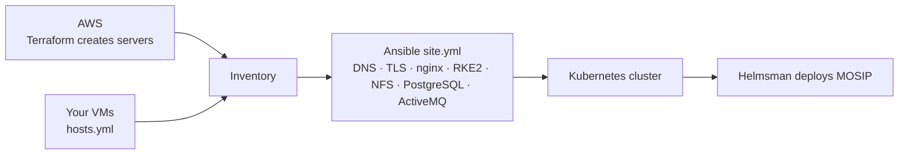

<div align="left">
 
</div>

# MOSIP Infra

Deploy the infrastructure for [MOSIP](https://mosip.io) — on **AWS** or on **servers you already
have** (data centre, Azure, GCP) — and install the MOSIP services on top.

> 📖 **Documentation:** **https://mosip.github.io/infra/** — getting started, how-to guides,
> reference and troubleshooting. The same pages are in [`docs/`](docs/index.md).

## What it does

| Layer | Tool | What it does |
|---|---|---|
| 1–2 | **Terraform** | Creates AWS resources — VPC, security groups, IAM, EC2, EBS, Route53 — one independent component (and state) at a time |
| 3 | **Ansible** | Configures the servers — TLS + nginx, RKE2 Kubernetes, NFS, PostgreSQL, ActiveMQ, Rancher — identically on AWS and on pre-created VMs |
| 4 | **Helmsman** | Deploys the MOSIP services on Kubernetes from Desired State Files (DSF) |

- **Deploy anywhere** — Terraform on AWS; Ansible-only on your own VMs.
- **Independent components** — change DNS without touching servers; each component has its own state.
- **Profiles** — `mosip`, `esignet-standalone`, `observ`.
- **Any DNS provider, any certificate** — Route53, GoDaddy, Cloudflare, BIND/Windows DNS; own cert or Let's Encrypt.


```mermaid
graph LR
    A["AWS<br/>Terraform creates servers"] --> G[Inventory]
    B["Your VMs<br/>hosts.yml"] --> G
    G --> S["Ansible site.yml<br/>DNS · TLS · nginx · RKE2 · NFS · PostgreSQL · ActiveMQ"]
    S --> K[Kubernetes cluster]
    K --> H[Helmsman deploys MOSIP]
```

## Quick start

**On AWS** — fork, set the secrets, fill `profiles/mosip/aws/common.tfvars`, then run
**Actions → terraform plan / apply** with `COMPONENT=all`, `PROFILE=mosip`, `TERRAFORM_APPLY` ✅.
→ [Quickstart: AWS](docs/getting-started/quickstart-aws.md)

**On your own VMs** — no Terraform:

```bash
cp ansible/inventory/hosts.example.yml my-hosts.yml        # IPs, disks, TLS mode
python3 ansible/inventory/generate.py --profile profiles/mosip --from-hosts my-hosts.yml -o inventory.yml
ansible-playbook -i inventory.yml ansible/site.yml
```

→ [Quickstart: data centre](docs/getting-started/quickstart-datacentre.md)

**Then deploy MOSIP** with the Helmsman workflows → [Deploy MOSIP services](docs/mosip/index.md)

## Documentation

| | |
|---|---|
| **Overview** | [Introduction](docs/overview/introduction.md) · [Architecture](docs/overview/architecture.md) · [Concepts](docs/overview/concepts.md) · [Deployment sequence](docs/overview/deployment-sequence.md) · [Supported platforms](docs/overview/supported-platforms.md) |
| **Getting started** | [Prerequisites](docs/getting-started/prerequisites.md) · [Secrets & configuration](docs/getting-started/secrets.md) · [Using GitHub Actions](docs/getting-started/github-actions.md) |
| **How-to guides** | [Profiles](docs/guides/profiles.md) · [DNS providers](docs/guides/dns-providers.md) · [TLS certificates](docs/guides/tls-certificates.md) · [Add/remove nodes](docs/guides/scaling-nodes.md) · [Standalone VM](docs/guides/standalone-vm.md) · [Observability & Rancher](docs/guides/observability-rancher.md) · [WireGuard](docs/guides/wireguard.md) · [Destroy](docs/guides/destroy.md) |
| **Deploy MOSIP** | [Overview](docs/mosip/index.md) · [External services](docs/mosip/external-services.md) · [MOSIP services](docs/mosip/mosip-services.md) · [eSignet](docs/mosip/esignet.md) · [eSignet standalone](docs/mosip/esignet-standalone.md) · [Test rigs](docs/mosip/testrigs.md) · [DSF](docs/mosip/dsf-configuration.md) |
| **Reference** | [Workflow inputs](docs/reference/workflow-inputs.md) · [Terraform components](docs/reference/terraform-components.md) · [Ansible roles](docs/reference/ansible-roles.md) · [Schemas](docs/reference/schemas.md) · [State & backends](docs/reference/state-backends.md) · [Repository layout](docs/reference/repository-layout.md) |
| **Help** | [Error catalogue](docs/troubleshooting/errors.md) · [FAQ](docs/troubleshooting/faq.md) · [Known limitations](docs/troubleshooting/known-limitations.md) · [Glossary](docs/glossary/index.md) · [Release notes](docs/release-notes/index.md) |

MOSIP platform architecture: [docs.mosip.io](https://docs.mosip.io/1.2.0/setup/deploymentnew/v3-installation/1.2.0.2/overview-and-architecture#architecture-diagram)

## Repository layout

```
profiles/      deployment shapes (profile.yml + AWS tfvars)
terraform/     AWS components, modules, base-infra
ansible/       site.yml, roles, inventory generator
Helmsman/      Desired State Files and hooks for MOSIP services
.github/       workflows (terraform, destroy, docs, checks, Helmsman) and scripts
docs/          this documentation (MkDocs)
```

Work on the docs locally: `pip install -r docs/requirements.txt && mkdocs serve`.

## Getting help

- Search the [documentation](https://mosip.github.io/infra/) or the [error catalogue](docs/troubleshooting/errors.md).
- Report bugs and request features in [GitHub Issues](https://github.com/mosip/infra/issues).

## License

[Mozilla Public License 2.0](LICENSE)
