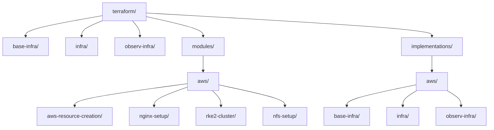
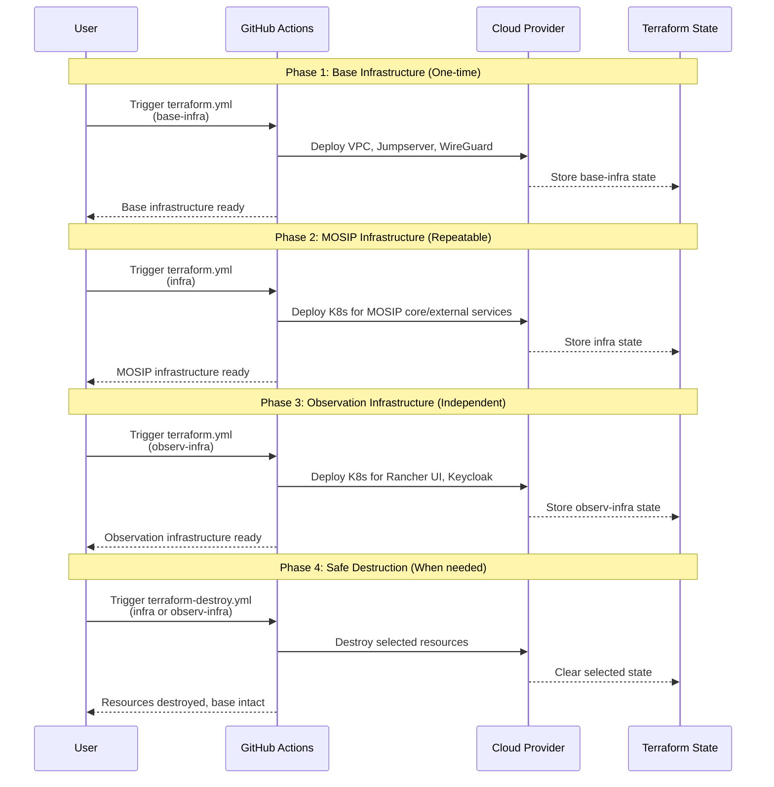

# MOSIP Cloud-Agnostic Infrastructure


This repository contains **cloud-agnostic Terraform code** for deploying MOSIP (Modular Open Source Identity Platform) infrastructure across **AWS, Azure, and GCP**. The architecture separates infrastructure into three distinct components for clear isolation and management.

## 🏗️ Architecture Overview

### Three-Component Architecture

```mermaid
graph TB
    subgraph "🌐 Multi-Cloud Infrastructure"
        subgraph "☁️ AWS"
            AWS_BASE[Base Infrastructure<br/>VPC, Jumpserver, WireGuard]
            AWS_INFRA[MOSIP Infrastructure<br/>K8s for Core/External Services]
            AWS_OBSERV[Observation Infrastructure<br/>K8s for Rancher UI, Keycloak]
            AWS_STATE[(AWS State Files<br/>S3 Backend)]
        end
        
        subgraph "🔷 Azure"
            AZ_BASE[Base Infrastructure<br/>VNet, Jumpserver, WireGuard]
            AZ_INFRA[MOSIP Infrastructure<br/>AKS for Core/External Services]
            AZ_OBSERV[Observation Infrastructure<br/>AKS for Rancher UI, Keycloak]
            AZ_STATE[(Azure State Files<br/>Storage Backend)]
        end
        
        subgraph "🟡 GCP"
            GCP_BASE[Base Infrastructure<br/>VPC, Jumpserver, WireGuard]
            GCP_INFRA[MOSIP Infrastructure<br/>GKE for Core/External Services]
            GCP_OBSERV[Observation Infrastructure<br/>GKE for Rancher UI, Keycloak]
            GCP_STATE[(GCP State Files<br/>GCS Backend)]
        end
    end
    
    subgraph "🔧 GitHub Actions"
        WORKFLOW[terraform.yml<br/>terraform-destroy.yml]
    end
    
    WORKFLOW --> AWS_BASE
    WORKFLOW --> AWS_INFRA
    WORKFLOW --> AWS_OBSERV
    WORKFLOW --> AZ_BASE
    WORKFLOW --> AZ_INFRA
    WORKFLOW --> AZ_OBSERV
    WORKFLOW --> GCP_BASE
    WORKFLOW --> GCP_INFRA
    WORKFLOW --> GCP_OBSERV
    
    AWS_BASE --> AWS_STATE
    AWS_INFRA --> AWS_STATE
    AWS_OBSERV --> AWS_STATE
    AZ_BASE --> AZ_STATE
    AZ_INFRA --> AZ_STATE
    AZ_OBSERV --> AZ_STATE
    GCP_BASE --> GCP_STATE
    GCP_INFRA --> GCP_STATE
    GCP_OBSERV --> GCP_STATE
```



### Terraform Directory Structure



## 📋 Component Overview

### 🏛️ Base Infrastructure (base-infra)
- **Purpose**: Foundational networking and VPN access
- **Includes**: VPC/VNet, Subnets, Security Groups, Jumpserver, WireGuard VPN
- **Lifecycle**: Deploy once, rarely destroyed
- **State File**: `{cloud}-base-infra-terraform.tfstate`

### 🚀 MOSIP Infrastructure (infra)
- **Purpose**: Core MOSIP services and external dependencies
- **Includes**: Kubernetes cluster for MOSIP core services, external services, databases, storage
- **Workloads**: Authentication, Registration, Partner Management, etc.
- **Lifecycle**: Can be destroyed and recreated as needed
- **State File**: `{cloud}-infra-terraform.tfstate`

### 🔧 Observation Infrastructure (observ-infra)
- **Purpose**: Observation and monitoring tools
- **Includes**: Minimal Kubernetes cluster for observation tools
- **Workloads**: Rancher UI, Keycloak, Integration services
- **Resources**: Minimal CPU/Memory configuration (different from infra)
- **Lifecycle**: Independent from MOSIP core services
- **State File**: `{cloud}-observ-infra-terraform.tfstate`

## 🔄 Deployment Workflow

### Three-Phase Deployment Strategy



## 🚀 Quick Start Guide

### Prerequisites

1. **GitHub Secrets Configuration** (per cloud):
   ```yaml
   # AWS
   AWS_ACCESS_KEY_ID: your-aws-access-key
   AWS_SECRET_ACCESS_KEY: your-aws-secret-key
   
   # Azure  
   AZURE_CLIENT_ID: your-azure-client-id
   AZURE_CLIENT_SECRET: your-azure-client-secret
   AZURE_SUBSCRIPTION_ID: your-azure-subscription-id
   AZURE_TENANT_ID: your-azure-tenant-id
   
   # GCP
   GOOGLE_CREDENTIALS: your-gcp-service-account-json
   
   # Common
   YOUR_SSH_KEY_NAME: your-ssh-private-key-content
   WG_CONFIG: wireguard-configuration
   SLACK_WEBHOOK_URL: slack-webhook-for-notifications
   

2. **State Storage Setup**:
   - **AWS**: S3 bucket for Terraform state
   - **Azure**: Storage Account with container
   - **GCP**: GCS bucket for state storage

### Step 1: Deploy Base Infrastructure

```bash
# Via GitHub Actions UI:
# 1. Go to Actions → terraform plan / apply
# 2. Select:
#    - CLOUD_PROVIDER: aws
#    - TERRAFORM_COMPONENT: base-infra
#    - SSH_PRIVATE_KEY: YOUR_SSH_KEY_NAME
#    - TERRAFORM_APPLY: true
```

### Step 2: Deploy MOSIP Infrastructure

```bash
# Via GitHub Actions UI:
# 1. Go to Actions → terraform plan / apply  
# 2. Select:
#    - CLOUD_PROVIDER: aws
#    - TERRAFORM_COMPONENT: infra
#    - SSH_PRIVATE_KEY: YOUR_SSH_KEY_NAME
#    - TERRAFORM_APPLY: true
```

### Step 3: Deploy Observation Infrastructure (Optional)

```bash
# Via GitHub Actions UI:
# 1. Go to Actions → terraform plan / apply  
# 2. Select:
#    - CLOUD_PROVIDER: aws
#    - TERRAFORM_COMPONENT: observ-infra
#    - SSH_PRIVATE_KEY: YOUR_SSH_KEY_NAME
#    - TERRAFORM_APPLY: true
```

### Step 4: Access Your MOSIP Deployment

After successful deployment, access your MOSIP services:

```bash
# MOSIP Services (from infra)
https://your-domain.mosip.net        # MOSIP Landing Page
https://api.your-domain.mosip.net    # API Gateway
https://admin.your-domain.mosip.net  # Admin Console

# Observation Services (from observ-infra)
https://rancher.your-domain.mosip.net    # Rancher UI
https://keycloak.your-domain.mosip.net   # Keycloak Management
```

## 📁 Directory Structure

```
terraform/
├── 📋 README.md                              # This file
├── 🏛️ base-infra/                           # Foundational infrastructure
│   ├── main.tf                              # Cloud selector for base infrastructure
│   ├── variables.tf                         # Common base infrastructure variables
│   ├── outputs.tf                           # Common base infrastructure outputs
│   ├── aws/                                 # AWS base infrastructure
│   │   ├── main.tf                          # AWS VPC, subnets, jumpserver, WireGuard
│   │   ├── variables.tf                     # AWS-specific base variables
│   │   └── outputs.tf                       # AWS base infrastructure outputs
│   ├── azure/                               # Azure base infrastructure (placeholder)
│   └── gcp/                                 # GCP base infrastructure (placeholder)
├── 🏗️ infra/                                # MOSIP infrastructure interface
│   ├── main.tf                              # Cloud selector for MOSIP infrastructure
│   ├── variables.tf                         # Common MOSIP variables
│   ├── outputs.tf                           # Common MOSIP outputs
│   ├── aws/                                 # AWS MOSIP infrastructure interface
│   │   ├── main.tf                          # Calls AWS modules for MOSIP services
│   │   ├── variables.tf                     # AWS-specific MOSIP variables
│   │   └── outputs.tf                       # AWS MOSIP outputs
│   ├── azure/                               # Azure MOSIP infrastructure (placeholder)
│   └── gcp/                                 # GCP MOSIP infrastructure (placeholder)
├── 🔧 observ-infra/                         # Observation infrastructure interface
│   ├── main.tf                              # Cloud selector for observation infrastructure
│   ├── variables.tf                         # Common observation variables
│   ├── outputs.tf                           # Common observation outputs
│   ├── aws/                                 # AWS observation infrastructure interface
│   │   ├── main.tf                          # Calls AWS modules for Rancher UI, Keycloak
│   │   ├── variables.tf                     # AWS-specific observation variables
│   │   └── outputs.tf                       # AWS observation outputs
│   ├── azure/                               # Azure observation infrastructure (placeholder)
│   └── gcp/                                 # GCP observation infrastructure (placeholder)
├── 🧱 modules/                              # Reusable infrastructure modules
│   ├── aws/                                 # AWS-specific modules
│   │   ├── main.tf                          # AWS module interface
│   │   ├── variables.tf                     # AWS module variables
│   │   ├── outputs.tf                       # AWS module outputs
│   │   ├── aws-resource-creation/           # Core AWS resources
│   │   ├── nginx-setup/                     # NGINX load balancer setup
│   │   ├── rke2-cluster/                    # RKE2 Kubernetes cluster
│   │   └── nfs-setup/                       # NFS storage setup
│   ├── azure/                               # Azure modules (placeholder)
│   └── gcp/                                 # GCP modules (placeholder)
├── 🚀 implementations/                      # Deployable configurations
│   ├── aws/                                 # AWS implementations
│   │   ├── base-infra/                      # AWS base infrastructure deployment
│   │   │   ├── main.tf                      # Points to base-infra/aws
│   │   │   ├── variables.tf                 # AWS base configuration
│   │   │   ├── outputs.tf                   # AWS base outputs
│   │   │   └── aws.tfvars                   # AWS base configuration values
│   │   ├── infra/                           # AWS MOSIP infrastructure deployment
│   │   │   ├── main.tf                      # Points to infra/aws
│   │   │   ├── variables.tf                 # AWS MOSIP configuration
│   │   │   ├── outputs.tf                   # AWS MOSIP outputs
│   │   │   └── aws.tfvars                   # AWS MOSIP configuration values
│   │   └── observ-infra/                    # AWS observation infrastructure deployment
│   │       ├── main.tf                      # Points to observ-infra/aws
│   │       ├── variables.tf                 # AWS observation configuration
│   │       ├── outputs.tf                   # AWS observation outputs
│   │       └── aws.tfvars                   # AWS observation configuration values
│   ├── azure/                               # Azure implementations
│   │   ├── base-infra/                      # Azure base infrastructure
│   │   ├── infra/                           # Azure MOSIP infrastructure
│   │   └── observ-infra/                    # Azure observation infrastructure
│   └── gcp/                                 # GCP implementations
│       ├── base-infra/                      # GCP base infrastructure
│       ├── infra/                           # GCP MOSIP infrastructure
│       └── observ-infra/                    # GCP observation infrastructure
└── 📚 CLOUD_AGNOSTIC_README.md             # Detailed technical documentation
```

## 🔒 State Management

### Isolated State Files

Each cloud provider and component combination maintains its own state file:

```mermaid
graph LR
    subgraph "State File Isolation"
        subgraph "AWS States"
            AWS_BASE_STATE[aws-base-infra-terraform.tfstate<br/>🏛️ VPC, Jumpserver, WireGuard]
            AWS_INFRA_STATE[aws-infra-terraform.tfstate<br/>🚀 K8s for MOSIP Core/External]
            AWS_OBSERV_STATE[aws-observ-infra-terraform.tfstate<br/>🔧 K8s for Rancher UI, Keycloak]
        end
        
        subgraph "Azure States"
            AZ_BASE_STATE[azure-base-infra-terraform.tfstate<br/>🏛️ VNet, Jumpserver, WireGuard]
            AZ_INFRA_STATE[azure-infra-terraform.tfstate<br/>🚀 AKS for MOSIP Core/External]
            AZ_OBSERV_STATE[azure-observ-infra-terraform.tfstate<br/>🔧 AKS for Rancher UI, Keycloak]
        end
        
        subgraph "GCP States"
            GCP_BASE_STATE[gcp-base-infra-terraform.tfstate<br/>🏛️ VPC, Jumpserver, WireGuard]
            GCP_INFRA_STATE[gcp-infra-terraform.tfstate<br/>🚀 GKE for MOSIP Core/External]
            GCP_OBSERV_STATE[gcp-observ-infra-terraform.tfstate<br/>🔧 GKE for Rancher UI, Keycloak]
        end
    end
```



### Benefits of Isolated States

✅ **No Cross-Cloud Interference**: Each cloud is completely isolated  
✅ **Safe Partial Destruction**: Destroy MOSIP or observation infrastructure without affecting base  
✅ **Independent Scaling**: Scale each cloud deployment independently  
✅ **Component Isolation**: MOSIP services and observation tools are separate  
✅ **Reduced Blast Radius**: Errors in one component don't affect others  
✅ **Parallel Development**: Teams can work on different clouds and components simultaneously  

## 🎛️ GitHub Actions Workflows

### 🚀 terraform.yml - Infrastructure Deployment

**Inputs:**
- `CLOUD_PROVIDER`: aws | azure | gcp
- `TERRAFORM_COMPONENT`: base-infra | infra | observ-infra
- `SSH_PRIVATE_KEY`: GitHub secret name
- `TERRAFORM_APPLY`: true/false

**Workflow Features:**
- ✅ Dynamic backend configuration per cloud
- ✅ Component-specific warnings and validations  
- ✅ Isolated working directories
- ✅ Support for all three components
- ✅ Comprehensive logging and status reporting

### 🗑️ terraform-destroy.yml - Infrastructure Destruction

**Inputs:**
- `CLOUD_PROVIDER`: aws | azure | gcp
- `TERRAFORM_COMPONENT`: infra | observ-infra (base-infra protected)
- `TERRAFORM_COMPONENT`: infra | base-infra
- `SSH_PRIVATE_KEY`: GitHub secret name
- `TERRAFORM_DESTROY`: true (required for confirmation)

**Safety Features:**
- ⚠️ Critical warnings for base-infra destruction
- 🔒 Explicit confirmation required
- 🧹 Automatic cleanup of state files after successful destruction
- 📋 Detailed destruction planning before execution

## 🌟 Key Benefits

### 🔄 **True Cloud Agnostic**
- Deploy to AWS, Azure, and GCP with identical interfaces
- Switch clouds without changing core logic
- Multi-cloud deployments for high availability

### 🏗️ **Modular Architecture** 
- Clear separation between base and application infrastructure
- Reusable modules across different deployments
- Easy to extend with new cloud providers

### 🔒 **Safe Operations**
- Isolated state management prevents accidental interference
- Explicit confirmation required for destructive operations
- Comprehensive validation and error handling

### 📈 **Scalable Design**
- Support for multiple environments per cloud
- Easy to add new components and modules
- Consistent patterns across all clouds

### 🚀 **Developer Friendly**
- Intuitive directory structure
- Comprehensive documentation and examples
- GitHub Actions integration for CI/CD

## 🛠️ Advanced Usage

### Multi-Cloud Deployment

Deploy the same MOSIP infrastructure across multiple clouds:

```bash
# Deploy to AWS
terraform.yml → CLOUD_PROVIDER: aws, TERRAFORM_COMPONENT: base-infra
terraform.yml → CLOUD_PROVIDER: aws, TERRAFORM_COMPONENT: infra

# Deploy to Azure  
terraform.yml → CLOUD_PROVIDER: azure, TERRAFORM_COMPONENT: base-infra
terraform.yml → CLOUD_PROVIDER: azure, TERRAFORM_COMPONENT: infra

# Deploy to GCP
terraform.yml → CLOUD_PROVIDER: gcp, TERRAFORM_COMPONENT: base-infra
terraform.yml → CLOUD_PROVIDER: gcp, TERRAFORM_COMPONENT: infra
```

### Environment-Specific Deployments

Create multiple environments by duplicating implementation directories:

```
implementations/
├── aws/
│   ├── base-infra/          # Shared base infrastructure
│   ├── infra-prod/          # Production environment
│   ├── infra-staging/       # Staging environment  
│   └── infra-dev/           # Development environment
```

### Custom Module Development

Add new modules following the established pattern:

```
modules/
├── aws/
│   ├── your-custom-module/
│   │   ├── main.tf
│   │   ├── variables.tf
│   │   └── outputs.tf
```

## 🔧 Troubleshooting

### Common Issues

1. **State File Conflicts**
   ```bash
   Error: Resource already exists in state
   ```
   **Solution**: Ensure you're not mixing old and new directory structures

2. **Backend Configuration Issues**
   ```bash
   Error: Backend configuration changed
   ```
   **Solution**: Run `terraform init -reconfigure` in the implementation directory

3. **Missing Dependencies**
   ```bash
   Error: base-infra resources not found
   ```
   **Solution**: Deploy base-infra before application infrastructure

### Debugging Tips

- Enable Terraform logging: Set `TF_LOG=DEBUG` in workflow
- Check state file location in cloud storage
- Verify cloud provider credentials and permissions
- Review implementation directory tfvars files

## 📞 Support and Contributing

### Getting Help
- 📖 Check [CLOUD_AGNOSTIC_README.md](terraform/CLOUD_AGNOSTIC_README.md) for detailed technical docs
- 🔧 Review [GitHub Actions Workflows](/.github/workflows/README-WORKFLOWS.md) for CI/CD details
- 🐛 Open issues for bugs or feature requests

### Contributing
1. Fork the repository
2. Create feature branch: `git checkout -b feature/your-feature`
3. Follow the established directory structure and naming conventions
4. Test changes with both plan and apply operations
5. Submit pull request with detailed description

## 📄 License

This project is licensed under the [Mozilla Public License 2.0](LICENSE).

---

**Built with ❤️ for the MOSIP Community**

*Enabling secure, scalable, and cloud-agnostic identity infrastructure worldwide.*
