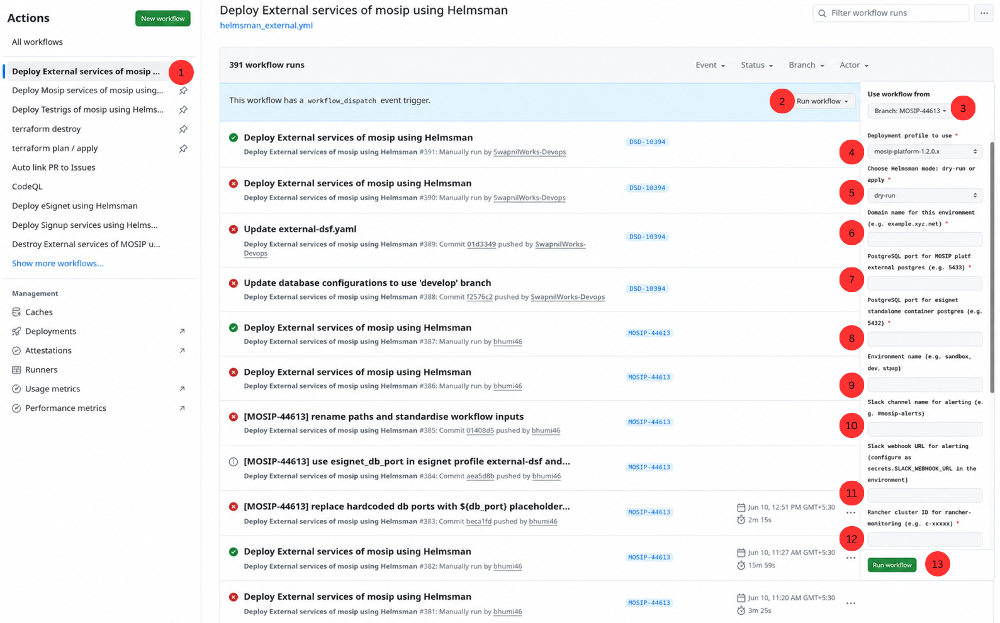
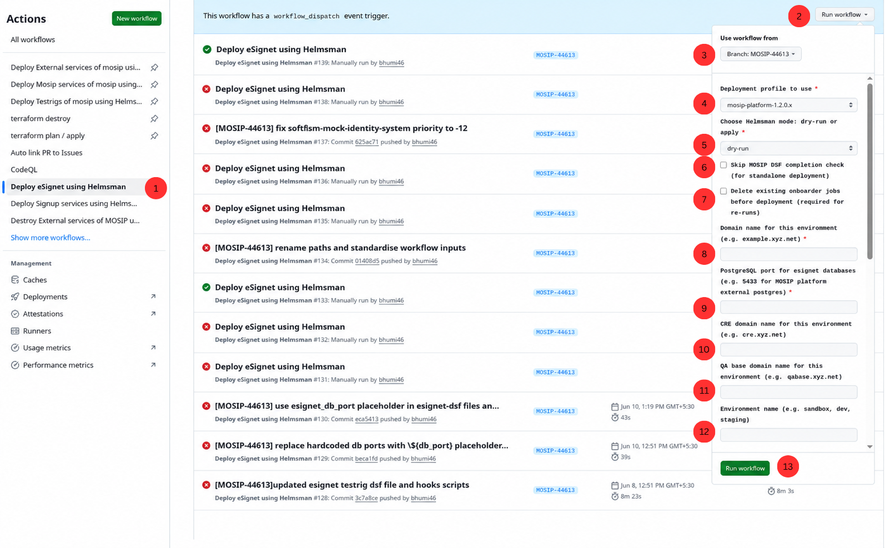
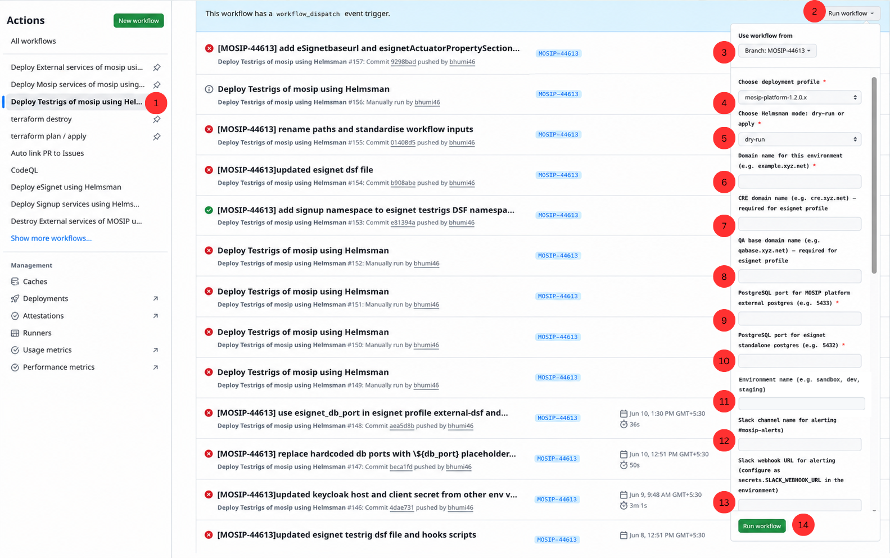

# eSignet Standalone Deployment Guide

This guide walks you through deploying eSignet standalone on your Kubernetes cluster using GitHub Actions.
You do **not** need to run any commands on your local machine — everything runs in the cloud via GitHub workflows.

**What gets deployed:**
- Up to 4 eSignet instances (esignet, esignet-mosipid1, esignet-mosipid2, esignet-sunbird) — **mosipid1 is enabled by default; mosipid2 is optional**
- OIDC UI for each enabled instance
- Mock Relying Party service and UI
- Supporting infrastructure: Postgres, Redis, Kafka, Keycloak, SoftHSM, Captcha, MinIO

**Estimated time:** ~90–120 minutes end to end (Terraform ~30 min, external services ~20 min, eSignet ~25 min).

---

## Table of Contents

1. [Understanding the eSignet Instances](#0-understanding-the-esignet-instances)
2. [Before You Start](#1-before-you-start)
3. [One-time GitHub Setup](#2-one-time-github-setup)
   - [Repository Secrets](#a-repository-secrets--required-by-all-workflows)
   - [Environment Secrets](#b-environment-secrets--configured-per-branch)
   - [Environment Variables](#c-environment-variables)
4. [Deployment Steps](#3-deployment-steps)
   - [Step 0 — Provision Infrastructure (Terraform)](#step-0--provision-infrastructure-terraform)
   - [Step 1 — Deploy External Services](#step-1--deploy-external-services)
   - [Step 2 — Deploy eSignet](#step-2--deploy-esignet)
   - [Step 3 — Deploy Signup (in progress)](#step-3--deploy-signup)
   - [Step 4 — Deploy Testrigs (optional)](#step-4--deploy-testrigs-optional)
5. [Re-deploying or Re-running](#4-re-deploying-or-re-running)
6. [Verifying Deployment](#5-verifying-deployment)

---

## 0. Understanding the eSignet Instances

This deployment can run up to **4 separate eSignet instances** on the same cluster, each isolated in its own Kubernetes namespace. Think of each instance as a completely independent eSignet service — it has its own database, its own Keycloak clients, its own domain name, and its own identity plugin.

| Instance | Namespace | What it connects to | Enabled by default |
|---|---|---|---|
| **eSignet (main)** | `esignet-mock` | Mock identity — for demos and testing without a live MOSIP system | Yes |
| **eSignet MOSIP-ID1** | `esignet-mosipid1` | A real MOSIP identity system at `MOSIPID1_DOMAIN_NAME` | **Yes** |
| **eSignet MOSIP-ID2** | `esignet-mosipid2` | A second real MOSIP identity system at `MOSIPID2_DOMAIN_NAME` | No |
| **eSignet Sunbird** | `esignet-sunbird` | A Sunbird RC credential registry | Yes |

### When do you need mosipid1?

Use `esignet-mosipid1` when you want eSignet to authenticate citizens against a **real MOSIP identity system**. You give it the domain of your MOSIP environment (e.g. `mosipenv.your-org.net`) via the `MOSIPID1_DOMAIN_NAME` variable, and the deployment automatically connects eSignet to that system's identity APIs, database, and Keycloak.

**This is enabled by default** — if you have a MOSIP system to connect to, fill in the `MOSIPID1_DOMAIN_NAME` variable and the related secrets and it will be deployed as part of the normal workflow run.

### When do you need mosipid2?

`esignet-mosipid2` is **disabled by default**. Enable it only if you need to run **two eSignet instances that each connect to a different MOSIP environment** on the same cluster — for example, one pointing at a production MOSIP environment and another at a staging one.

If you only have one MOSIP system to connect to, leave mosipid2 disabled. You do not need to configure any mosipid2 secrets or variables.

**To enable mosipid2:**

1. Add the `MOSIPID2_DOMAIN_NAME` environment variable in your GitHub Environment (Section 2B)
2. Add these secrets in your GitHub Environment (Section 2A):
   - `ESIGNET_MOSIPID2_CAPTCHA_SITE_KEY` and `ESIGNET_MOSIPID2_CAPTCHA_SECRET_KEY`
   - `MOSIPID2_POSTGRES_PASSWORD` and `MOSIPID2_KEYCLOAK_ADMIN_PASSWORD`
3. When running the eSignet workflow (Step 2), toggle **`enable_mosipid2`** to `true` and fill in the `mosipid2_domain_name` field

> No DSF file edits needed — `enable_mosipid2` is a workflow input toggle that controls deployment at runtime.

---

## 1. Before You Start

Complete this checklist before triggering any workflow:

- [ ] Kubernetes cluster is up and running
- [ ] `KUBECONFIG` file is available for your cluster
- [ ] DNS records for all domain names are pointed to your cluster's load balancer
- [ ] Google reCAPTCHA v2 keys are generated — you need **at minimum 4 site/secret key pairs** (one per enabled instance):
  - one for `esignet-mock` namespace
  - one for `esignet-mosipid1` namespace
  - one for `esignet-sunbird` namespace
  - one for `signup` namespace
  - one for `esignet-mosipid2` namespace *(only if you are enabling mosipid2 — see [Section 0](#0-understanding-the-esignet-instances))*
  - See [reCAPTCHA Setup Guide](RECAPTCHA_SETUP_GUIDE.md)
- [ ] Mock Relying Party PEM key pair is generated (client private key + JWE private key)
- [ ] GitHub Environment named after your branch (e.g. `MOSIP-44613`) exists under:
  `Repository → Settings → Environments`

---

## 2. One-time GitHub Setup

GitHub has two places to store secrets. It is important to put each secret in the **right place** — putting a secret in the wrong place will cause the workflow to fail.

| Type | Where to configure | Who can see it |
|---|---|---|
| **Repository secret** | `Settings → Secrets and variables → Actions → Repository secrets` | All workflows in the repo, regardless of environment |
| **Environment secret** | `Settings → Environments → <branch-name> → Secrets` | Only workflows that run in that specific environment (i.e. your branch) |

---

### A. Repository Secrets — required by all workflows

> Configure these once under `Settings → Secrets and variables → Actions → Repository secrets`.

| Secret Name | What it is | Notes |
|---|---|---|
| `GH_INFRA_PAT` | GitHub Fine-grained Personal Access Token | **Contents**: R/W · **Actions**: R/W · **Environments**: R/W · **Variables**: R/W · **Metadata**: R/O. Used by Helmsman workflows to update env vars and dispatch signup. See [Secret Generation Guide](SECRET_GENERATION_GUIDE.md). |
| `AWS_ACCESS_KEY_ID` | AWS IAM access key ID | Used by the Terraform workflow to create/manage AWS resources |
| `AWS_SECRET_ACCESS_KEY` | AWS IAM secret access key | Paired with `AWS_ACCESS_KEY_ID` |
| `GPG_PASSPHRASE` | Passphrase for encrypting Terraform state | Terraform state files are GPG-encrypted before being committed to the repo when using local backend |
| `TF_WG_CONFIG` | WireGuard client config for Terraform runner | Terraform connects to the nginx node via WireGuard VPN to run post-provisioning scripts. Paste the raw `wg0.conf` content — **not** base64 encoded. See [Secret Generation Guide](SECRET_GENERATION_GUIDE.md). |
| `SLACK_WEBHOOK_URL` | Slack incoming webhook URL | Used by Terraform and Helmsman for failure/success notifications |

> ⚠️ **Common `GH_INFRA_PAT` mistake:** Using a Classic token, or setting `Contents` to Read-only — both cause a `403` when the workflow tries to push commits or update environment variables. Always use Fine-grained tokens.

Path to create `GH_INFRA_PAT`: `Your profile → Settings → Developer settings → Personal access tokens → Fine-grained tokens → Generate new token`
- **Resource owner**: your organisation (e.g. `mosip`)
- **Repository access**: Only select repositories → choose this infra repo
- Set the permissions listed above, then generate and copy the token

---

### B. Environment Secrets — configured per branch

> Configure these under `Settings → Environments → <your-branch-name> → Secrets`.

**Cluster access — required by all Helmsman workflows:**

| Secret Name | What it is | Notes |
|---|---|---|
| `KUBECONFIG` | Raw kubeconfig YAML for your cluster | Paste the raw YAML — **do not** base64 encode it. Generated after Terraform apply completes. |
| `CLUSTER_WIREGUARD_WG0` | WireGuard VPN client config for Helmsman runner (interface 0) | Different from `TF_WG_CONFIG` — this is the Helmsman runner's peer config. See [Secret Generation Guide](SECRET_GENERATION_GUIDE.md). |
| `CLUSTER_WIREGUARD_WG1` | WireGuard VPN client config for Helmsman runner (interface 1) | Second WireGuard interface — required alongside `WG0`. See [Secret Generation Guide](SECRET_GENERATION_GUIDE.md). |

**For `helmsman_external.yml` (profile = `esignet-standalone`):**

| Secret Name | What it is |
|---|---|
| `ESIGNET_CAPTCHA_SITE_KEY` | reCAPTCHA **site** key for the main `esignet-mock` namespace |
| `ESIGNET_CAPTCHA_SECRET_KEY` | reCAPTCHA **secret** key for the main `esignet-mock` namespace |

**For `helmsman_esignet.yml`:**

| Secret Name | What it is |
|---|---|
| `MOCK_RELYING_PARTY_CLIENT_PRIVATE_KEY` | Base64-encoded PEM — mock relying party client private key |
| `MOCK_RELYING_PARTY_JWE_PRIVATE_KEY` | Base64-encoded PEM — JWE userinfo private key |
| `ESIGNET_MOSIPID1_CAPTCHA_SITE_KEY` | reCAPTCHA **site** key for `esignet-mosipid1` namespace |
| `ESIGNET_MOSIPID1_CAPTCHA_SECRET_KEY` | reCAPTCHA **secret** key for `esignet-mosipid1` namespace |
| `ESIGNET_MOSIPID2_CAPTCHA_SITE_KEY` | reCAPTCHA **site** key for `esignet-mosipid2` namespace *(only needed if mosipid2 is enabled)* |
| `ESIGNET_MOSIPID2_CAPTCHA_SECRET_KEY` | reCAPTCHA **secret** key for `esignet-mosipid2` namespace *(only needed if mosipid2 is enabled)* |
| `ESIGNET_SUNBIRD_CAPTCHA_SITE_KEY` | reCAPTCHA **site** key for `esignet-sunbird` namespace |
| `ESIGNET_SUNBIRD_CAPTCHA_SECRET_KEY` | reCAPTCHA **secret** key for `esignet-sunbird` namespace |
| `MOSIPID1_POSTGRES_PASSWORD` | Postgres superuser password for the MOSIP-ID1 remote MOSIP environment |
| `MOSIPID2_POSTGRES_PASSWORD` | Postgres superuser password for the MOSIP-ID2 remote MOSIP environment *(only needed if mosipid2 is enabled)* |
| `MOSIPID1_KEYCLOAK_ADMIN_PASSWORD` | Keycloak admin password for the MOSIP-ID1 remote MOSIP environment |
| `MOSIPID2_KEYCLOAK_ADMIN_PASSWORD` | Keycloak admin password for the MOSIP-ID2 remote MOSIP environment *(only needed if mosipid2 is enabled)* |

> ⚠️ `MOSIPID1_KEYCLOAK_ADMIN_PASSWORD` and `MOSIPID2_KEYCLOAK_ADMIN_PASSWORD` are the admin passwords of the **remote** MOSIP-ID1 and MOSIP-ID2 Keycloak instances (not the local one deployed by this stack). The preinstall hook calls those Keycloak REST APIs to fetch client secrets. A wrong domain or wrong password here will cause the preinstall to fail with a curl error.

**For `helmsman_signup.yml` (set now even though signup is not yet active):**

| Secret Name | What it is |
|---|---|
| `MOSIP_SIGNUP_CAPTCHA_SITE_KEY` | reCAPTCHA **site** key for the `signup` namespace |
| `MOSIP_SIGNUP_CAPTCHA_SECRET_KEY` | reCAPTCHA **secret** key for the `signup` namespace |

---

### C. Environment Variables

> Variables are non-sensitive configuration values visible in workflow logs.

Navigate to: `Repository → Settings → Environments → <your-branch-name> → Variables`

| Variable Name | Example Value | Required | Description |
|---|---|---|---|
| `DOMAIN_NAME` | `sandbox.xyz.net` | **Yes** | Base domain — all service hostnames are built from this |
| `ESIGNET_DB_PORT` | `5432` | **Yes** | Postgres port — always `5432` for standalone |
| `ENV_NAME` | `sandbox` | **Yes** | Short environment label shown on the landing page |
| `CLUSTER_ID` | `c-xxxxx` | **Yes** | Rancher cluster ID used by monitoring setup — see [Finding your clusterid](../README.md#step-4a-configure-github-environment-variables) in the root README |
| `SLACK_CHANNEL_NAME` | `#mosip-alerts` | **Yes** | Slack channel name for alert notifications |
| `MOSIPID1_DOMAIN_NAME` | `mosipid1.xyz.net` | Optional | Base domain of the MOSIP environment that `esignet-mosipid1` connects to (required if mosipid1 is enabled) |
| `MOSIPID2_DOMAIN_NAME` | `mosipid2.xyz.net` | Optional | Base domain of the second MOSIP environment — only set this if you have enabled mosipid2 (see [Section 0](#0-understanding-the-esignet-instances)) |
| `ESIGNET_MOSIPID1_SPRING_CONFIG_LABEL` | `develop` | Optional | Git branch/tag for MOSIP-ID1 config-server (defaults to `develop`) |
| `ESIGNET_MOSIPID2_SPRING_CONFIG_LABEL` | `develop` | Optional | Git branch/tag for MOSIP-ID2 config-server — only relevant if mosipid2 is enabled (defaults to `develop`) |
| `ESIGNET_STANDALONE_MODE` | `true` | Optional | Set to `true` to skip the MOSIP DSF completion check |

---

## 3. Deployment Steps

There are **5 steps** in total. Run them in the order shown below. **Do not start the next step until the current one shows a green tick (✅) in GitHub Actions.**

```
Step 0 → Provision Infrastructure   (terraform plan / apply)
  ├── 0b  base-infra      ~10 min   ← once per AWS account; skip if already done
  ├── 0c  observ-infra    ~15 min   ← optional monitoring cluster
  └── 0d  infra           ~20 min   profile: esignet-standalone  ← the main cluster
Step 1 → Deploy External Services   (helmsman_external.yml)   ~20 min
Step 2 → Deploy eSignet             (helmsman_esignet.yml)    ~25 min
Step 3 → Deploy Signup              (helmsman_signup.yml)     ⚠️  IN PROGRESS — not ready yet
Step 4 → Deploy Testrigs (optional) (helmsman_testrigs.yml)   ~10 min
```

---

### Step 0 — Provision Infrastructure (Terraform)

> **What this does:** Creates the AWS infrastructure your cluster will run on — VPC, networking, EC2 nodes, WireGuard jump server, and the RKE2 Kubernetes cluster itself.
> **Skip this step** if your cluster already exists. Jump straight to Step 1.

The Terraform workflow has three separate components. Run them in this order:

```
0a → base-infra     (once per AWS account — shared networking layer)
0b → observ-infra   (optional — separate monitoring cluster)
0c → infra          (profile: esignet-standalone — the main eSignet cluster)
```

> **Already have `base-infra` deployed?** Skip `0a` and go straight to `0b` or `0c`.

**Terraform workflow name:** `terraform plan / apply`

---

#### 0a — Update the tfvars file

Before running the workflow, fill in the placeholders in the `esignet-standalone` tfvars file:

**File:** `terraform/implementations/aws/infra/profiles/esignet-standalone/aws.tfvars`

| Field | What to set |
|---|---|
| `cluster_name` | A short name for your cluster (e.g. `esignet-sandbox`) |
| `cluster_env_domain` | Your base domain (e.g. `sandbox.xyz.net`) |
| `mosip_email_id` | Email address for SSL certificate expiry alerts from Certbot |
| `ssh_key_name` | Name of the AWS key pair to use for SSH access to nodes |
| `zone_id` | Your Route 53 hosted zone ID for this domain |
| `vpc_name` | Name of your existing VPC (looked up by `Name` tag) |
| `rancher_import_url` | Rancher import URL for this cluster — see [Rancher Import Configuration](../README.md#rancher-import-configuration-optional) in the root README for where to find this URL and how to escape it correctly |
| `aws_provider_region` | AWS region to deploy into (default: `ap-south-1`) |

All other fields (node counts, instance types, volume sizes) are already set to sensible defaults for eSignet standalone. Review and adjust if needed.

Commit the updated file on your branch before triggering the workflow.

---

#### 0b — Run: Base Infrastructure (first time only)

> **One-time per AWS account.** Creates the shared base networking layer — VPC, subnets, WireGuard jump server. If `base-infra` has already been deployed for this AWS account, skip to `0c`.

Follow the full instructions in the root README: [Step 3a: Base Infrastructure](../README.md#step-3a-base-infrastructure)

After `base-infra` completes, configure `TF_WG_CONFIG` (repository secret) with your WireGuard client config before proceeding — see [WireGuard VPN Setup](../README.md#step-3b-wireguard-vpn-setup-required-for-private-network-access).

---

#### 0c — Run: Observability Infrastructure (optional)

> **Optional.** Creates a separate lightweight Kubernetes cluster for monitoring and observability tooling (Rancher, Keycloak, logging). eSignet standalone works without it — skip if you don't need a dedicated monitoring cluster.

Follow the full instructions in the root README: [Step 3ca: Observation Infrastructure](../README.md#step-3ca-observation-infrastructure-observ-infra--optional)

---

#### 0d — Run: Main Infrastructure

> Creates the Kubernetes nodes and cluster for eSignet standalone. Run this after `base-infra` (and optionally `observ-infra`) are complete.

1. Trigger **`terraform plan / apply`** with:

| Field | Value |
|---|---|
| `cloud_provider` | `aws` |
| `component` | `infra` |
| `profile` | `esignet-standalone` |
| `backend` | `local` *(or `s3`)* |
| `SSH_PRIVATE_KEY` | Name of your SSH private key secret |
| `terraform_apply` | Tick to apply |

2. **After apply completes (~20 min):** Retrieve the kubeconfig from the cluster and add it as the `KUBECONFIG` environment secret (Section 2B) before proceeding to Step 1.

> **Note on WireGuard:** The Terraform runner connects to the nginx node via `TF_WG_CONFIG` (repository secret) to run post-provisioning scripts. `CLUSTER_WIREGUARD_WG0` and `CLUSTER_WIREGUARD_WG1` (environment secrets) are separate — they are used by Helmsman workflows to reach the cluster API. All three must be configured before their respective workflows run.

---

### Step 1 — Deploy External Services

> **What this does:** Sets up all the background infrastructure that eSignet needs to run — database (PostgreSQL), cache (Redis), messaging (Kafka), identity provider (Keycloak), hardware security module (SoftHSM), captcha service, and file storage (MinIO).
> You must complete this step before anything else.

**GitHub Actions workflow name:** `Deploy External services of mosip using Helmsman`

**How to run:**
1. Go to your repository on GitHub
2. Click the **Actions** tab at the top
3. In the left sidebar, click **`Deploy External services of mosip using Helmsman`**
4. Click the **`Run workflow`** button (top right of the workflow runs list)
5. Fill in the fields exactly as shown:

| Field | Value to enter |
|---|---|
| `profile` | `esignet-standalone` |
| `mode` | `apply` |
| `domain_name` | your base domain — e.g. `sandbox.xyz.net` |
| `db_port` *(MOSIP platform external postgres)* | leave blank — not used by the `esignet-standalone` profile |
| `esignet_db_port` *(esignet container postgres)* | `5432` |
| `clusterid` | your Rancher cluster ID — e.g. `c-xxxxx` |
| `env_name` | a short label for your environment — e.g. `sandbox` |
| `slack_channel_name` | your Slack channel — e.g. `#mosip-alerts` |

> **Note:** The form always shows both `db_port` and `esignet_db_port` fields regardless of profile — for `esignet-standalone`, fill in only `esignet_db_port` and leave `db_port` blank.

6. Click the green **`Run workflow`** button



**How to know it succeeded:** Click into the running workflow. Wait for all jobs to show a green tick. Then run:
```bash
kubectl get pods -n postgres && kubectl get pods -n keycloak && kubectl get pods -n kafka
```
All pods should show `Running` or `Completed`.

---

### Step 2 — Deploy eSignet

> **What this does:** Deploys the eSignet application itself — 4 separate instances (main, MOSIP-ID1, MOSIP-ID2, Sunbird), the OIDC login UI for each, and the Mock Relying Party service for testing.
> Only run this after Step 1 is fully complete.

**GitHub Actions workflow name:** `Deploy eSignet using Helmsman`

**How to run:**
1. Go to **Actions** → click **`Deploy eSignet using Helmsman`** in the left sidebar
2. Click **`Run workflow`**
3. Fill in the fields:

| Field | Value to enter |
|---|---|
| `profile` | `esignet-standalone` |
| `mode` | `apply` |
| `skip_mosip_dsf_check` | **tick this** — standalone has no MOSIP deployment to wait for |
| `delete_existing_jobs` | tick only if re-running after a failure; leave unticked on first deploy |
| `domain_name` | your base domain — e.g. `sandbox.xyz.net` |
| `esignet_db_port` | `5432` |
| `mosipid1_domain_name` | MOSIP-ID1 base domain — e.g. `mosipid1.xyz.net` *(leave blank if not using MOSIP-ID1)* |
| `enable_mosipid2` | toggle `true` to deploy the MOSIP-ID2 eSignet instance; leave `false` to skip it |
| `mosipid2_domain_name` | MOSIP-ID2 base domain — e.g. `mosipid2.xyz.net` *(only required if `enable_mosipid2` is true)* |
| `env_name` | your environment name — e.g. `sandbox` |

> **Important:** Always tick `skip_mosip_dsf_check` for standalone eSignet — without it, the workflow waits for a `mosip-dsf=completed` namespace label that will never appear (there is no full MOSIP deployment in this mode), and the workflow will fail.

4. Click the green **`Run workflow`** button



**How to know it succeeded:**
```bash
kubectl get pods -n esignet-mock && kubectl get pods -n esignet-mosipid1 && kubectl get pods -n esignet-sunbird
# If enable_mosipid2 was set to true:
kubectl get pods -n esignet-mosipid2
```
All pods should show `Running`.

---

### Step 3 — Deploy Signup

> ⚠️ **Signup deployment is currently in progress and not yet available.**
>
> The `helmsman_signup.yml` workflow exists but the signup configuration (DSF and hook scripts) is still being finalised and tested. The automatic trigger that was meant to fire signup after Step 2 has been **temporarily disabled** until this work is complete.
>
> **What you need to do right now:** Nothing — skip this step for now. However, make sure the signup secrets (`MOSIP_SIGNUP_CAPTCHA_SITE_KEY` and `MOSIP_SIGNUP_CAPTCHA_SECRET_KEY`) are already added to the GitHub Environment (see Section 2) so you are ready when signup is enabled.
>
> This section will be updated with full instructions once signup deployment is ready.

---

### Step 4 — Deploy Testrigs (Optional)

> **What this does:** Deploys automated API and UI test jobs that run against the deployed eSignet instances to verify everything is working correctly. This step is optional — only run it if you want to validate the deployment with automated tests.
> Only run this after Steps 1 and 2 are complete and **all pods are in `Running` state**.

**GitHub Actions workflow name:** `Deploy Testrigs of mosip using Helmsman`

**How to run:**
1. Go to **Actions** → click **`Deploy Testrigs of mosip using Helmsman`** in the left sidebar
2. Click **`Run workflow`**
3. Fill in the fields:

| Field | Value to enter |
|---|---|
| `profile` | `esignet-standalone` |
| `mode` | `apply` |
| `domain_name` | your base domain — e.g. `sandbox.xyz.net` |
| `mosipid1_domain_name` | MOSIP-ID1 base domain *(if MOSIP-ID1 was deployed in Step 2)* |
| `mosipid2_domain_name` | MOSIP-ID2 base domain *(if `enable_mosipid2` was `true` in Step 2)* |
| `db_port` *(MOSIP platform external postgres)* | leave blank — not used by the `esignet-standalone` profile |
| `esignet_db_port` *(esignet container postgres)* | `5432` |
| `env_name` | your environment name |
| `slack_channel_name` | your Slack channel |

4. Click the green **`Run workflow`** button



**How to know it succeeded:** The workflow log should show all Helmsman releases applied without errors. Verify that test cronjobs were created:
```bash
kubectl get cronjobs -n esignet-mock
kubectl get cronjobs -n esignet-mosipid1
kubectl get cronjobs -n esignet-mosipid2
kubectl get cronjobs -n esignet-sunbird
```

---

## 4. Re-deploying or Re-running

If a workflow fails or you need to re-run a deployment:

- **Always tick `delete_existing_jobs`** in the `helmsman_esignet.yml` inputs on re-runs — this removes stale Kubernetes Jobs that would otherwise block the deployment
- If re-running `helmsman_external.yml`, MinIO will reuse the existing password automatically — no action needed
- If a workflow fails mid-way, check the failed step's logs first — most failures are missing secrets or DNS not yet propagated

---

## 5. Verifying Deployment

Run these commands against your cluster to confirm everything is healthy:

```bash
# Check all pods across eSignet namespaces
kubectl get pods -n esignet-mock
kubectl get pods -n esignet-mosipid1
kubectl get pods -n esignet-mosipid2
kubectl get pods -n esignet-sunbird

# Check Istio virtual services (confirms domain routing)
kubectl get virtualservice -n esignet-mock

# Check Helm releases
helm list -n esignet-mock
helm list -n keycloak

# Quick health check — should return no non-Running pods
kubectl get pods --all-namespaces | grep -v Running | grep -v Completed | grep -v Terminating
```

**Expected URLs after deployment** (replace `sandbox.xyz.net` with your domain):

| Service | URL |
|---|---|
| eSignet OIDC UI | `https://esignet.sandbox.xyz.net` |
| Mock Relying Party UI | `https://healthservices.sandbox.xyz.net` |
| Keycloak | `https://iam.sandbox.xyz.net` |
| MOSIP-ID1 eSignet | `https://esignet-mosipid1.sandbox.xyz.net` |
| MOSIP-ID2 eSignet | `https://esignet-mosipid2.sandbox.xyz.net` |
| Sunbird eSignet | `https://esignet-sunbird.sandbox.xyz.net` |
