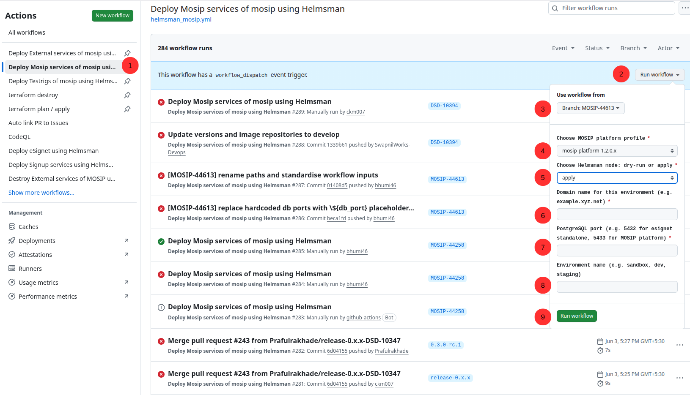

# Helmsman MOSIP Services Deployment Guide

Deploy the full MOSIP core services stack (22 namespaces, 50+ microservices) after external dependencies are running.

## Overview

**Workflow:** `helmsman_mosip.yml`  
**DSF:** `Helmsman/dsf/<profile>/mosip-dsf.yaml`  
**Profiles:** `mosip-platform-1.2.0.x` (Java 11) and `mosip-platform-1.2.1.x` (Java 21)

> This workflow is **not used** for the `esignet` standalone profile — eSignet standalone does not deploy the full MOSIP stack.

**Time required:** 30–60 minutes

---

## Prerequisites

- `helmsman_external.yml` completed successfully for the same profile
- All external service pods are in `Running` state
- `KUBECONFIG` and `CLUSTER_WIREGUARD_WG0` secrets configured in the branch environment

---

## Required Secrets

All secrets are **Environment Secrets** — configure at **Repository → Settings → Environments → `<branch-name>` → Secrets**.

| Secret | Description |
|--------|-------------|
| `KUBECONFIG` | Raw YAML kubeconfig (not base64 encoded) |
| `CLUSTER_WIREGUARD_WG0` | WireGuard VPN config for cluster access |

> reCAPTCHA secrets (`PREREG_CAPTCHA_SITE_KEY`, etc.) are consumed by `external-dsf.yaml` in the previous step — no additional captcha secrets are needed here.

---

## Trigger: Automatic vs Manual

### Automatic (recommended)

`helmsman_mosip.yml` is automatically triggered by `helmsman_external.yml` on successful completion. No manual action needed.

> **Note:** For push-triggered external runs, only the first detected profile dispatches the MOSIP workflow. Use `workflow_dispatch` if deploying multiple profiles.

### Manual trigger (fallback)

If the automatic trigger fails or you need to re-run independently:



- **(1)** Go to **Actions** (top of the repository page) → click **"Deploy MOSIP services using Helmsman"** in the list on the left.
- **(2)** Click the **Run workflow** dropdown button (top right) — this opens the form shown above.
- **(3)** **Branch** — pick the branch you're deploying from (e.g., `MOSIP-44613`).
- **(4)** **Choose MOSIP platform profile** — pick `mosip-platform-1.2.0.x` (Java 11) or `mosip-platform-1.2.1.x` (Java 21).
- **(5)** **Choose Helmsman mode: dry-run or apply** — always pick **`apply`**.
- **(6)** **Domain name for this environment** — type the web domain this environment should use (e.g., `example.xyz.net`).
- **(7)** **PostgreSQL port** — type `5433` for MOSIP platform. (The field's placeholder text also mentions `5432` for eSignet standalone, but that profile doesn't use this workflow — always use `5433` here.)
- **(8)** **Environment name** — a short nickname for this environment (e.g., `sandbox`, `dev`, `staging`).
- **(9)** Click the green **Run workflow** button to start the deployment.

---

## Workflow Inputs

| Input | Description | Example |
|-------|-------------|---------|
| `profile` | Deployment profile | `mosip-platform-1.2.0.x` / `mosip-platform-1.2.1.x` |
| `mode` | Helmsman mode | Always `apply` — dry-run will fail |
| `domain_name` | Base domain for this environment | `soil38.mosip.net` |
| `env_name` | Environment name | `soil38` |
| `db_port` | External postgres port | `5433` |

> If not provided as inputs, values fall back to GitHub Environment Variables (`vars.DOMAIN_NAME`, `vars.ENV_NAME`, `vars.DB_PORT`).

---

## After This Workflow: Verify Pods

Before proceeding to eSignet or testrigs, confirm all MOSIP pods are healthy:

```bash
# Check all namespaces
kubectl get pods --all-namespaces | grep -v Running | grep -v Completed

# Key namespaces to check
kubectl get pods -n keycloak
kubectl get pods -n postgres
kubectl get pods -n idrepo
kubectl get pods -n ida
kubectl get pods -n prereg

# Confirm MOSIP DSF completion label
kubectl get ns default --show-labels | grep mosip-dsf
```

---

## Partner Onboarding Verification

> **Important:** The partner-onboarder pod completing with `Completed` status does **not** guarantee all partners onboarded successfully. You must check the MinIO reports.

**When to check:**
- After the partner-onboarder pod completes
- Before deploying eSignet or testrigs

**How to check and rerun failed onboarding:**

See [ONBOARDING_GUIDE.md](ONBOARDING_GUIDE.md) for the full procedure — includes accessing MinIO reports, identifying failed partners, and re-running specific modules.

---

## After This Workflow

Once all MOSIP pods are `Running` and partner onboarding is confirmed:

- Deploy eSignet → [esignet_README.md](esignet_README.md)
- Deploy testrigs → [HELMSMAN_TESTRIGS_GUIDE.md](HELMSMAN_TESTRIGS_GUIDE.md)
