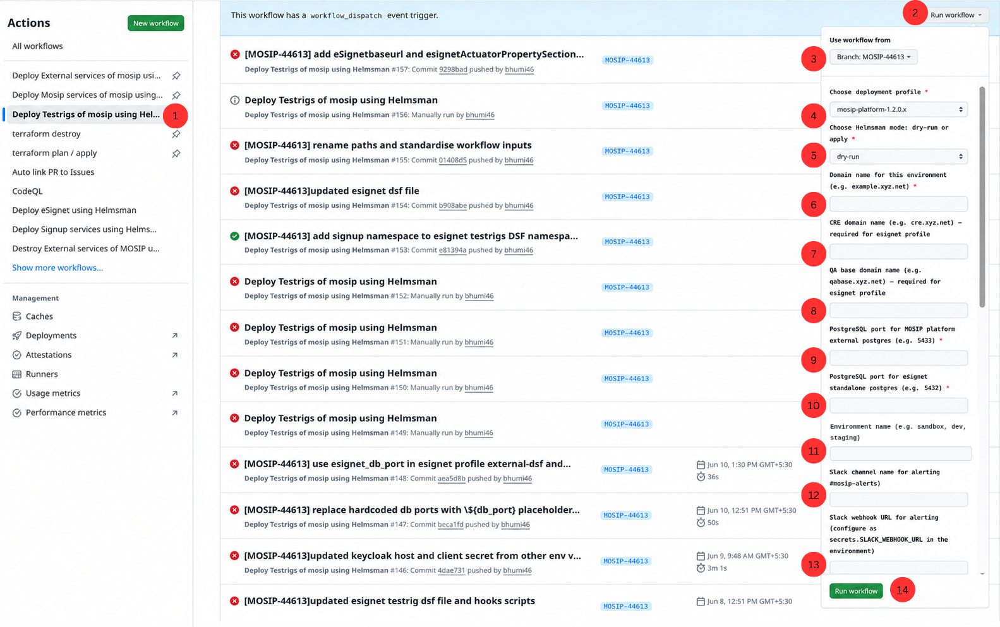

# Helmsman Testrigs Deployment Guide

Deploy API, UI, and DSL test rigs after all services are running and partner onboarding is complete.

## Overview

**Workflow:** `helmsman_testrigs.yml`  
**DSF:** `Helmsman/dsf/<profile>/testrigs-dsf.yaml`  
**Time required:** 10–20 minutes (`esignet-standalone-2.0.0`: up to ~45 minutes — its 3 UI testrigs each run headless Chrome + a JVM, which is slower than the API-only rigs)

---

## Profile Differences

| Profile | What deploys | Namespaces |
|---------|-------------|------------|
| `esignet-standalone` | Generic `mosip/apitestrig`/`mosip/uitestrig` charts: `esignet-apitestrig` into 3 namespaces; optional signup apitestrig + uitestrig | `esignet-mock`, `esignet-mosipid`, `esignet-sunbird`, `signup` |
| `esignet-standalone-2.0.0` | eSignet's own dedicated `mosip/esignet-apitestrig` (Go harness) + `mosip/esignet-uitestrig` (Java harness) charts — see note below; plus the same optional signup apitestrig/uitestrig as `esignet-standalone` | `esignet-mock`, `esignet-mosipid`, `esignet-sunbird`, `esignet-uitestrig`, `esignet-mosipid-uitestrig`, `esignet-sunbird-uitestrig`, `signup` |
| `mosip-platform-1.2.0.x` | API testrig, UI testrig, DSL testrig | MOSIP testrig namespaces |
| `mosip-platform-1.2.1.x` | Same as above | MOSIP testrig namespaces |

> **eSignet standalone (`esignet-standalone` / `esignet-standalone-2.0.0` profiles):** Requires `mosipid_domain_name` for the MOSIP-ID apitestrig endpoint.
>
> **`esignet-standalone-2.0.0` note:** Unlike the profile-differences doc gap this used to have, `testrigs-dsf.yaml` here does **not** deploy the same apps as `esignet-standalone` — it deploys eSignet's own reference testrig charts instead, modeled directly on
> [`esignet-apitestrig/install.sh`](https://github.com/mosip/esignet/blob/v2.0.0/deploy/esignet-apitestrig/install.sh) and
> [`esignet-uitestrig/install.sh`](https://github.com/mosip/esignet/blob/v2.0.0/deploy/esignet-uitestrig/install.sh). Each eSignet instance's apitestrig lives in that instance's own namespace (matching install.sh's `NS=esignet` pattern); each uitestrig gets its **own** namespace, separate from the eSignet instance it tests (matching install.sh's `NS=esignet-uitestrig` / `SOURCE_NS=esignet` split) — see [Required Secrets](#required-secrets) below for the extra values this needs. Only `esignet-mosipid` (the only instance backed by a real IDA identity) needs real test-identity values; `esignet-mock` and `esignet-sunbird` don't.

---

## Prerequisites

**All profiles:**
- All service pods from previous steps are in `Running` state
- Partner onboarding completed successfully (MOSIP platform profiles)

**eSignet standalone profile additionally:**
- eSignet DSF completed (`kubectl get ns default --show-labels | grep esignet-dsf`)
- Signup DSF completed if testing signup (`kubectl get ns default --show-labels | grep signup-dsf`)

---

## Required Secrets

All secrets are **Environment Secrets** — configure at **Repository → Settings → Environments → `<branch-name>` → Secrets**.

### All profiles

| Secret | Description |
|--------|-------------|
| `KUBECONFIG` | Raw YAML kubeconfig (not base64 encoded) |
| `CLUSTER_WIREGUARD_WG0` | WireGuard VPN config for cluster access |
| `SLACK_WEBHOOK_URL` | Slack incoming webhook URL (optional — for test result notifications) |

### `esignet-standalone` profile only

No additional secrets required for testrigs — captcha and keycloak secrets were already created during eSignet deployment and are available in each namespace.

### `esignet-standalone-2.0.0` profile only

`esignet-apitestrig`/`esignet-uitestrig` (eSignet's own reference charts) need a few values the generic testrig charts didn't. Some are read live from the cluster (no setup needed); the rest must be configured as **Environment Secrets/Variables**:

**Read automatically from the cluster** (already provisioned by eSignet's own deployment — nothing to add):

| Value | Source |
|-------|--------|
| `KEYCLOAK_CLIENT_SECRET` (apitestrig, all 3 instances) | `keycloak-client-secrets` secret in the `keycloak` namespace — the same `mosip_pms_client_secret` key `esignet-preinstall-keycloak-init.sh` already uses |
| `esignetDbPassword` (uitestrig, all 3 instances) | `db-common-secrets` secret in the `postgres` namespace |

**Required Environment Secrets/Variables** (Settings → Environments → `<branch-name>`):

| Secret/Variable | Type | Used by | Description |
|---|---|---|---|
| `MOSIPID_KEYCLOAK_ADMIN_PASSWORD` | Secret | uitestrig, all 3 instances | Reuses the same Keycloak admin password `esignet-misp-onboarder-mosipid-preinstall.sh` already needs — one shared `mosip/keycloak` release for the whole profile |
| `ESIGNET_UITESTRIG_OIDC_CLIENT_ID` | Variable | uitestrig, all 3 instances | Pre-provisioned OIDC client ID for browser login testing (reused across instances, same pattern as `mock-relying-party-service`'s shared `CLIENT_ID` in `esignet-dsf.yaml`) |
| `ESIGNET_UITESTRIG_CLIENT_SECRET` | Secret | uitestrig, all 3 instances | Secret for the client above |
| `MOSIPID_TESTRIG_INDIVIDUAL_ID` | Secret | apitestrig, `esignet-mosipid` only | Real IDA test identity (UIN) — PII |
| `MOSIPID_TESTRIG_OTP_RECIPIENT` | Secret | apitestrig, `esignet-mosipid` only | Phone/email that receives the test OTP |
| `MOSIPID_TESTRIG_AUTH_PARTNER_ID` | Variable | apitestrig, `esignet-mosipid` only | Auth partner ID used to build the test client ID |
| `MOSIPID_TESTRIG_AUTH_POLICY_ID` | Variable | apitestrig, `esignet-mosipid` only | Policy ID used to build the test client ID |
| `MOSIPID_TESTRIG_UIN` | Secret | uitestrig, `esignet-mosipid` only | Test UIN — PII |
| `MOSIPID_TESTRIG_VID` | Secret | uitestrig, `esignet-mosipid` only | Test VID — PII |
| `MOSIPID_TESTRIG_PHONE_NUMBER` | Secret | uitestrig, `esignet-mosipid` only | Test UIN's phone number — PII |
| `MOSIPID_TESTRIG_EMAIL_LOGIN_ID` | Secret | uitestrig, `esignet-mosipid` only | Test identity for email-OTP login scenarios |
| `MOSIPID_TESTRIG_PASSWORD_LOGIN_UIN` | Secret | uitestrig, `esignet-mosipid` only | Test identity for password-login scenarios |
| `MOSIPID_TESTRIG_PASSWORD_LOGIN_PASSWORD` | Secret | uitestrig, `esignet-mosipid` only | Password for the identity above |

Only `esignet-mosipid` needs real test-identity/onboarding values — it's the only instance backed by a real IDA identity (`config.mosip.json`/the `mosip` plugin). `esignet-mock` (`config.mock.json`/`mock` plugin) and `esignet-sunbird` (`config.sunbird.json`/`sunbird` plugin) need none of the `MOSIPID_TESTRIG_*` values above.

The workflow's own "Validate esignet-standalone-2.0.0 testrig secrets" step fails clearly, listing exactly which of these are missing, before it tries to deploy.

Report storage uses a PVC (`reports.persistence.enabled: true`), not S3 — there's no established MinIO bucket convention for these charts yet in this repo. Switch to `reports.s3.*` once one exists.

### MOSIP platform profiles only

No additional secrets required — MinIO root password is read automatically from the `minio` secret in the `minio` namespace (`kubectl -n minio get secret minio`).

---

## Workflow Inputs

### All profiles

| Input | Description | Example |
|-------|-------------|---------|
| `profile` | Deployment profile | `esignet-standalone` / `esignet-standalone-2.0.0` / `mosip-platform-1.2.0.x` / `mosip-platform-1.2.1.x` |
| `mode` | Helmsman mode | Always `apply` — dry-run will fail |
| `domain_name` | Base domain for this environment | `soil38.mosip.net` |
| `db_port` | External postgres port — MOSIP platform only | `5433` |
| `esignet_db_port` | eSignet container postgres port — eSignet profile only | `5432` |
| `env_name` | Environment name | `soil38` |
| `slack_channel_name` | Slack channel for alerting (optional) | `#mosip-alerts` |

### eSignet standalone profiles (`esignet-standalone` / `esignet-standalone-2.0.0`) additionally

| Input | Description | Example |
|-------|-------------|---------|
| `mosipid_domain_name` | Domain for the MOSIP-ID eSignet instance | `mosipid.mosip.net` |

> If not provided as an input, the value falls back to the GitHub Environment Variable `vars.MOSIPID_DOMAIN_NAME`.

---

## Step-by-Step: Run the Workflow



- **(1)** Go to **Actions** (top of the repository page) → click **"Deploy Testrigs of mosip using Helmsman"** in the list on the left.
  > Can't find it? Search for "Testrig" or "Testrigs" in the workflows list.
- **(2)** Click the **Run workflow** dropdown button (top right) — this opens the form shown above.
- **(3)** **Branch** — pick the branch you're deploying from (e.g., `MOSIP-44613`).
- **(4)** **Deployment profile to use** — pick the profile you want (e.g., `mosip-platform-1.2.0.x`, `esignet-standalone`, or `esignet-standalone-2.0.0` for the Go rewrite).
- **(5)** **Choose Helmsman mode: dry-run or apply** — always pick **`apply`**.
- **(6)** **Domain name for this environment** — type the web domain this environment should use (e.g., `example.xyz.net`).
- **(7)** **MOSIP-ID domain name** *(eSignet profile only)* — type the base domain used by the MOSIP-ID eSignet instance (e.g., `mosipid.xyz.net`). Leave blank for MOSIP platform profiles.
- **(8)** **PostgreSQL port for MOSIP platform external postgres** — only fill this in if you picked a `mosip-platform-*` profile in step 4. Type `5433` (or whatever port your external PostgreSQL uses).
- **(9)** **PostgreSQL port for esignet standalone container postgres** — only fill this in if you picked the `esignet-standalone` profile in step 4. Type `5432`.
- **(10)** **Environment name** — a short nickname for this environment (e.g., `sandbox`, `dev`, `staging`).
- **(11)** **Slack channel name for alerting** (optional) — the Slack channel that should receive test result notifications (e.g., `#mosip-alerts`). Leave blank if you don't want Slack alerts.
- **(12)** **Slack webhook URL for alerting** (optional) — leave this blank; it's normally already saved as the `SLACK_WEBHOOK_URL` secret in your GitHub environment.
- **(13)** Click the green **Run workflow** button to start the deployment.

> **Note:** Steps 7–9 all appear in the form regardless of which profile you picked — fill in only the ones that match your profile (MOSIP-ID domain for `esignet-standalone`, PostgreSQL port for `mosip-platform-*`) and leave the rest blank.

> **Important:** Always pass `--keep-untracked-releases` — without it Helmsman will delete releases from previous DSFs (esignet, oidc-ui, etc.) that aren't listed in `testrigs-dsf.yaml`. The workflow handles this automatically.

---

## Post-Deployment Steps

After testrigs deploy successfully:

**1. Update cron schedules**

Update the cron time for CronJobs in the testrig namespaces to match your desired schedule:

```bash
# List all cronjobs across testrig namespaces
kubectl get cronjobs -n apitestrig
kubectl get cronjobs -n uitestrig
kubectl get cronjobs -n dslrig

# For eSignet standalone
kubectl get cronjobs -n esignet
kubectl get cronjobs -n esignet-mosipid
kubectl get cronjobs -n esignet-sunbird

# esignet-standalone-2.0.0 only — separate uitestrig namespaces
kubectl get cronjobs -n esignet-uitestrig
kubectl get cronjobs -n esignet-mosipid-uitestrig
kubectl get cronjobs -n esignet-sunbird-uitestrig
```

**2. Trigger DSL orchestrator (MOSIP platform profiles)**

```bash
kubectl create job --from=cronjob/cronjob-dslorchestrator-full dslrig-manual-run -n dslrig
```

> This job runs for 3+ hours. Monitor progress:
> ```bash
> kubectl logs -f job/dslrig-manual-run -n dslrig
> ```

**3. Trigger eSignet test jobs (eSignet standalone profiles)**

The `trigger-test-jobs-esignet.sh` postInstall hook fires automatically after the last testrig deploys — it triggers all cronjobs across all 3 esignet namespaces sequentially and optionally signup/signup-uitestrig if deployed.

To trigger manually:

```bash
export KUBECONFIG=/path/to/kubeconfig
export WORKDIR=/path/to/Helmsman

# esignet-standalone
./hooks/esignet-standalone/trigger-test-jobs-esignet.sh

# esignet-standalone-2.0.0
./hooks/esignet-standalone-2.0.0/trigger-test-jobs-esignet.sh
```

---

## Verify

```bash
# Check testrig pods (MOSIP platform)
kubectl get pods -n apitestrig
kubectl get pods -n uitestrig
kubectl get pods -n dslrig

# Check testrig pods (eSignet standalone apitestrig — same namespaces for esignet-standalone-2.0.0)
kubectl get pods -n esignet      # esignet-apitestrig cronjob
kubectl get pods -n esignet-mosipid
kubectl get pods -n esignet-sunbird
kubectl get pods -n signup       # signup-apitestrig (if enabled)

# esignet-standalone-2.0.0 only — separate uitestrig namespaces
kubectl get pods -n esignet-uitestrig
kubectl get pods -n esignet-mosipid-uitestrig
kubectl get pods -n esignet-sunbird-uitestrig
```
