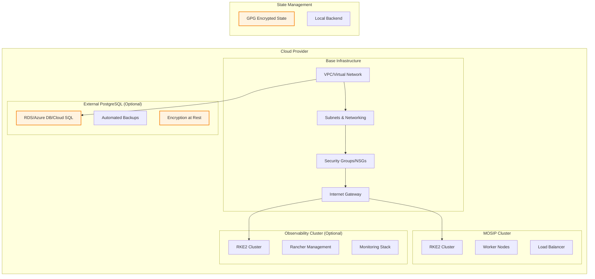
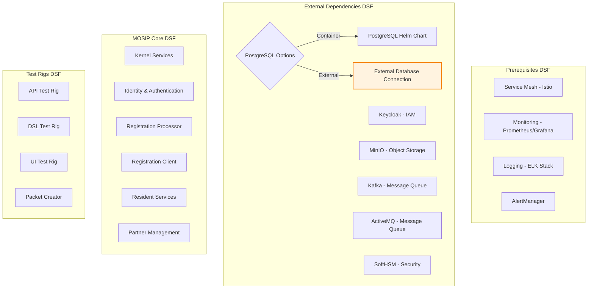
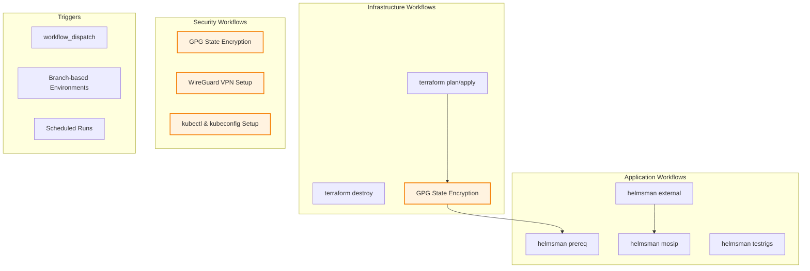
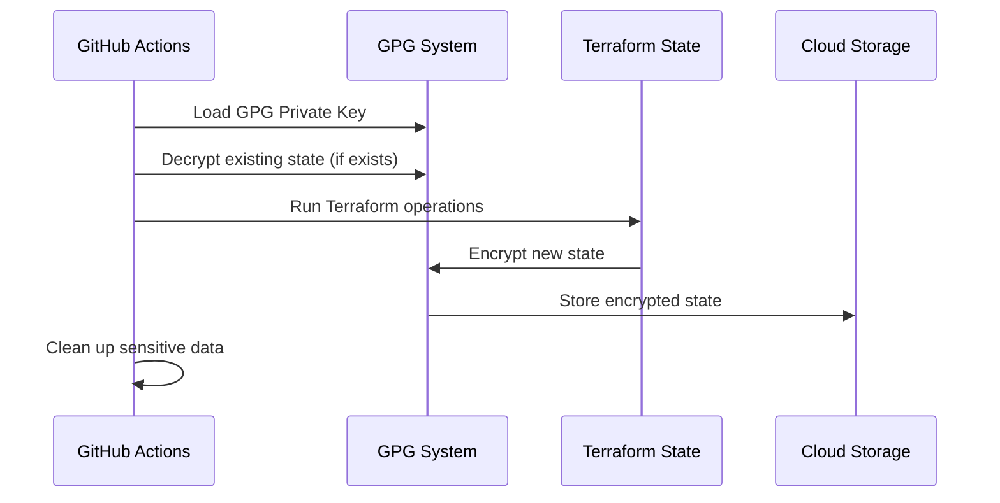
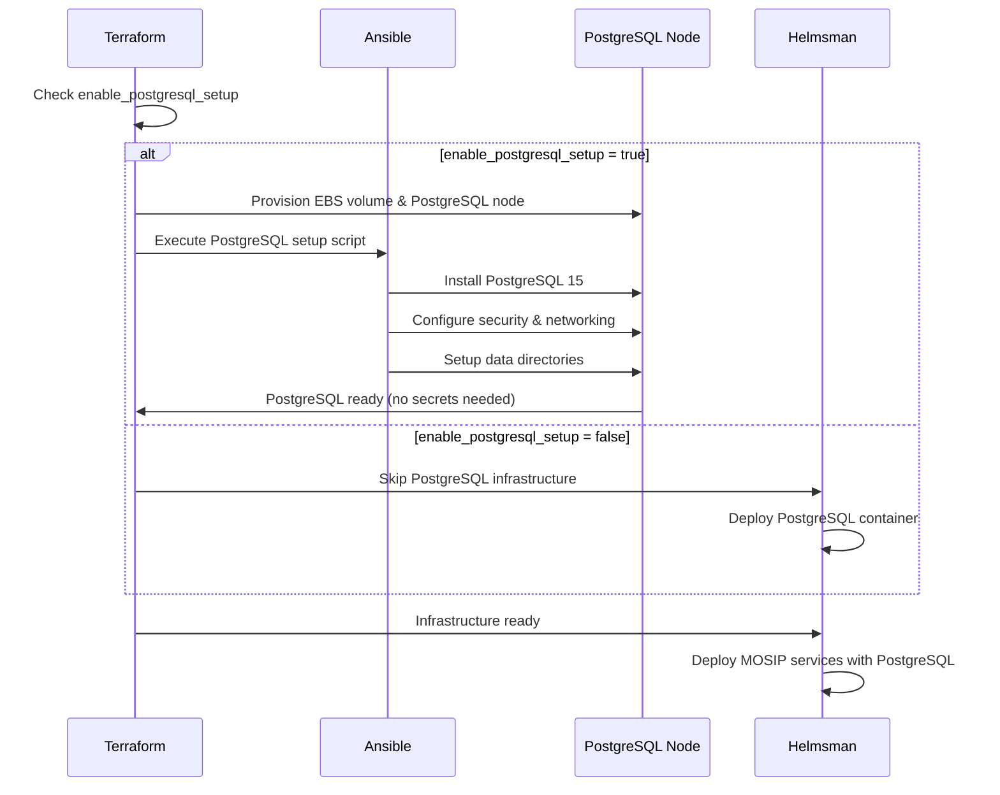
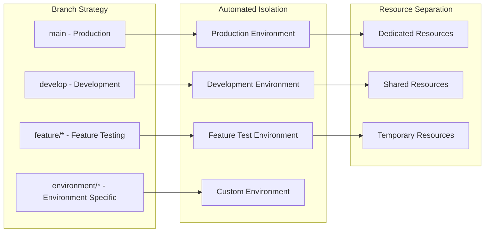

# MOSIP Rapid Deployment Architecture - Updated

## Complete Deployment Flow Diagram (Updated)

```mermaid
graph TB
    %% Prerequisites
    A[Fork Repository] --> B[Configure Secrets]
    B --> C[Select Cloud Provider<br/>AWS/Azure/GCP]
    
    %% Infrastructure Phase
    C --> D[Terraform: Base Infrastructure<br/>VPC, Networking, Jumpserver, WireGuard]
    D --> E{Deploy Observability?}
    E -->|Yes| F[Terraform: Observability Infrastructure<br/>Rancher UI, Keycloak, Monitoring]
    E -->|No| G[Configure PostgreSQL Setup]
    F --> G[Configure PostgreSQL Setup]
    
    %% PostgreSQL Configuration
    G --> H{PostgreSQL Deployment Choice}
    H -->|Production| I[Set enable_postgresql_setup = true<br/>External PostgreSQL via Terraform]
    H -->|Development| J[Set enable_postgresql_setup = false<br/>Container PostgreSQL via Helmsman]
    
    %% Terraform Infrastructure Deployment
    I --> K[Terraform: MOSIP Infrastructure<br/>+ Auto PostgreSQL Setup via Ansible]
    J --> L[Terraform: MOSIP Infrastructure<br/>Kubernetes Cluster Only]
    K --> M[Run Terraform via GitHub Actions<br/>GPG Encrypted State Management]
    L --> M
    
    %% Helmsman Configuration
    M --> N{PostgreSQL Setup Complete?}
    N -->|External PostgreSQL| O[Configure Helmsman DSF Files<br/>postgresql.enabled = false]
    N -->|Container PostgreSQL| P[Configure Helmsman DSF Files<br/>postgresql.enabled = true]
    
    %% Helmsman Deployment Phase
    O --> Q[Helmsman: Prerequisites<br/>Monitoring, Istio, Logging]
    P --> Q
    Q --> R[Helmsman: External Dependencies<br/>PostgreSQL containers, Keycloak, MinIO, Kafka]
    
    %% MOSIP Services
    R --> S[Helmsman: MOSIP Core Services<br/>Registration, Authentication, ID Repository]
    S --> T{Deploy Test Rigs?}
    T -->|Yes| U[Helmsman: Test Rigs<br/>API Testing, UI Testing, DSL Testing]
    T -->|No| V[Verify Deployment]
    U --> V
    
    %% Final Verification
    V --> W[Access MOSIP Platform<br/>Web UI, APIs, Admin Console]
    W --> X[Complete MOSIP Platform<br/>Ready for Production]
    
    %% Styling
    classDef prereq fill:#fff3e0,stroke:#ff8f00,stroke-width:2px
    classDef terraform fill:#e3f2fd,stroke:#1976d2,stroke-width:2px
    classDef helmsman fill:#f3e5f5,stroke:#7b1fa2,stroke-width:2px
    classDef postgres fill:#c8e6c9,stroke:#2e7d32,stroke-width:2px
    classDef success fill:#e8f5e8,stroke:#388e3c,stroke-width:2px
    classDef decision fill:#fce4ec,stroke:#c2185b,stroke-width:2px
    classDef config fill:#f1f8e9,stroke:#689f38,stroke-width:2px
    
    class A,B,C prereq
    class D,F,I,J,K,L,M terraform
    class O,P,Q,R,S,U helmsman
    class G,H,N postgres
    class V,W,X success
    class E,H,N,T decision
    class G,O,P config
```

## Architecture Components

### Infrastructure Layer (Terraform)

### Application Layer (Helmsman)

### Automation Layer (GitHub Actions)

## Security Architecture

### GPG Encryption Flow

### PostgreSQL Integration (Updated Approach)

## Deployment Options Matrix (Updated)

| Component | Containerized | External/Managed | Configuration |
|-----------|--------------|------------------|---------------|
| **PostgreSQL** | Kubernetes Container | Terraform + Ansible Auto-setup | `enable_postgresql_setup = false/true` |
| **Monitoring** | Prometheus/Grafana | Cloud Provider Native | Via Helmsman DSF |
| **Storage** | MinIO | S3/Blob/GCS | Via Helmsman DSF |
| **Load Balancer** | Nginx/Traefik | ALB/Azure LB/GCP LB | Via Terraform |

### PostgreSQL Configuration Summary

| Approach | Use Case | Configuration | Secrets Management |
|----------|----------|---------------|-------------------|
| **External PostgreSQL** | Production, Staging | `enable_postgresql_setup = true` | **Handled by Ansible** |
| **Container PostgreSQL** | Development, Testing | `enable_postgresql_setup = false` | **Handled by Kubernetes** |

## Multi-Cloud Support

### Current Support
- **AWS** - Complete implementation
- **Azure** - Complete implementation  
- **GCP** - Complete implementation

### Community Contributions Welcome
- **Oracle Cloud** - Placeholder available
- **IBM Cloud** - Placeholder available
- **DigitalOcean** - Placeholder available
- **Linode** - Placeholder available

## Environment Isolation

## Scalability & Performance

### Infrastructure Scaling
- **Horizontal Pod Autoscaling (HPA)** for MOSIP services
- **Cluster Autoscaling** for Kubernetes nodes  
- **Database scaling** via external managed services
- **Load balancing** with cloud-native solutions

### Performance Optimization
- **Resource requests and limits** properly configured
- **Persistent volume** optimization for databases
- **Network policies** for secure communication
- **Monitoring and alerting** for proactive scaling

---

*This architecture supports rapid deployment while maintaining enterprise-grade security, scalability, and reliability.*
