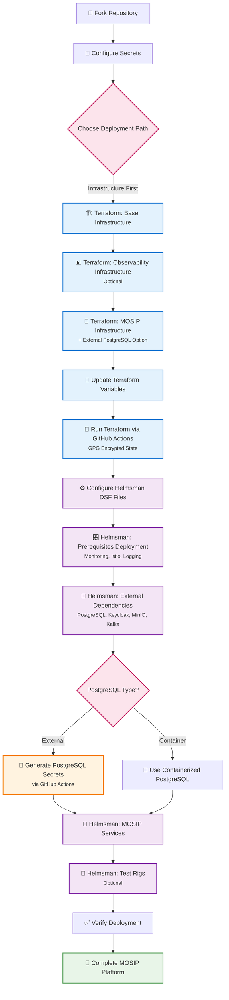
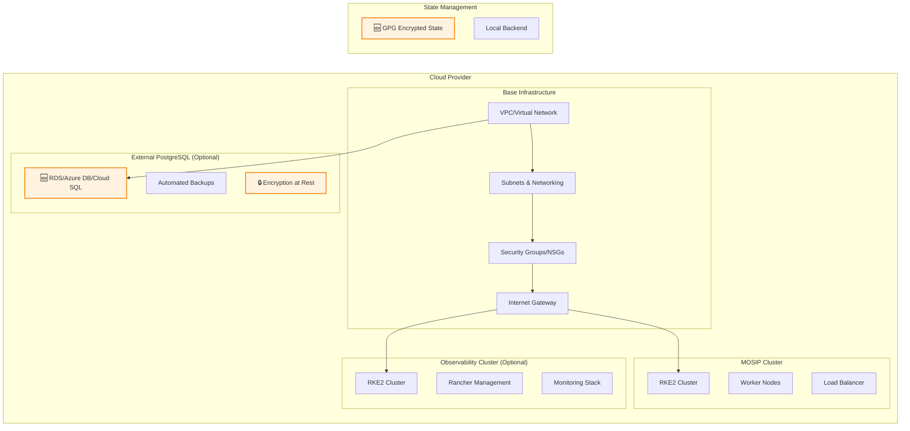
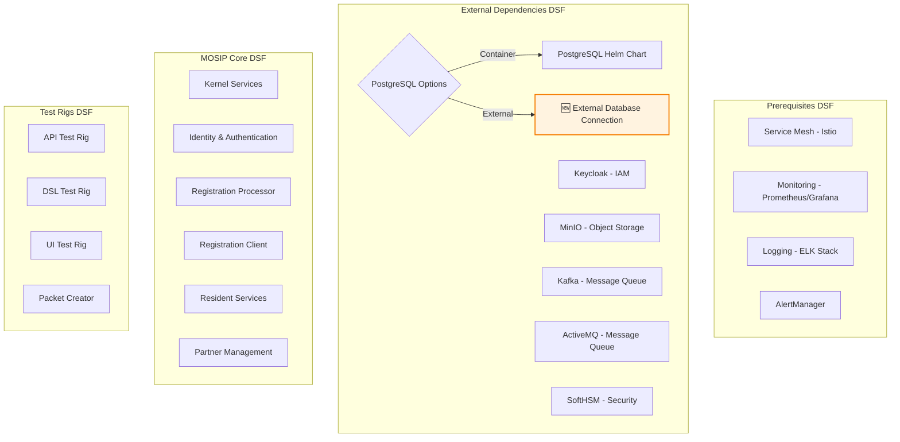
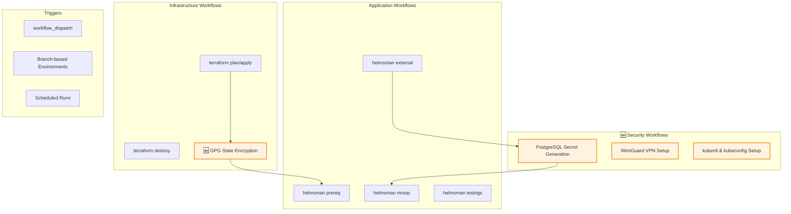
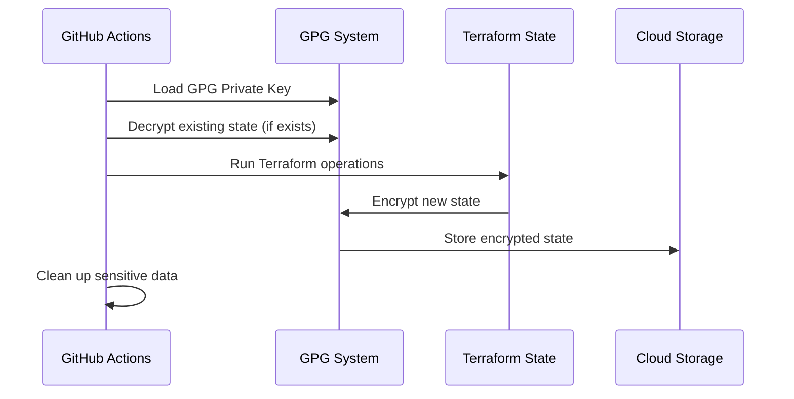
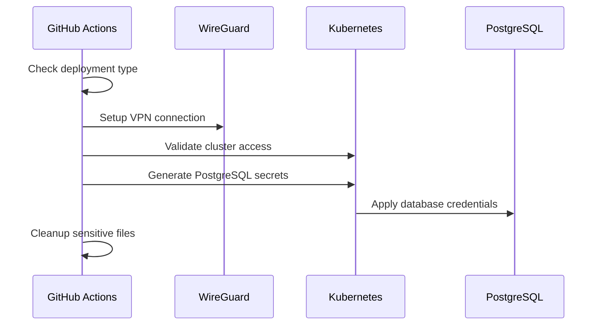
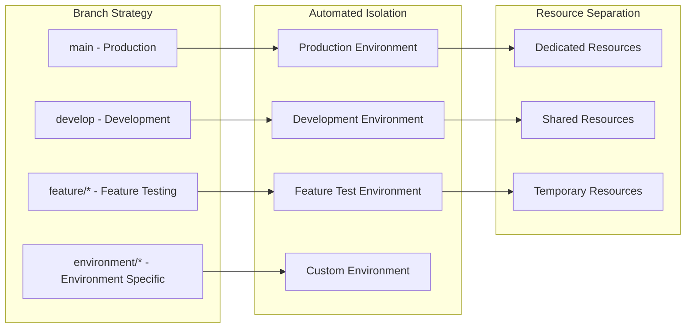

# MOSIP Rapid Deployment Architecture

## Complete Deployment Flow Diagram

## Architecture Components

### 🏗️ Infrastructure Layer (Terraform)

### 🎛️ Application Layer (Helmsman)

### 🤖 Automation Layer (GitHub Actions)

## 🔐 Security Architecture

### GPG Encryption Flow

### PostgreSQL Secret Management

## 📊 Deployment Options Matrix

| Component | Containerized | External/Managed | Hybrid |
|-----------|--------------|------------------|---------|
| **PostgreSQL** | ✅ Helm Chart | 🆕 RDS/Azure DB/Cloud SQL | ⚡ Both Options |
| **Monitoring** | ✅ Prometheus/Grafana | ☁️ Cloud Provider Native | 🔄 Integrated |
| **Storage** | ✅ MinIO | ☁️ S3/Blob/GCS | 🔄 Multi-tier |
| **Load Balancer** | ✅ Nginx/Traefik | ☁️ ALB/Azure LB/GCP LB | ⚖️ Hybrid |

## 🌐 Multi-Cloud Support

### Current Support
- ✅ **AWS** - Complete implementation
- ✅ **Azure** - Complete implementation  
- ✅ **GCP** - Complete implementation

### Community Contributions Welcome
- 🚧 **Oracle Cloud** - Placeholder available
- 🚧 **IBM Cloud** - Placeholder available
- 🚧 **DigitalOcean** - Placeholder available
- 🚧 **Linode** - Placeholder available

## 🔄 Environment Isolation

## 📈 Scalability & Performance

### Infrastructure Scaling
- **Horizontal Pod Autoscaling (HPA)** for MOSIP services
- **Cluster Autoscaling** for Kubernetes nodes  
- **Database scaling** via external managed services
- **Load balancing** with cloud-native solutions

### Performance Optimization
- **Resource requests and limits** properly configured
- **Persistent volume** optimization for databases
- **Network policies** for secure communication
- **Monitoring and alerting** for proactive scaling

---

*This architecture supports rapid deployment while maintaining enterprise-grade security, scalability, and reliability.*
