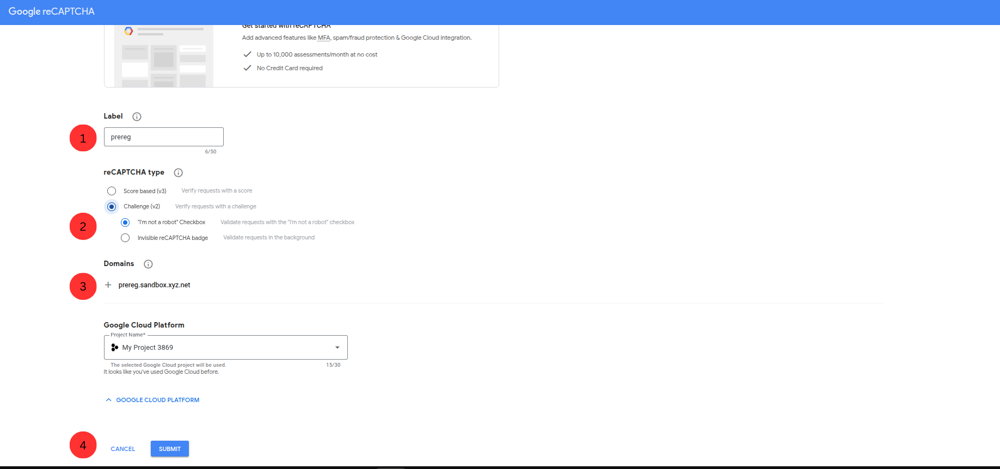
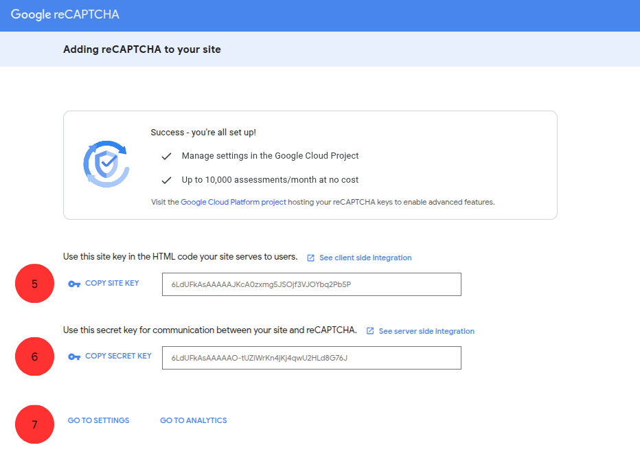
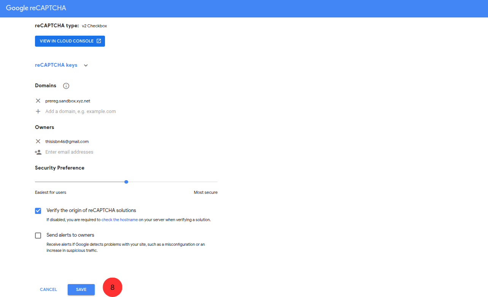
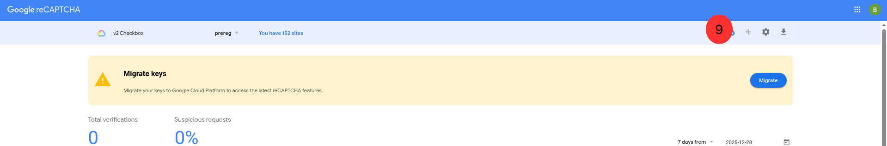
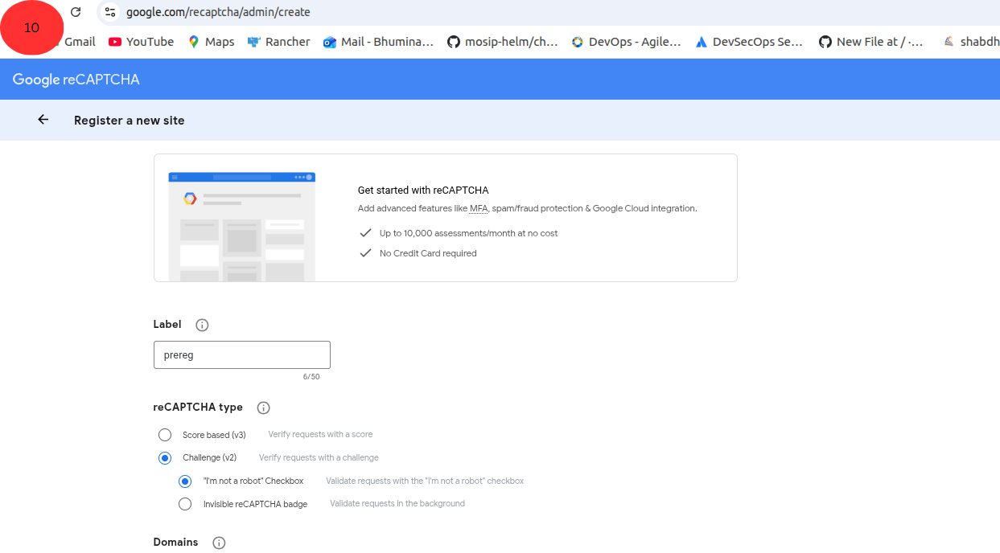

# reCAPTCHA Setup Guide

This guide provides step-by-step instructions for creating and configuring Google reCAPTCHA v2 keys for MOSIP domains (PreReg, Admin, and Resident).

## Prerequisites

- A Google account
- Access to [Google reCAPTCHA Admin Console](https://www.google.com/recaptcha/admin/create)
- Your MOSIP domain names (e.g., `prereg.your-domain.net`, `admin.your-domain.net`, `resident.your-domain.net`)

---

## Step-by-Step Guide

### Steps 1-4: Create reCAPTCHA for PreReg Domain



1. **Add Label**: Enter a descriptive label name for your reCAPTCHA (e.g., `MOSIP PreReg`)
2. **Select reCAPTCHA Type**: Choose **"I'm not a robot" Checkbox** (reCAPTCHA v2)
3. **Enter Domain**: Add your PreReg domain (e.g., `prereg.your-domain.net`)
4. **Submit**: Click the **Submit** button to create the reCAPTCHA

---

### Steps 5-7: Copy Keys and Access Settings



5. **Copy Site Key**: Copy the **Site Key** and save it securely - you'll need this for configuration
6. **Copy Secret Key**: Copy the **Secret Key** and save it securely - you'll need this for configuration
7. **Go to Settings**: Click on the **Settings** (gear icon) to access additional configuration options

---

### Step 8: Save Settings



8. **Save**: Click the **Save** button to save your reCAPTCHA settings

---

### Step 9: Add Additional Domains



9. **Add More Domains**: Click the **+** button to create reCAPTCHA keys for **Admin** and **Resident** domains

---

### Step 10: Repeat for Admin and Resident



10. **Repeat Steps 1-9**: Refresh the page and repeat steps 1-9 for:
    - **Admin domain**: `admin.your-domain.net`
    - **Resident domain**: `resident.your-domain.net`

---

## Configuration in MOSIP

After obtaining all six keys (Site Key and Secret Key for each domain), update the `external-dsf.yaml` file:

### Update captcha-setup.sh arguments (around line 315):

```yaml
hooks:
  postInstall: "$WORKDIR/hooks/captcha-setup.sh PREREG_SITE_KEY PREREG_SECRET_KEY ADMIN_SITE_KEY ADMIN_SECRET_KEY RESIDENT_SITE_KEY RESIDENT_SECRET_KEY"
```

### Arguments Order:

| Argument | Description |
|----------|-------------|
| Argument 1 | PreReg Site Key |
| Argument 2 | PreReg Secret Key |
| Argument 3 | Admin Site Key |
| Argument 4 | Admin Secret Key |
| Argument 5 | Resident Site Key |
| Argument 6 | Resident Secret Key |

### Example Configuration:

```yaml
hooks:
  postInstall: "$WORKDIR/hooks/captcha-setup.sh 6LfkAMwrAAAAAATB1WhkIhzuAVMtOs9VWabODoZ_ 6LfkAMwrAAAAAHQAT93nTGcLKa-h3XYhGoNSG-NL 6LdNAcwrAAAAAETGWvz-3I12vZ5V8vPJLu2ct9CO 6LdNAcwrAAAAAE4iWGJ-g6Dc2HreeJdIwAl5h1iL 6LdRAcwrAAAAAFUEHHKK5D_bSrwAPqdqAJqo4mCk 6LdRAcwrAAAAAOeVl6yHGBCBA8ye9GsUOy4pi9s9"
```

---

## Summary

| Domain | Keys Required |
|--------|---------------|
| PreReg (`prereg.your-domain.net`) | Site Key + Secret Key |
| Admin (`admin.your-domain.net`) | Site Key + Secret Key |
| Resident (`resident.your-domain.net`) | Site Key + Secret Key |

> **Note:** Keep your Secret Keys confidential. Never commit them directly to version control. Use GitHub Secrets or environment variables for secure storage.

---

## Related Documentation

- [DSF Configuration Guide](DSF_CONFIGURATION_GUIDE.md)
- [Main README](../README.md)
