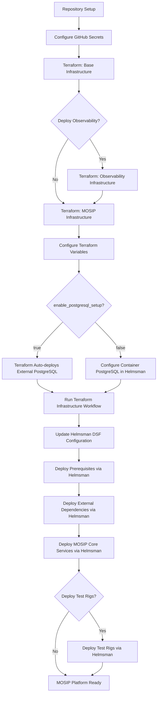
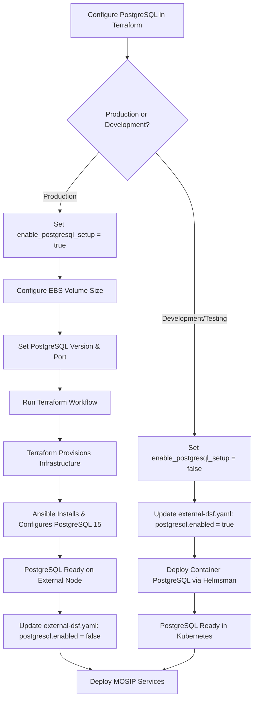
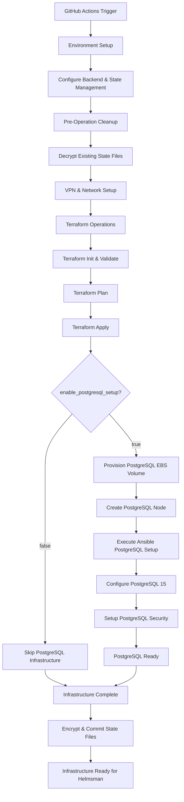
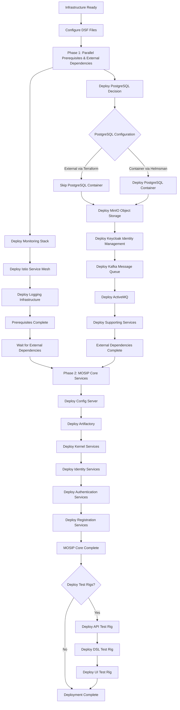
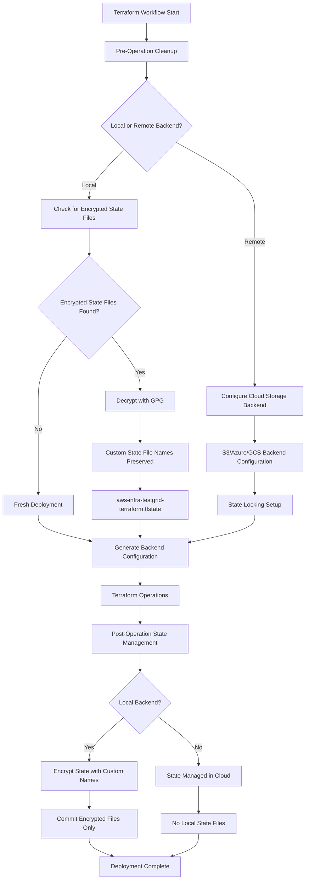
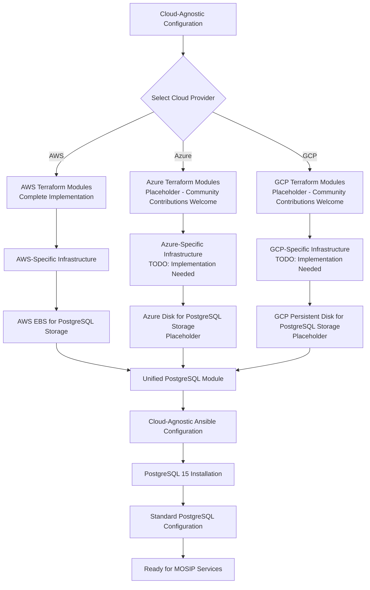
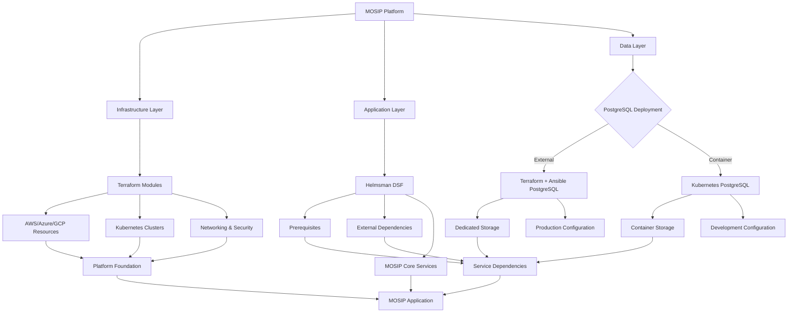

# MOSIP Infrastructure Deployment Flows - Updated Architecture

## Complete Infrastructure & Application Deployment Flow

## PostgreSQL Deployment Decision Flow

## Terraform Infrastructure Provisioning Flow

## Helmsman Application Deployment Flow

## State Management & Security Flow

## Multi-Cloud Infrastructure Pattern

## Component Integration Matrix

## Deployment Timeline & Dependencies

| Phase | Component | Dependencies | Duration | PostgreSQL Impact | **Parallel** |
|-------|-----------|--------------|----------|-------------------|--------------|
| 1 | Base Infrastructure | Cloud Credentials | 5-10 min | N/A | No |
| 2 | Observability (Optional) | Base Infrastructure | 10-15 min | N/A | No |
| 3 | MOSIP Infrastructure | Base/Observ Infrastructure | 15-25 min | PostgreSQL installed if enabled | No |
| 4a | Prerequisites | MOSIP Infrastructure | 10-15 min | N/A | **Yes** |
| 4b | External Dependencies | MOSIP Infrastructure | 15-20 min | Container PostgreSQL if not external | **Yes** |
| 5 | MOSIP Core Services | Prerequisites + External Dependencies | 20-30 min | Uses configured PostgreSQL | No |
| 6 | Test Rigs (Optional) | MOSIP Core | 10-15 min | N/A | No |

**Total Deployment Time**: 
- **Sequential**: 85-130 minutes 
- **With Parallel Prerequisites/External**: 70-110 minutes (**~20% faster!**)

## Key Benefits of Updated Architecture

### **Simplified PostgreSQL Management**
- **No separate workflow** for PostgreSQL secrets
- **Terraform handles everything** - infrastructure + configuration
- **Ansible ensures consistency** across environments
- **Simple enable/disable flag** in Terraform variables

### **Enhanced Security & State Management**
- **GPG encryption** for local state files
- **Custom state file naming** preserved through encryption
- **Modern Terraform backend** configuration
- **No deprecated command-line flags**

### **Streamlined Deployment Flow**
- **Fewer manual steps** required
- **Automated dependency resolution**
- **Better error recovery** mechanisms
- **Consistent multi-cloud approach**

---

*This document reflects the updated architecture with integrated PostgreSQL management and enhanced security features.*
