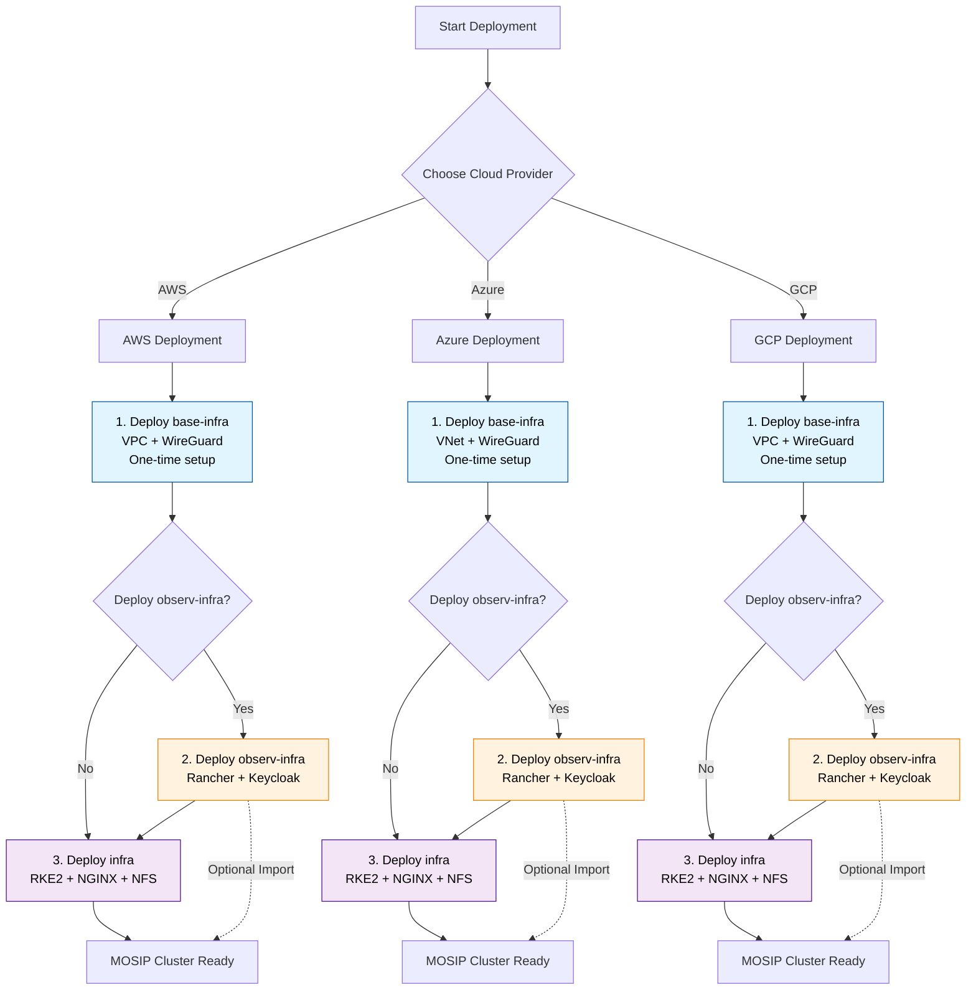
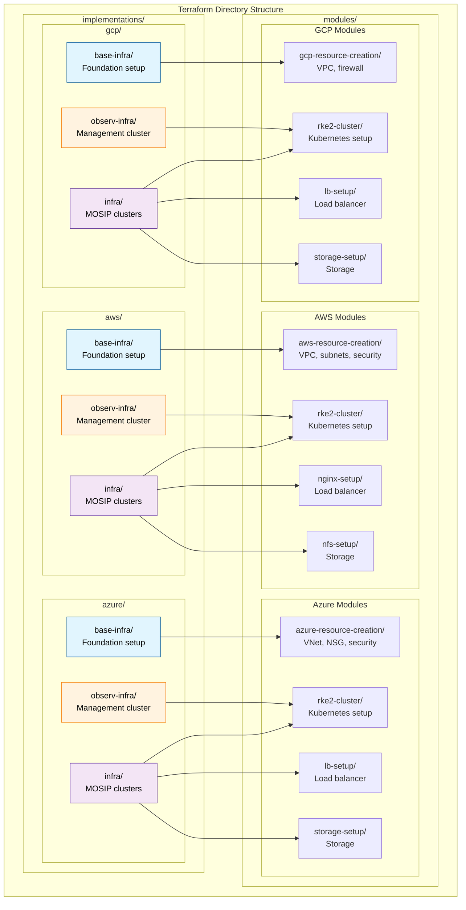

# MOSIP Three-Component Architecture

> **Cloud-agnostic infrastructure for MOSIP platform deployment**

## High-Level Architecture Overview

### Simple Component Flow

```
MOSIP Infrastructure Components
===============================

GitHub Actions (Central Orchestration)
      |
      v
┌─────────────┬─────────────┬─────────────┐
│ AWS Cloud   │Azure Cloud  │ GCP Cloud   │
└─────────────┴─────────────┴─────────────┘
      |             |             |
┌─────┼─────┐      ┌─┼─┐          ┌─┼─┐
│     │     │      │ │ │          │ │ │
v     v     v      v v v          v v v
base  obs   infra  base infra     base infra
│     │     │      │   │          │   │
└─────┼─────┘      └───┘          └───┘
      |              |              |
      v              v              v
[State Files]   [State Files]  [State Files]
(Branch/Cloud   (Branch/Cloud   (Branch/Cloud
 Isolated)       Isolated)       Isolated)
```

### Component Relationships

| Component | Purpose | Dependencies | State Isolation |
|-----------|---------|--------------|-----------------|
| **base-infra** | Foundation (VPC, WireGuard) | None | Per branch/cloud |
| **observ-infra** | Management (Rancher, Keycloak) | base-infra | Per branch/cloud |
| **infra** | Application (MOSIP K8s) | base-infra | Per branch/cloud |

## Multi-Cloud Deployment Architecture

```mermaid
graph TB
    subgraph "AWS Deployment"
        subgraph "AWS Base-Infra (One-time)"
            AWS_VPC[VPC 10.0.0.0/16<br/>Public/Private Subnets<br/>Security Groups<br/>WireGuard Jumpserver]
        end
        subgraph "AWS Observ-Infra (Optional)"
            AWS_MON[Management Cluster<br/>Rancher UI + Keycloak<br/>RBAC Integration]
        end
        subgraph "AWS Infra (Multiple)"
            AWS_RKE1[MOSIP Cluster 1<br/>Production Environment]
            AWS_RKE2[MOSIP Cluster 2<br/>Staging Environment]
        end
        AWS_VPC --> AWS_MON
        AWS_VPC --> AWS_RKE1
        AWS_VPC --> AWS_RKE2
        AWS_MON -.->|Import| AWS_RKE1
        AWS_MON -.->|Import| AWS_RKE2
    end
    
    subgraph "Azure Deployment"
        subgraph "Azure Base-Infra (One-time)"
            AZ_VNET[VNet 10.1.0.0/16<br/>Public/Private Subnets<br/>Network Security Groups<br/>WireGuard Jumpserver]
        end
        subgraph "Azure Observ-Infra (Optional)"
            AZ_MON[Management Cluster<br/>Rancher UI + Keycloak<br/>RBAC Integration]
        end
        subgraph "Azure Infra (Multiple)"
            AZ_RKE1[MOSIP Cluster 1<br/>Production Environment]
            AZ_RKE2[MOSIP Cluster 2<br/>Staging Environment]
        end
        AZ_VNET --> AZ_MON
        AZ_VNET --> AZ_RKE1
        AZ_VNET --> AZ_RKE2
        AZ_MON -.->|Import| AZ_RKE1
        AZ_MON -.->|Import| AZ_RKE2
    end
    
    subgraph "GCP Deployment"
        subgraph "GCP Base-Infra (One-time)"
            GCP_VPC[VPC 10.2.0.0/16<br/>Public/Private Subnets<br/>Firewall Rules<br/>WireGuard Jumpserver]
        end
        subgraph "GCP Observ-Infra (Optional)"
            GCP_MON[Management Cluster<br/>Rancher UI + Keycloak<br/>RBAC Integration]
        end
        subgraph "GCP Infra (Multiple)"
            GCP_RKE1[MOSIP Cluster 1<br/>Production Environment]
            GCP_RKE2[MOSIP Cluster 2<br/>Staging Environment]
        end
        GCP_VPC --> GCP_MON
        GCP_VPC --> GCP_RKE1
        GCP_VPC --> GCP_RKE2
        GCP_MON -.->|Import| GCP_RKE1
        GCP_MON -.->|Import| GCP_RKE2
    end
    
    style AWS_VPC fill:#e1f5fe,stroke:#01579b,color:#000000
    style AWS_MON fill:#fff3e0,stroke:#f57c00,color:#000000
    style AWS_RKE1 fill:#f3e5f5,stroke:#4a148c,color:#000000
    style AWS_RKE2 fill:#e8f5e8,stroke:#1b5e20,color:#000000
    style AZ_VNET fill:#e1f5fe,stroke:#01579b,color:#000000
    style AZ_MON fill:#fff3e0,stroke:#f57c00,color:#000000
    style AZ_RKE1 fill:#f3e5f5,stroke:#4a148c,color:#000000
    style AZ_RKE2 fill:#e8f5e8,stroke:#1b5e20,color:#000000
    style GCP_VPC fill:#e1f5fe,stroke:#01579b,color:#000000
    style GCP_MON fill:#fff3e0,stroke:#f57c00,color:#000000
    style GCP_RKE1 fill:#f3e5f5,stroke:#4a148c,color:#000000
    style GCP_RKE2 fill:#e8f5e8,stroke:#1b5e20,color:#000000
```



## Deployment Flow & Dependencies



## Terraform Module Structure



## State File Isolation

### Branch-Based Isolation
```
State Management Structure
==========================

Production (main branch):
├── mosip-terraform-bucket-main/
│   ├── aws-base-infra-main-terraform.tfstate
│   ├── aws-observ-infra-main-terraform.tfstate
│   ├── aws-infra-main-terraform.tfstate
│   ├── azure-base-infra-main-terraform.tfstate
│   ├── azure-observ-infra-main-terraform.tfstate
│   ├── azure-infra-main-terraform.tfstate
│   ├── gcp-base-infra-main-terraform.tfstate
│   ├── gcp-observ-infra-main-terraform.tfstate
│   └── gcp-infra-main-terraform.tfstate

Staging (staging branch):
├── mosip-terraform-bucket-staging/
└── ... (same pattern for staging environment)

Development (dev branch):
├── mosip-terraform-bucket-dev/
└── ... (same pattern for dev environment)
```

### Cloud-Specific State Backends
```
AWS: S3 Bucket + DynamoDB Locking
├── Bucket: mosip-terraform-bucket-{branch}
├── Locking: DynamoDB table for state coordination
└── Versioning: Enabled for rollback capability

Azure: Storage Account + Container Isolation
├── Account: mosipterraform{branch}storage
├── Container: terraform-state-{component}
└── Versioning: Blob versioning enabled

GCP: Google Cloud Storage + Versioning
├── Bucket: mosip-terraform-bucket-{branch}
├── Objects: {cloud}-{component}-{branch}-terraform.tfstate
└── Versioning: Object versioning enabled
```

## Component Summary

| Component | Purpose | Key Resources | Cloud Services | Lifecycle |
|-----------|---------|---------------|----------------|-----------|
| **base-infra** | Foundation & VPN | VPC, Subnets, Jumpserver, WireGuard | Network, Compute, Security | One-time setup |
| **observ-infra** | Cluster Management | Rancher UI, Keycloak, RBAC | Lightweight K8s, Load Balancer | Optional, Independent |
| **infra** | MOSIP Applications | RKE2, NGINX, NFS, Databases | Full K8s, Storage, Networking | Multiple deployments |

## Architecture Benefits

- **Modular Design**: Independent component lifecycle management
- **Cloud Agnostic**: Consistent deployment across AWS/Azure/GCP  
- **Security First**: Built-in VPN, encryption, and access controls
- **State Isolation**: Complete separation of environments and components
- **Centralized Management**: Optional Rancher UI for cluster oversight
- **Scalable**: Support for multiple MOSIP deployments
- **Production Ready**: Reliability and operational excellence

---

**Professional architecture designed for MOSIP deployments with modular components, state isolation, and multi-cloud support**
