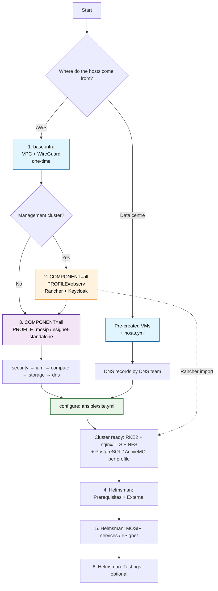
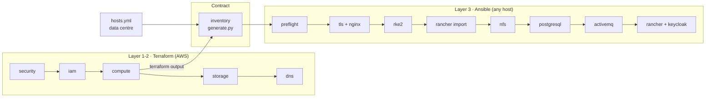

# High-Level Architecture Overview

> **Note:** Terraform provisioning is implemented for **AWS**; Azure and GCP have `base-infra` only. Data-centre VMs need no Terraform — the Ansible layer configures them directly.

## Deployment Flow & Dependencies


```mermaid
graph TD
 A[Start] --> B{Where do the hosts come from?}
 B -->|AWS| C[1. base-infra<br/>VPC + WireGuard<br/>one-time]
 B -->|Data centre| DC[Pre-created VMs<br/>+ hosts.yml]

 C --> OBS{Management cluster?}
 OBS -->|Yes| O[2. COMPONENT=all<br/>PROFILE=observ<br/>Rancher + Keycloak]
 OBS -->|No| M
 O --> M[3. COMPONENT=all<br/>PROFILE=mosip / esignet-standalone]

 M --> TF[security → iam → compute → storage → dns]
 TF --> CFG[configure: ansible/site.yml]
 DC --> DNS[DNS records by DNS team]
 DNS --> CFG

 CFG --> R[Cluster ready: RKE2 + nginx/TLS + NFS<br/>+ PostgreSQL / ActiveMQ per profile]
 O -.->|Rancher import| R

 R --> H1[4. Helmsman: Prerequisites + External]
 H1 --> H2[5. Helmsman: MOSIP services / eSignet]
 H2 --> H3[6. Helmsman: Test rigs - optional]

 style C fill:#e1f5fe,stroke:#01579b,color:#000000
 style DC fill:#e1f5fe,stroke:#01579b,color:#000000
 style O fill:#fff3e0,stroke:#f57c00,color:#000000
 style M fill:#f3e5f5,stroke:#4a148c,color:#000000
 style CFG fill:#e8f5e8,stroke:#1b5e20,color:#000000
```

## Layers and contracts


```mermaid
graph LR
 subgraph "Layer 1-2 · Terraform (AWS)"
 S[security] --> I[iam] --> CO[compute] --> ST[storage] --> D[dns]
 end
 subgraph "Contract"
 INV[inventory<br/>generate.py]
 end
 subgraph "Layer 3 · Ansible (any host)"
 PF[preflight] --> N[tls + nginx] --> K[rke2] --> RI[rancher import] --> NF[nfs] --> PG[postgresql] --> AM[activemq] --> RK[rancher + keycloak]
 end
 CO -->|terraform output| INV
 HY[hosts.yml<br/>data centre] --> INV
 INV --> PF
```

Components find each other through AWS tags (`Cluster`, `Role`), never
shared state. The only contract between the layers is the inventory, which
`ansible/inventory/generate.py` renders identically from Terraform outputs or
from an operator's `hosts.yml`.

## State isolation

One state per component × profile × branch:

```
{provider}-{component}-{profile}-{branch}-terraform.tfstate
e.g. aws-compute-mosip-main-terraform.tfstate
     aws-compute-observ-main-terraform.tfstate
     aws-base-infra-main-terraform.tfstate          (base-infra has no profile)
```

Local backend: GPG-encrypted and committed to the branch. Remote backend:
one bucket per component (S3 / Azure Storage / GCS), with optional locking.

## Component summary

| Component | Purpose | Key resources | Lifecycle |
|-----------|---------|---------------|-----------|
| **base-infra** | Foundation & VPN | VPC, subnets, jump server, WireGuard | One-time |
| **security** | Network rules | 4 security groups | Per cluster |
| **compute** | Hosts | nginx + RKE2 EC2 instances | Per cluster; resize any time |
| **iam** | Certbot access | Route53 role + instance profile | Per cluster |
| **storage** | Data disks | EBS for NFS / PostgreSQL / ActiveMQ | Per cluster; destroyed last-but-one |
| **dns** | Names | Route53 records → nginx | Per cluster; change any time |
| **configure** | Everything on the hosts | nginx/TLS, RKE2, NFS, PostgreSQL, ActiveMQ, Rancher/Keycloak | Re-runnable |

Profiles (`mosip`, `esignet-standalone`, `observ`) pick sizes and which
Layer-3 components run — see [docs/PROFILES.md](../PROFILES.md).
