# MOSIP Cloud-Agnostic Architecture Diagrams

This document contains detailed architecture diagrams for the MOSIP cloud-agnostic infrastructure.

## 🏗️ Infrastructure Component Diagram

```mermaid
graph TB
    subgraph "🌍 Global Infrastructure"
        subgraph "🏛️ Base Infrastructure Layer"
            subgraph "☁️ AWS Base"
                AWS_VPC[VPC<br/>10.0.0.0/16]
                AWS_PUB[Public Subnets<br/>10.0.1.0/24]
                AWS_PRIV[Private Subnets<br/>10.0.2.0/24]
                AWS_SG[Security Groups<br/>Web, App, DB tiers]
                AWS_IAM[IAM Roles<br/>Service accounts]
            end
            
            subgraph "🔷 Azure Base"
                AZ_VNET[Virtual Network<br/>10.1.0.0/16]
                AZ_PUB[Public Subnets<br/>10.1.1.0/24]
                AZ_PRIV[Private Subnets<br/>10.1.2.0/24]  
                AZ_NSG[Network Security Groups<br/>Web, App, DB tiers]
                AZ_RBAC[RBAC Roles<br/>Service principals]
            end
            
            subgraph "🟡 GCP Base"
                GCP_VPC[VPC Network<br/>10.2.0.0/16]
                GCP_PUB[Public Subnets<br/>10.2.1.0/24]
                GCP_PRIV[Private Subnets<br/>10.2.2.0/24]
                GCP_FW[Firewall Rules<br/>Web, App, DB tiers]
                GCP_IAM[IAM Roles<br/>Service accounts]
            end
        end
        
        subgraph "🚀 Application Infrastructure Layer"
            subgraph "☁️ AWS Application"
                AWS_K8S[RKE2 Cluster<br/>Control Plane + Workers]
                AWS_NGINX[NGINX Load Balancer<br/>SSL Termination]
                AWS_NFS[NFS Storage<br/>Shared volumes]
                AWS_DNS[Route53 DNS<br/>Domain management]
            end
            
            subgraph "🔷 Azure Application"
                AZ_K8S[AKS Cluster<br/>Managed Kubernetes]
                AZ_LB[Azure Load Balancer<br/>SSL Termination]
                AZ_STORAGE[Azure Files<br/>Shared storage]
                AZ_DNS[Azure DNS<br/>Domain management]
            end
            
            subgraph "🟡 GCP Application"
                GCP_K8S[GKE Cluster<br/>Managed Kubernetes]
                GCP_LB[Cloud Load Balancer<br/>SSL Termination]
                GCP_STORAGE[Cloud Filestore<br/>Shared storage]
                GCP_DNS[Cloud DNS<br/>Domain management]
            end
        end
    end
    
    AWS_VPC --> AWS_K8S
    AWS_PUB --> AWS_NGINX
    AWS_PRIV --> AWS_K8S
    AWS_SG --> AWS_K8S
    AWS_SG --> AWS_NGINX
    
    AZ_VNET --> AZ_K8S
    AZ_PUB --> AZ_LB
    AZ_PRIV --> AZ_K8S
    AZ_NSG --> AZ_K8S
    AZ_NSG --> AZ_LB
    
    GCP_VPC --> GCP_K8S
    GCP_PUB --> GCP_LB
    GCP_PRIV --> GCP_K8S
    GCP_FW --> GCP_K8S
    GCP_FW --> GCP_LB
```



## 🔄 Terraform Module Dependency Flow

```mermaid
graph TD
    subgraph "📋 User Input"
        CLOUD_CHOICE[Cloud Provider Selection<br/>aws | azure | gcp]
        COMPONENT_CHOICE[Component Selection<br/>base-infra | infra]
        CONFIG[Configuration Files<br/>.tfvars]
    end
    
    subgraph "🎯 Implementation Layer"
        IMPL[implementations/{cloud}/{component}/]
        IMPL_MAIN[main.tf]
        IMPL_VARS[variables.tf]
        IMPL_TFVARS[{cloud}.tfvars]
    end
    
    subgraph "🏗️ Interface Layer"
        BASE_INTF[base-infra/{cloud}/]
        INFRA_INTF[infra/{cloud}/]
    end
    
    subgraph "🧱 Module Layer"
        BASE_MOD[base-infra modules]
        INFRA_MOD[infra modules]
        AWS_MODULES[AWS Specific Modules<br/>• aws-resource-creation<br/>• nginx-setup<br/>• rke2-cluster<br/>• nfs-setup]
        AZURE_MODULES[Azure Specific Modules<br/>• azure-resource-creation<br/>• lb-setup<br/>• aks-cluster<br/>• storage-setup]
        GCP_MODULES[GCP Specific Modules<br/>• gcp-resource-creation<br/>• lb-setup<br/>• gke-cluster<br/>• storage-setup]
    end
    
    subgraph "☁️ Cloud Resources"
        AWS_RES[AWS Resources]
        AZURE_RES[Azure Resources]
        GCP_RES[GCP Resources]
    end
    
    CLOUD_CHOICE --> IMPL
    COMPONENT_CHOICE --> IMPL
    CONFIG --> IMPL_TFVARS
    
    IMPL --> IMPL_MAIN
    IMPL_MAIN --> BASE_INTF
    IMPL_MAIN --> INFRA_INTF
    
    BASE_INTF --> BASE_MOD
    INFRA_INTF --> INFRA_MOD
    
    INFRA_MOD --> AWS_MODULES
    INFRA_MOD --> AZURE_MODULES
    INFRA_MOD --> GCP_MODULES
    
    AWS_MODULES --> AWS_RES
    AZURE_MODULES --> AZURE_RES
    GCP_MODULES --> GCP_RES
```

## 📊 State Management Architecture

```mermaid
graph TB
    subgraph "🗄️ Terraform State Storage"
        subgraph "☁️ AWS State (S3)"
            AWS_BASE_S3[aws-base-infra-terraform.tfstate<br/>S3 Bucket: terraform-state-bucket<br/>Region: us-east-1]
            AWS_INFRA_S3[aws-infra-terraform.tfstate<br/>S3 Bucket: terraform-state-bucket<br/>Region: us-east-1]
        end
        
        subgraph "🔷 Azure State (Storage)"
            AZ_BASE_BLOB[azure-base-infra-terraform.tfstate<br/>Storage Account: terraformstate<br/>Container: terraform-state]
            AZ_INFRA_BLOB[azure-infra-terraform.tfstate<br/>Storage Account: terraformstate<br/>Container: terraform-state]
        end
        
        subgraph "🟡 GCP State (GCS)"
            GCP_BASE_GCS[gcp-base-infra-terraform.tfstate<br/>GCS Bucket: terraform-state-bucket<br/>Prefix: terraform/gcp-base-infra]
            GCP_INFRA_GCS[gcp-infra-terraform.tfstate<br/>GCS Bucket: terraform-state-bucket<br/>Prefix: terraform/gcp-infra]
        end
    end
    
    subgraph "🔐 State Locking"
        AWS_LOCK[DynamoDB Table<br/>terraform-state-lock]
        AZ_LOCK[Storage Account Lease<br/>Built-in locking]
        GCP_LOCK[GCS Object Locking<br/>Built-in locking]
    end
    
    subgraph "🚀 Deployment Environments"
        PROD[Production Environment]
        STAGING[Staging Environment]
        DEV[Development Environment]
    end
    
    AWS_BASE_S3 -.-> AWS_LOCK
    AWS_INFRA_S3 -.-> AWS_LOCK
    AZ_BASE_BLOB -.-> AZ_LOCK
    AZ_INFRA_BLOB -.-> AZ_LOCK
    GCP_BASE_GCS -.-> GCP_LOCK
    GCP_INFRA_GCS -.-> GCP_LOCK
    
    PROD --> AWS_BASE_S3
    PROD --> AWS_INFRA_S3
    STAGING --> AZ_BASE_BLOB
    STAGING --> AZ_INFRA_BLOB
    DEV --> GCP_BASE_GCS
    DEV --> GCP_INFRA_GCS
```



## 🔄 CI/CD Pipeline Flow

```mermaid
graph TD
    subgraph "👨‍💻 Developer Actions"
        DEV_PUSH[Code Push/PR]
        DEV_TRIGGER[Manual Workflow Trigger]
    end
    
    subgraph "🔧 GitHub Actions"
        WORKFLOW_TRIGGER{Workflow Triggered}
        INPUT_VALIDATION[Input Validation<br/>• Cloud Provider<br/>• Component Type<br/>• Credentials Check]
        
        subgraph "🏗️ Terraform Operations"
            TF_INIT[terraform init<br/>• Backend configuration<br/>• Provider setup<br/>• Module download]
            TF_VALIDATE[terraform validate<br/>• Syntax check<br/>• Configuration validation]
            TF_PLAN[terraform plan<br/>• Resource planning<br/>• Change detection<br/>• Cost estimation]
            TF_APPLY[terraform apply<br/>• Resource creation<br/>• State updates<br/>• Output generation]
        end
        
        subgraph "📋 Validation & Security"
            SECURITY_SCAN[Security Scanning<br/>• tfsec<br/>• checkov<br/>• infracost]
            POLICY_CHECK[Policy Validation<br/>• OPA/Sentinel<br/>• Compliance checks]
        end
        
        subgraph "🔔 Notifications"
            SLACK_SUCCESS[Slack Success Notification]
            SLACK_FAILURE[Slack Failure Notification]
            EMAIL_REPORT[Email Summary Report]
        end
    end
    
    subgraph "☁️ Cloud Providers"
        AWS_DEPLOY[AWS Deployment]
        AZURE_DEPLOY[Azure Deployment]
        GCP_DEPLOY[GCP Deployment]
    end
    
    subgraph "� Management & Integration"
        RANCHER[Rancher UI]
        KEYCLOAK[Keycloak]
        INTEGRATION[Rancher-Keycloak Integration]
        MONITORING[Cluster Monitoring]
    end
    
    DEV_PUSH --> WORKFLOW_TRIGGER
    DEV_TRIGGER --> WORKFLOW_TRIGGER
    WORKFLOW_TRIGGER --> INPUT_VALIDATION
    INPUT_VALIDATION --> TF_INIT
    TF_INIT --> TF_VALIDATE
    TF_VALIDATE --> SECURITY_SCAN
    SECURITY_SCAN --> POLICY_CHECK
    POLICY_CHECK --> TF_PLAN
    TF_PLAN --> TF_APPLY
    
    TF_APPLY --> AWS_DEPLOY
    TF_APPLY --> AZURE_DEPLOY
    TF_APPLY --> GCP_DEPLOY
    
    TF_APPLY --> SLACK_SUCCESS
    TF_APPLY --> EMAIL_REPORT
    WORKFLOW_TRIGGER --> SLACK_FAILURE
    SLACK_FAILURE -.-> DEV_PUSH
    
    AWS_DEPLOY --> RANCHER
    AZURE_DEPLOY --> RANCHER
    GCP_DEPLOY --> RANCHER
    RANCHER --> KEYCLOAK
    KEYCLOAK --> INTEGRATION
    PROMETHEUS --> ALERTMANAGER
    GRAFANA --> LOGS
```



## 🏗️ MOSIP Application Architecture on Kubernetes

```mermaid
graph TB
    subgraph "🌐 External Access"
        USERS[End Users]
        ADMIN[Administrators]
        API_CLIENTS[API Clients]
    end
    
    subgraph "🔒 Load Balancer & SSL"
        NGINX[NGINX Ingress<br/>SSL Termination<br/>Rate Limiting]
    end
    
    subgraph "🎯 Kubernetes Cluster"
        subgraph "🔐 Authentication & Authorization"
            KEYCLOAK[Keycloak<br/>Identity Provider]
            AUTHMANAGER[Auth Manager<br/>JWT Token Validation]
        end
        
        subgraph "📋 Core MOSIP Services"
            PREREGISTRATION[Pre-Registration<br/>Appointment Booking]
            REGISTRATION[Registration Client<br/>Biometric Capture]
            IDREPO[ID Repository<br/>Identity Storage]
            IDAUTH[ID Authentication<br/>Verification Service]
            RESIDENT[Resident Services<br/>Self-Service Portal]
        end
        
        subgraph "🔧 Supporting Services"
            CONFIGSERVER[Config Server<br/>Centralized Configuration]
            AUDITMANAGER[Audit Manager<br/>Audit Logging]
            KEYMANAGER[Key Manager<br/>Encryption Keys]
            NOTIFIER[Notification Service<br/>Email/SMS Gateway]
        end
        
        subgraph "📊 Data Layer"
            POSTGRES[PostgreSQL<br/>Master Database]
            POSTGRES_REPLICA[PostgreSQL<br/>Read Replicas]
            MINIO[MinIO<br/>Object Storage]
            ACTIVEMQ[ActiveMQ<br/>Message Queue]
        end
        
        subgraph "📈 Monitoring & Logging"
            PROMETHEUS_K8S[Prometheus<br/>Metrics Collection]
            GRAFANA_K8S[Grafana<br/>Monitoring Dashboards]
            ELASTICSEARCH[Elasticsearch<br/>Log Aggregation]
            KIBANA[Kibana<br/>Log Visualization]
        end
    end
    
    subgraph "💾 Persistent Storage"
        NFS[NFS Server<br/>Shared File Storage]
        EBS[EBS Volumes<br/>Database Storage]
    end
    
    USERS --> NGINX
    ADMIN --> NGINX
    API_CLIENTS --> NGINX
    
    NGINX --> KEYCLOAK
    NGINX --> PREREGISTRATION
    NGINX --> RESIDENT
    NGINX --> IDAUTH
    
    KEYCLOAK --> AUTHMANAGER
    AUTHMANAGER --> PREREGISTRATION
    AUTHMANAGER --> REGISTRATION
    AUTHMANAGER --> IDREPO
    AUTHMANAGER --> IDAUTH
    AUTHMANAGER --> RESIDENT
    
    PREREGISTRATION --> POSTGRES
    REGISTRATION --> POSTGRES  
    IDREPO --> POSTGRES
    IDAUTH --> POSTGRES
    RESIDENT --> POSTGRES
    
    POSTGRES --> POSTGRES_REPLICA
    
    PREREGISTRATION --> MINIO
    REGISTRATION --> MINIO
    IDREPO --> MINIO
    
    CONFIGSERVER --> PREREGISTRATION
    CONFIGSERVER --> REGISTRATION
    CONFIGSERVER --> IDREPO
    CONFIGSERVER --> IDAUTH
    CONFIGSERVER --> RESIDENT
    
    AUDITMANAGER --> ELASTICSEARCH
    KEYMANAGER --> MINIO
    NOTIFIER --> ACTIVEMQ
    
    POSTGRES --> EBS
    MINIO --> NFS
    ELASTICSEARCH --> EBS
    
    PROMETHEUS_K8S --> GRAFANA_K8S
    ELASTICSEARCH --> KIBANA
```



## 🔧 Network Security Architecture


## 📋 Summary

These diagrams illustrate the comprehensive architecture of the MOSIP cloud-agnostic infrastructure, showing:

1. **Multi-cloud foundation** with isolated base and application layers
2. **Modular Terraform design** with clear separation of concerns
3. **Robust state management** with proper isolation and locking
4. **Complete CI/CD pipeline** with security and compliance checks
5. **Detailed MOSIP application architecture** on Kubernetes
6. **Comprehensive network security** with defense-in-depth approach

The architecture ensures scalability, security, and maintainability across all supported cloud providers while providing a consistent deployment experience.
