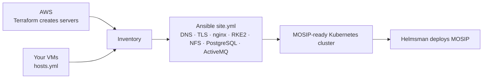

---
hide:
  - navigation
  - toc
---

# MOSIP Infra

**Deploy the infrastructure for MOSIP — on AWS or on servers you already have.**

MOSIP Infra builds everything MOSIP needs underneath the application: servers, firewall rules,
disks, DNS, TLS certificates, a Kubernetes (RKE2) cluster, NFS, PostgreSQL and ActiveMQ. On AWS
it creates the servers for you; in a data centre it sets up the VMs you already have. Either way,
the result is the same cluster, ready for the MOSIP services.

-   :material-aws:{ .lg .middle } **Deploy on AWS**

    ---

    Terraform creates the servers, Ansible sets them up — one workflow run.

    [:octicons-arrow-right-24: Quickstart: AWS](getting-started/quickstart-aws.md)

-   :material-server-network:{ .lg .middle } **Deploy on your own VMs**

    ---

    Data centre, Azure or GCP VMs you already have. No Terraform — just Ansible.

    [:octicons-arrow-right-24: Quickstart: data centre](getting-started/quickstart-datacentre.md)

-   :material-cog-sync:{ .lg .middle } **Run day-2 operations**

    ---

    Change DNS, add nodes, renew certificates, add a bastion, destroy safely.

    [:octicons-arrow-right-24: How-to guides](guides/dns-providers.md)

-   :material-sitemap:{ .lg .middle } **Understand the design**

    ---

    Layers, components, profiles and why the order matters.

    [:octicons-arrow-right-24: Architecture](overview/architecture.md)

## What you get

| | |
|---|---|
| :material-layers-triple: **Independent components** | Five Terraform components, each with its own state — change DNS without touching servers. |
| :material-earth: **Any environment** | The same Ansible configures AWS instances and data-centre VMs. |
| :material-dns: **Any DNS provider** | Route53, GoDaddy, Cloudflare, BIND / PowerDNS / Windows DNS, or manual. |
| :material-certificate: **Any certificate** | Your own certificate, or Let's Encrypt over HTTP or DNS. |
| :material-shield-check: **Safe by default** | Pre-flight checks, encrypted state, scoped IAM, legacy-proven order. |
| :material-source-branch: **One branch per environment** | State, secrets and settings isolated per branch. |

## How it works in one picture

!!! tip "New here?"
    Start with [Introduction](overview/introduction.md) for the five-minute overview, then pick a
    quickstart.
