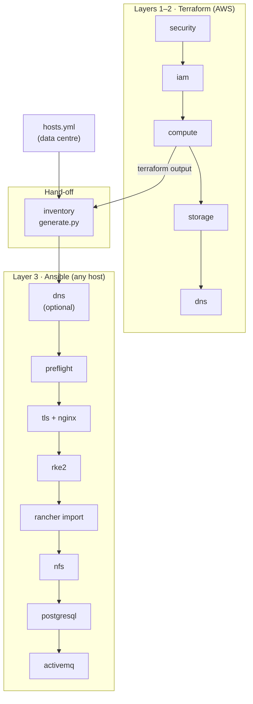

# Architecture

MOSIP Infra has **two layers** with one clear hand-off between them. Terraform creates machines
(on AWS); Ansible configures machines (anywhere). Because Ansible never needs to know where a
machine came from, the same configuration runs on AWS and in a data centre.



## Layer 1–2: Terraform components

The legacy single module is split into **five components**. Each one is its own Terraform root
with its own state, so it can be planned, applied or destroyed on its own.

| Order | Component | Creates | Finds the previous layer by |
|:-:|---|---|---|
| 1 | `security` | 4 security groups (nginx, control-plane, etcd, worker) | VPC `Name` tag |
| 2 | `iam` | certbot role + instance profile, scoped to your DNS zone | — |
| 3 | `compute` | nginx + RKE2 EC2 instances; nginx gets the certbot profile at creation | security-group tags, profile name |
| 4 | `storage` | EBS data disks attached to nginx | instance tags |
| 5 | `dns` | Route53 records pointing at nginx | instance tags (or fixed IPs) |
| — | `vm` | standalone EC2 groups, each with its own security group and IAM | VPC `Name` tag |

!!! info "No shared state between components"
    Components discover each other through AWS tags (`Cluster`, `Role`) or well-known names —
    never through each other's state. That is what makes them independent.

## Layer 3: Ansible configuration

`ansible/site.yml` configures the hosts in a **fixed order**. A [profile](concepts.md#profiles)
can switch steps on or off, but never changes the order.

| Step | Role | What it does |
|:-:|---|---|
| 0 | `dns` | Creates DNS records through your provider *(only when `dns_provider` is set)* |
| 1 | `preflight` | Checks SSH, required values, data disks and DNS — changes nothing |
| 2 | `tls` + `nginx` | Gets the certificate (own / HTTP-01 / DNS-01), installs nginx |
| 3 | `rke2` | Builds the Kubernetes cluster |
| 4 | `rancher_import` | Registers the cluster in Rancher *(optional)* |
| 5 | `nfs` | NFS server on the nginx host + CSI driver |
| 6 | `postgresql` | External PostgreSQL on its own disk *(profile)* |
| 7 | `activemq` | ActiveMQ storage *(profile)* |
| 8 | `rancher_keycloak` | Rancher UI + Keycloak *(observ profile only)* |

## The hand-off: one inventory, two sources

`ansible/inventory/generate.py` produces the inventory Ansible reads:

=== "AWS"

    Reads the IP addresses from the Terraform `compute` and `storage` outputs.

    ```bash
    python3 ansible/inventory/generate.py --profile profiles/mosip \
      --from-terraform /tmp/tf-outputs --tfvars profiles/mosip/aws/common.tfvars \
      -o inventory.yml
    ```

=== "Data centre"

    Reads a short `hosts.yml` written by the operator.

    ```bash
    python3 ansible/inventory/generate.py --profile profiles/mosip \
      --from-hosts my-hosts.yml -o inventory.yml
    ```

Both produce the **same inventory format** — a unit test proves it — so every Ansible role behaves
identically.

## Why the order matters

The order is the legacy monolith's dependency chain, kept on purpose:

- **IAM before compute** — nginx needs its certificate permission when it is created.
- **DNS before nginx** — Let's Encrypt can only validate a name that already points to nginx.
  Pre-flight blocks the run for HTTP-01 if DNS isn't ready.
- **Compute before storage and DNS** — both look up the nginx instance.

## What changed from the legacy setup

| Before | Now |
|---|---|
| One `aws-resource-creation` module, one state | Five components, one state each |
| Setup scripts run from inside Terraform | Ansible roles, runnable anywhere |
| AWS only | AWS + any pre-created VMs |
| `observ-infra` was a full copy of the code | `observ` is a profile |
| Route53 only | Any DNS provider; any certificate source |

**Next:** [Concepts](concepts.md) · [Quickstart: AWS](../getting-started/quickstart-aws.md)
