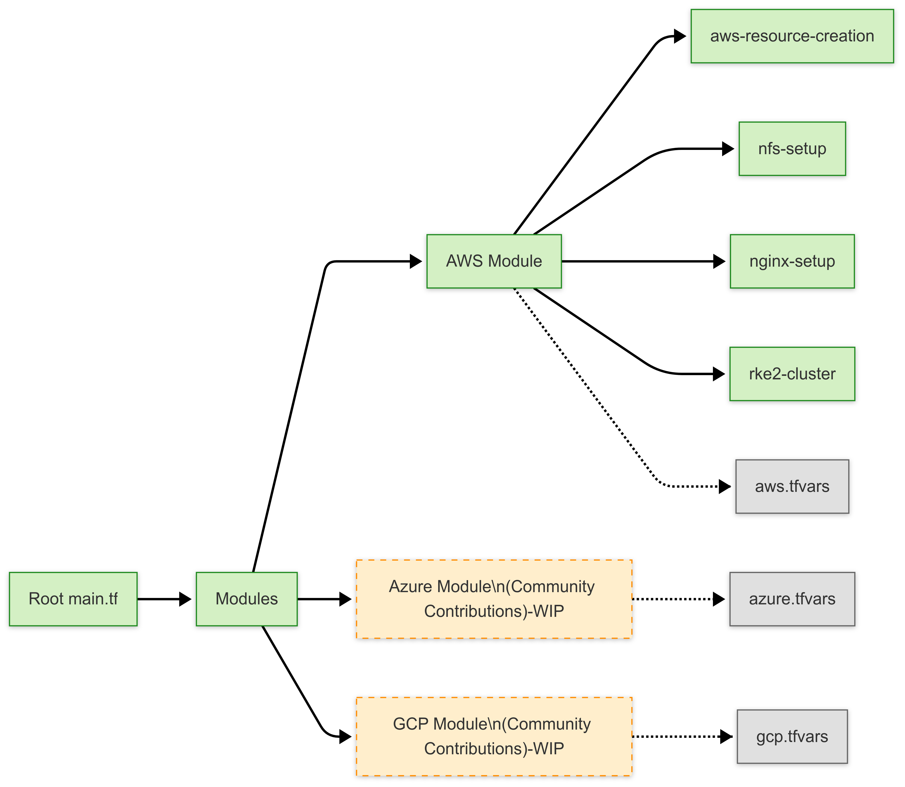

# MOSIP Terraform Infrastructure

This repository contains a comprehensive, cloud-agnostic Terraform setup for MOSIP infrastructure deployment with three distinct components and automated WireGuard VPN integration.

## 🏗️ Three-Component Architecture



### Component Overview

1. **🏛️ base-infra** - Foundational networking and VPN access
2. **🚀 infra** - MOSIP core and external services on Kubernetes
3. **🔧 observ-infra** - Observation tools (Rancher UI, Keycloak) on minimal Kubernetes

## 📚 Documentation

- **[Directory Structure Guide](./DIRECTORY_STRUCTURE.md)** - Comprehensive overview of the Terraform directory organization
- **[WireGuard Automation Guide](./WIREGUARD_AUTOMATION.md)** - Automated WireGuard setup documentation
- **[Cloud-Agnostic Implementation](./CLOUD_AGNOSTIC_README.md)** - Multi-cloud deployment guide

## 🚀 Quick Start

### 1. Base Infrastructure (VPC, Networking, Jumpserver, WireGuard)

```bash
cd terraform/implementations/aws/base-infra/
terraform init
terraform plan -var-file="aws.tfvars"
terraform apply -var-file="aws.tfvars"
```

### 2. MOSIP Infrastructure (Kubernetes for Core/External Services)

```bash
cd terraform/implementations/aws/infra/
terraform init
terraform plan -var-file="aws.tfvars"
terraform apply -var-file="aws.tfvars"
```

### 3. Observation Infrastructure (Kubernetes for Rancher UI, Keycloak)

```bash
cd terraform/implementations/aws/observ-infra/
terraform init
terraform plan -var-file="aws.tfvars"
terraform apply -var-file="aws.tfvars"
```

## 🌟 Key Features

### ✅ Automated WireGuard Setup
- **Zero Manual Configuration**: Jumpserver automatically configured with WireGuard VPN
- **Docker & Ansible Pre-installed**: Ready for k8s-infra deployment
- **Configurable Peer Count**: Support for multiple VPN clients
- **Management Scripts**: Built-in aliases and helper commands

### ✅ Cloud-Agnostic Design
- **Multi-Cloud Support**: AWS, Azure, GCP implementations
- **Consistent Structure**: Same workflow across all cloud providers
- **Modular Architecture**: Reusable components and modules

### ✅ Production-Ready
- **Security Best Practices**: Proper IAM, security groups, and network isolation
- **Scalable Design**: Support for multiple environments and regions
- **Comprehensive Outputs**: All necessary information for post-deployment

## 📁 Directory Structure

```
terraform/
├── base-infra/          # 🏗️  Foundation (VPC, jumpserver)
├── infra/               # 🎯  Main (Kubernetes clusters)
├── implementations/     # 🌍  Environment configs
├── modules/             # 🧩  Reusable modules
└── docs/                # 📖  Documentation
```

## 🔧 Configuration

### WireGuard Automation Variables

```hcl
# Enable automated WireGuard setup
enable_wireguard_setup = true
wireguard_peers        = 30
k8s_infra_repo_url     = "https://github.com/mosip/k8s-infra.git"
k8s_infra_branch       = "develop"
```

### Cloud Provider Selection

```hcl
# Choose your cloud provider
cloud_provider = "aws"    # or "azure" or "gcp"
```

## 🛠️ Management Commands

After deployment, connect to your jumpserver:

```bash
ssh ubuntu@<jumpserver-ip>

# WireGuard management
wg-status              # Check WireGuard status
wg-restart             # Restart WireGuard container
./get-wireguard-configs.sh  # View client configurations

# Navigate to repositories
k8s-infra              # Go to k8s-infra directory
wg-dir                 # Go to WireGuard directory
```

## 🌐 Multi-Cloud Support

| Cloud Provider | Status | Features |
|----------------|---------|----------|
| **AWS** | ✅ Complete | EKS clusters, VPC, automated WireGuard |
| **Azure** | 🚧 In Progress | AKS clusters, VNet, resource groups |
| **GCP** | 🚧 In Progress | GKE clusters, VPC, project setup |

## 📋 Prerequisites

- Terraform >= 1.0
- Cloud provider CLI tools (AWS CLI, Azure CLI, or gcloud)
- Valid cloud provider credentials
- SSH key pair for jumpserver access

## 🔍 Monitoring & Logs

- **Setup Logs**: `/var/log/jumpserver-setup.log`
- **Status Check**: `/home/ubuntu/jumpserver-setup-complete.txt`
- **WireGuard Logs**: `sudo docker logs wireguard`

## 🤝 Contributing

1. Fork the repository
2. Create a feature branch
3. Make your changes
4. Test thoroughly
5. Submit a pull request

## 📞 Support

For detailed implementation guides and troubleshooting:
- Review the [Directory Structure Guide](./DIRECTORY_STRUCTURE.md)
- Check the [WireGuard Automation Guide](./WIREGUARD_AUTOMATION.md)
- Consult cloud-specific module documentation

## 🏷️ Version

Current implementation supports:
- Terraform ~> 1.0
- AWS Provider ~> 5.0
- Azure Provider ~> 3.0
- GCP Provider ~> 4.0

