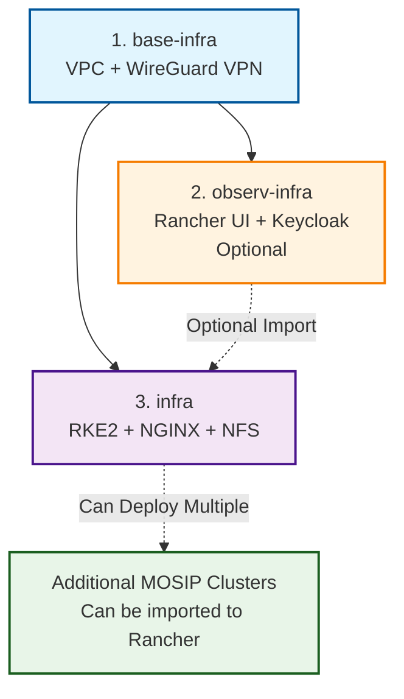

# MOSIP Infrastructure Terraform

> **Cloud-agnostic infrastructure automation for MOSIP platform deployment**

## Architecture Overview

```
MOSIP Infrastructure (3-Component Architecture) 
├── base-infra      → Foundation (VPC, Sub## Additional Documentationets, NAT, WireGuard VPN) - One-time setup
├── observ-infra    → Management Cluster (Rancher UI + Keycloak + RBAC) - Optional, One-time
└── infra           → MOSIP K8s Clusters (Multiple clusters, optionally imported to Rancher)
```

## Directory Structure

```
terraform/
├── implementations/           # Cloud-specific deployments
│   ├── aws/
│   │   ├── base-infra/       # Foundation resources (VPC, subnets, jumpserver)
│   │   ├── observ-infra/     # Management cluster (Rancher UI + Keycloak)
│   │   └── infra/            # MOSIP application clusters
│   ├── azure/                # Azure implementations
│   └── gcp/                  # GCP implementations
│
├── modules/                  # Reusable Terraform modules
│   ├── aws/                  # AWS-specific modules
│   │   ├── aws-resource-creation/    # VPC, networking, security groups
│   │   ├── rke2-cluster/            # Kubernetes cluster creation
│   │   ├── nginx-setup/             # Load balancer setup
│   │   └── nfs-setup/               # Storage setup
│   ├── azure/                # Azure-specific modules
│   └── gcp/                  # GCP-specific modules
│
├── base-infra/               # Component entry points
├── observ-infra/             # Component entry points
├── infra/                    # Component entry points
└── README.md                 # This documentation
```

## Deployment Options

### Option 1: GitHub Actions (Recommended)
```yaml
# Automated deployment via workflows
Component: base-infra | observ-infra | infra
Cloud: aws | azure | gcp
Backend: remote (S3 with encryption & versioning)
```

### Option 2: Manual Deployment
```bash
# 1. Foundation (Deploy first - One-time setup)
cd implementations/aws/base-infra/
terraform init && terraform apply -var-file="aws.tfvars"

# 2. Management Cluster (Deploy second - Optional, One-time)
cd implementations/aws/observ-infra/  
terraform init && terraform apply -var-file="aws.tfvars"

# 3. MOSIP Clusters (Deploy third - Can create multiple)
cd implementations/aws/infra/
terraform init && terraform apply -var-file="aws.tfvars"
```

## Component Details

| Component | Purpose | Resources | Dependencies | Lifecycle |
|-----------|---------|-----------|--------------|-----------|
| **base-infra** | Foundation & VPN | VPC, Subnets, Security Groups, WireGuard Jumpserver | None | One-time setup |
| **observ-infra** | Cluster Management | Rancher UI, Keycloak, RBAC Integration | base-infra | Optional, One-time |  
| **infra** | MOSIP Clusters | Kubernetes clusters, NGINX load balancers, NFS storage | base-infra | Multiple deployments |

### Detailed Component Breakdown

#### **base-infra** (Foundation - Deploy First)
- **VPC/VNet Creation**: Public/private subnets with proper CIDR allocation
- **Network Components**: NAT gateways, Internet gateways, Route tables
- **Security**: Security groups, Network ACLs, Firewall rules
- **VPN Access**: Jumpserver with automated WireGuard container setup
- **DNS & SSL**: Route53/Azure DNS zones, SSL certificate management

#### **observ-infra** (Management - Optional Second)
- **Rancher UI**: Web-based Kubernetes cluster management interface
- **Keycloak**: Identity and access management service
- **RBAC Integration**: Rancher-Keycloak integration for cluster access control
- **Lightweight K8s**: Minimal cluster for management services only
- **Import Capability**: Allows importing multiple infra clusters for centralized management

#### **infra** (Applications - Deploy Third, Multiple Times)
- **Production K8s Clusters**: Full-featured clusters for MOSIP services
- **Load Balancing**: Application load balancers with SSL termination
- **Storage**: Persistent volumes, NFS, database storage
- **Databases**: PostgreSQL, Redis, other MOSIP data services
- **Optional Import**: Can be imported to observ-infra Rancher for centralized management

## Backend Configuration

### Remote Backend (Production)
```yaml
BACKEND_TYPE: remote
REMOTE_BACKEND_CONFIG: aws:my-terraform-bucket:us-west-2
```
- **Automated S3 bucket creation** with encryption (AES256) and versioning
- **Branch-specific isolation**: `bucket-{branch}` naming
- **Component-specific state**: `{cloud}-{component}-{branch}-terraform.tfstate`

### Local Backend (Development)
```yaml
BACKEND_TYPE: local
```
- State files stored locally and committed to git (not recommended for production)

## Multi-Cloud Support

| Cloud | Status | Components | Features |
|-------|--------|------------|----------|
| **AWS** | Production Ready | All 3 components | RKE2, VPC, automated WireGuard |
| **Azure** | Production Ready | All 3 components | RKE2, VNet, resource groups |
| **GCP** | Production Ready | All 3 components | RKE2, VPC, project setup |

## Security & Compliance

- **State Encryption**: AES256 encryption for all remote state files
- **State Versioning**: Automatic backup and rollback capability  
- **Access Control**: IAM-based permissions with least privilege
- **Resource Tagging**: Consistent tagging for cost management and compliance
- **Network Isolation**: Private subnets with NAT gateways
- **VPN Access**: Automated WireGuard setup for secure cluster access

## State Management Architecture

### Branch-Based Isolation
```
Production:  my-terraform-bucket-main
Staging:     my-terraform-bucket-staging  
Development: my-terraform-bucket-dev
```

### Component-Specific State Files
```
my-terraform-bucket-main/
├── aws-base-infra-main-terraform.tfstate     # Foundation layer
├── aws-infra-main-terraform.tfstate          # Application layer  
└── aws-observ-infra-main-terraform.tfstate   # Monitoring layer
```

## GitHub Actions Integration

Professional-grade CI/CD automation:
- **Create/Update**: `.github/workflows/terraform.yml`
- **Destroy**: `.github/workflows/terraform-destroy.yml`
- **Automated S3 Setup**: Bucket creation, encryption, versioning
- **Branch Management**: Environment-specific deployments

See: [GitHub Actions Documentation](../.github/workflows/README.md)

## Deployment Sequence



**Deployment Order**: base-infra → observ-infra (optional) → infra (multiple clusters)

## Resource Tagging Strategy

```hcl
tags = {
  Project      = "MOSIP"
  Environment  = "production|staging|development"  
  Component    = "base-infra|infra|observ-infra"
  ManagedBy    = "Terraform"
  Owner        = "Platform-Team"
  CostCenter   = "MOSIP-Infrastructure"
}
```

## Key Features

### Automated WireGuard VPN
- **Zero-touch setup**: Jumpserver auto-configured with WireGuard container
- **Multi-client support**: Configurable peer count (default: 30 clients)
- **Ready-to-use**: Docker, Ansible, k8s-infra repo pre-installed
- **Management tools**: Built-in status check and restart scripts

### Cloud-Agnostic Design  
- **Consistent APIs**: Same Terraform workflow across AWS/Azure/GCP
- **Modular architecture**: Reusable modules and implementations
- **Environment parity**: Identical infrastructure across environments

### Production Security
- **Encrypted state**: AES256 S3 encryption with versioning
- **Network isolation**: Private subnets with controlled egress
- **Access control**: IAM roles with least-privilege principles
- **Audit trail**: Comprehensive resource tagging and logging

## Troubleshooting

### Common Issues & Solutions

| Issue | Solution |
|-------|----------|
| **State Lock Error** | `terraform force-unlock LOCK_ID` |
| **Provider Auth Failed** | `aws sts get-caller-identity` / `az account show` / `gcloud auth list` |
| **Backend Init Failed** | `terraform init -reconfigure` |
| **Module Not Found** | `terraform init -upgrade` |
| **S3 Access Denied** | Verify IAM permissions for S3 and DynamoDB |

### Validation Commands
```bash
# Verify Terraform syntax
terraform validate

# Check state file integrity  
terraform state list

# Verify provider authentication
terraform providers

# Test connectivity to backend
terraform init -backend=false
```

## � Additional Documentation

- **[AWS Implementation Guide](implementations/aws/README.md)** - AWS-specific deployment details
- **[Azure Implementation Guide](implementations/azure/README.md)** - Azure-specific deployment details  
- **[GCP Implementation Guide](implementations/gcp/README.md)** - GCP-specific deployment details
- **[Module Documentation](modules/README.md)** - Detailed module specifications
- **[GitHub Actions Guide](../.github/workflows/README.md)** - CI/CD workflow documentation

---

## Support & Maintenance

**Production Support**: Platform Engineering Team  
**Documentation**: Keep up-to-date with infrastructure changes  
**Monitoring**: Use observ-infra component for infrastructure health  
**Backup**: State files automatically versioned in S3

**Production-ready infrastructure with comprehensive security, monitoring, and compliance**

