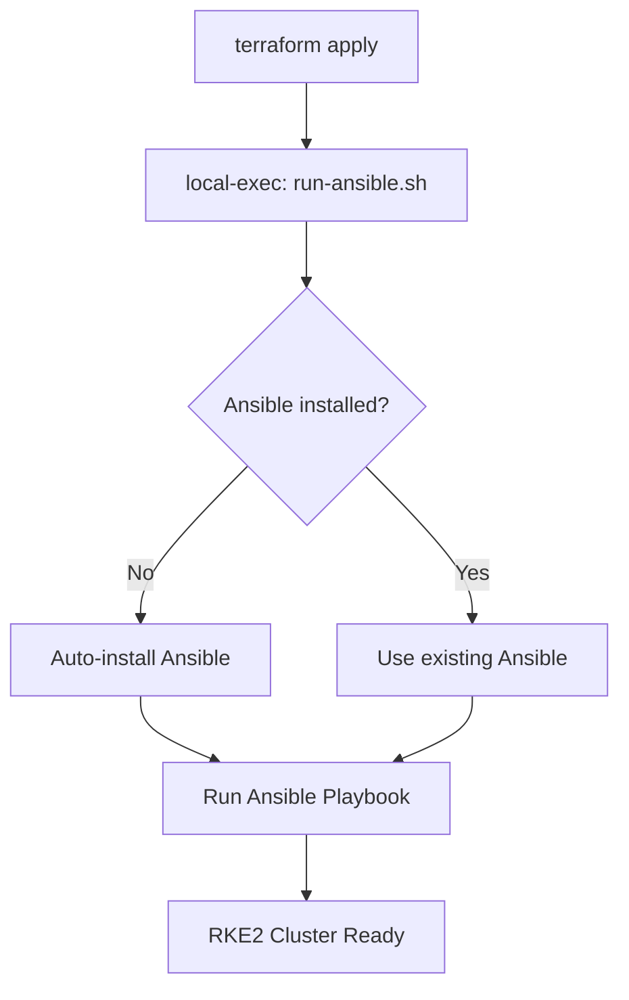

# RKE2 Ansible-Based Cluster Provisioning

This module has been converted from using Terraform's unreliable `remote-exec` provisioner to using **Ansible** for RKE2 cluster installation. This provides much better reliability and error handling.

## ⚙️ System Requirements

### **Terraform Runner Machine** (where you run `terraform apply`)

**Required:**
- ✅ **Terraform** (any recent version)
- ✅ **Python3** (for Ansible)
- ✅ **SSH client** (ssh, scp commands)
- ✅ **Internet connectivity**

**Auto-Installed:**
- **Ansible** - automatically installed during `terraform apply`
- **pip3** - installed with Ansible if needed

### **Supported Operating Systems for Terraform Runner:**
- ✅ **Ubuntu/Debian** (apt-get)
- ✅ **RHEL/CentOS/Rocky** (yum/dnf) 
- ✅ **Fedora** (dnf)
- ✅ **openSUSE** (zypper)
- ✅ **macOS** (brew)
- ✅ **Any Linux with pip3**

## Quick Start

### **1. Pre-flight Check (Optional but Recommended)**
```bash
cd terraform/implementations/aws/infra
../../../modules/aws/rke2-cluster/ansible/preflight-check.sh
```

### **2. Run Terraform (Ansible Auto-Installs)**
```bash
terraform init
terraform plan
terraform apply # Ansible will be auto-installed if needed
```

That's it! No manual Ansible installation required.

## How Ansible Installation Works

### **Automatic Installation Flow:**


### **Installation Methods by OS:**
| OS | Method | Command Used |
|----|--------|--------------|
| **Ubuntu/Debian** | apt-get | `sudo apt-get install ansible python3-pip` |
| **RHEL/CentOS** | yum | `sudo yum install ansible python3-pip` |
| **Fedora** | dnf | `sudo dnf install ansible python3-pip` |
| **openSUSE** | zypper | `sudo zypper install ansible python3-pip` |
| **macOS** | brew | `brew install ansible` |
| **Fallback** | pip3 | `pip3 install --user ansible` |

## 📍 Where Does What Run?

### **Terraform Runner Machine** (your local machine/CI):
- ✅ Terraform execution
- ✅ Ansible installation (auto)
- ✅ Ansible playbook execution
- ✅ SSH connections to AWS instances

### **AWS EC2 Instances** (target nodes):
- ✅ RKE2 server/agent installation
- ✅ Kubernetes cluster formation
- ✅ kubectl configuration

## Manual Ansible Installation (if preferred)

If you prefer to install Ansible manually before running terraform:

### **Ubuntu/Debian:**
```bash
sudo apt-get update
sudo apt-get install -y ansible python3-pip
```

### **RHEL/CentOS:**
```bash
sudo yum install -y epel-release
sudo yum install -y ansible python3-pip
```

### **macOS:**
```bash
brew install ansible
```

### **Any Linux (pip):**
```bash
pip3 install --user ansible
export PATH="$HOME/.local/bin:$PATH"
```

## What Changed

### Before (remote-exec)
- ❌ Unreliable "remote command exited without exit status" errors
- ❌ Complex error handling causing timeouts
- ❌ No proper retry mechanisms
- ❌ Difficult to debug failures

### After (Ansible)
- ✅ Reliable SSH connection management
- ✅ Built-in retry mechanisms
- ✅ Better error reporting
- ✅ Idempotent operations
- ✅ Easier to debug and troubleshoot

## How It Works

1. **Terraform** creates AWS infrastructure (VPC, EC2 instances, security groups)
2. **Terraform** generates Ansible inventory from instance IPs
3. **Terraform** calls Ansible playbook via `local-exec`
4. **Ansible** connects to all nodes and installs RKE2 cluster

## Files Structure

```
ansible/
├── inventory.yml.tpl # Terraform template for Ansible inventory
├── rke2-playbook.yml # Main Ansible playbook for RKE2 installation
├── run-ansible.sh # Script to execute Ansible with proper settings
├── test-cluster.sh # Test script to verify cluster health
├── inventory.yml # Generated inventory file (created by Terraform)
├── ssh_key # SSH private key file (created by Terraform)
├── primary-kubeconfig.yaml # Downloaded kubeconfig (created by Ansible)
└── kubeconfigs/ # Directory with all node kubeconfigs
```

## Usage

### 1. Run Terraform Apply
```bash
cd terraform/implementations/aws/infra
terraform apply
```

This will:
- Create AWS infrastructure
- Generate Ansible inventory
- Run Ansible playbook automatically
- Install RKE2 cluster on all nodes

### 2. Test Cluster Health
```bash
cd terraform/modules/aws/rke2-cluster/ansible
./test-cluster.sh
```

### 3. Use Kubeconfig
```bash
export KUBECONFIG="$PWD/terraform/modules/aws/rke2-cluster/ansible/primary-kubeconfig.yaml"
kubectl get nodes
```

## Manual Ansible Operations

If you need to run Ansible manually for troubleshooting:

```bash
cd terraform/modules/aws/rke2-cluster/ansible

# Test connectivity
ansible all -i inventory.yml -u ubuntu --private-key=ssh_key -m ping

# Check service status
ansible rke2_cluster -i inventory.yml -u ubuntu --private-key=ssh_key \
 -m shell -a "sudo systemctl status rke2-server || sudo systemctl status rke2-agent"

# Re-run the playbook
ansible-playbook -i inventory.yml -u ubuntu --private-key=ssh_key rke2-playbook.yml
```

## Troubleshooting

### Ansible Not Installed
The `run-ansible.sh` script will automatically install Ansible if it's not present.

### SSH Connection Issues
- Check that security groups allow SSH access (port 22)
- Verify the SSH key is correct
- Ensure instances are running and accessible

### RKE2 Installation Issues
- Check logs on individual nodes: `sudo journalctl -u rke2-server -f`
- Verify network connectivity between nodes
- Check DNS resolution

### Cluster Not Ready
- Wait 5-10 minutes for cluster initialization
- Run the test script: `./test-cluster.sh`
- Check individual node status with Ansible

## Advantages Over Remote-Exec

1. **Reliability**: Ansible handles SSH connection drops and retries automatically
2. **Idempotency**: Can re-run without issues if something fails
3. **Error Handling**: Better error messages and logging
4. **Debugging**: Can run individual tasks or playbooks for troubleshooting
5. **Scalability**: Easily handles large clusters with parallel execution
6. **Flexibility**: Can easily add new tasks or modify behavior

## Configuration Variables

The following variables are automatically passed from Terraform to Ansible:

- `cluster_name`: Cluster identifier
- `cluster_env_domain`: Domain for the cluster
- `k8s_infra_repo_url`: Git repository URL for k8s infrastructure
- `k8s_infra_branch`: Git branch to use
- `enable_rancher_import`: Whether to import into Rancher
- `rancher_import_url`: Rancher import command

Node roles are automatically detected based on hostname patterns:
- `*CONTROL-PLANE-NODE*`: Control plane nodes
- `*ETCD-NODE*`: ETCD nodes 
- `*WORKER-NODE*`: Worker nodes

## Next Steps

This Ansible-based approach eliminates the "remote command exited without exit status" errors you were experiencing. The cluster installation should now be much more reliable and easier to debug if issues occur.

Try running `terraform apply` and you should see much better success rates compared to the previous remote-exec approach.
